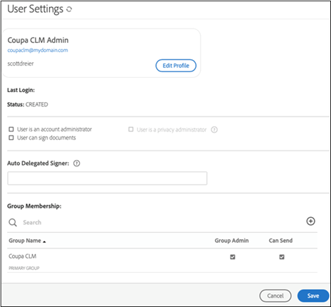
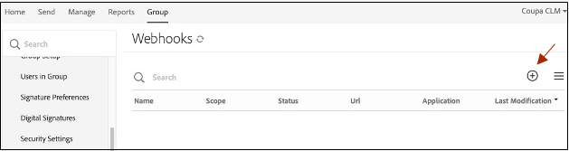

# [!DNL Coupa] Installationshandbok{#coupa-installation-guide}

[**Kontakta supporten för Adobe Sign**](https://adobe.com/go/adobesign-support-center_se)

## Översikt {#overview}

I det här dokumentet beskrivs hur du konfigurerar ditt Adobe Sign-konto för integrering [!DNL Coupa BSM Suite] -instans för att hämta signaturer.

Förutsättningar:

* Prenumeration på Adobe Sign Enterprise, [Adobe Sign Developer Edition](https://www.adobe.com/sign/developer-form.html)eller [Testversion av Adobe Sign Enterprise](https://www.adobe.com/sign/business.html)
* Åtkomst till Adobe Sign-administratör
* [!DNL Coupa BSM Suite] Standard eller avancerad instans

De viktigaste stegen för att slutföra integreringen är:

* Konfigurera en Adobe Sign-grupp för användning med [!DNL Coupa BSM Suite]
* Anslut [!DNL Coupa BSM Suite] till Adobe Sign
* Skapa en Adobe Sign-webhook för att meddela din [!DNL Coupa BSM Suite] instans

## Konfigurera Adobe Sign Group för [!DNL Coupa BSM Suite] {#configure-adobe-sign-for-coupa}

Att ha en dedikerad användning av Adobe Sign för [!DNL Coupa] inom en organisation måste administratörerna skapa en Adobe Sign-grupp speciellt för [!DNL Coupa BSM Suite] användning. Den här Adobe Sign-gruppen bör ha ett användarkonto för gruppadministratörer som fungerar som tjänstkonto. Eftersom detta tjänstkonto används för alla signaturbegäranden bör det hållas anonymt, till exempel: `Legal@xyz.com`, `Purchasing@xyz.com`eller `CoupaCLM@xyz.com`i stället för personligt, som `Bob.Smith@xyz.com`.

### Skapa en grupp och en användare i Adobe Sign {#create-sign-user-group}

Så här skapar du en användare i Adobe Sign:

1. Logga in på Adobe Sign som kontoadministratör.
1. Gå till **[!UICONTROL Konto]** > **[!UICONTROL Användare]**.
1. Om du vill skapa en ny användare klickar du på  -ikonen.
1. Ange information om den nya användaren i dialogrutan som öppnas:

   1. Ange en fungerande e-postadress som du kan komma åt.

      * Den här användaren upprättar och upprätthåller OAuth-relationen.
      * E-postadressen måste vara en faktisk adress för verifiering.
   1. Ange lämpliga värden för [!UICONTROL Förnamn] och [!UICONTROL Efternamn].
   1. I dialogrutan [!UICONTROL Primär grupp] fält väljer du **[!UICONTROL Skapa en ny grupp för den här användaren]**.
   1. I dialogrutan [!UICONTROL Nytt gruppnamn] fält, ange ett intuitivt gruppnamn som *[!DNL Coupa BSM Suite]*.

   

1. Välj **[!UICONTROL Spara]**.

   När du har sparat informationen kan [!UICONTROL Användare] visar den nya användaren med en [!UICONTROL SKAPAD] status.

   

   Den [!UICONTROL SKAPAD] status anger att användaren ännu inte har verifierat sin e-postadress.

1. Så här verifierar du e-postadressen:
   1. Logga in på den nya användarens e-postadress.
   2. Hitta e-postmeddelandet &quot;Välkommen till Adobe Sign&quot;. Kontrollera skräppostmappen om det behövs.
   3. Klicka där det står **[!UICONTROL Klicka här för att ange ditt lösenord]**
   4. Ange lösenordet.

   När du har verifierat e-postadressen ändras statusen för användaren från [!UICONTROL SKAPAD] till [!UICONTROL AKTIV].

   

### Definiera den verifierande användaren {#define-authenticating-user}

När du har skapat en grupp och en användare i den gruppen måste du göra användaren till en gruppadministratör.

Så här befordrar du den nya användaren i [!DNL Coupa BSM Suite] grupp:

1. Navigera till sidan [!UICONTROL Användare] (om du inte redan är där).
2. Dubbelklicka på användaren.

   Det öppnar en [!UICONTROL Redigera] för användarbehörigheterna.

3. Under avsnittet Gruppmedlemskap väljer du **[!UICONTROL Gruppadministratör]** och **[!UICONTROL Kan skicka]** alternativ.
4. Avmarkera **[!UICONTROL Användaren är kontoadministratör]** och **[!UICONTROL Användare kan signera dokument]** alternativ.
5. Klicka på **[!UICONTROL Spara]**.

   

## Konfigurera [!DNL Coupa BSM Suite] instans {#configure-coupa}

Så här slutför du anslutningen mellan [!DNL Coupa BSM Suite ] och Adobe Sign måste en betrodd relation upprättas mellan tjänsterna.

Så här konfigurerar du [!DNL Coupa BSM Suite]:

1. Anslut din [!DNL Coupa BSM Suite] till ditt Adobe Sign-tjänstkonto som du skapade ovan.
1. Skapa en Adobe Sign-webhookinstans för att meddela din Coupa BSM Suite-instans om avtalsuppdateringar.

Mer information om hur du ansluter [!DNL Coupa BSM Suite] och hur du skapar och registrerar en webhook, se [Adobe Sign Coupa BSM Suite Instanssupportdokumentation](https://success.coupa.com/Support/Docs/Power_Apps/CLM_Standard/Signing_and_Approvals/Enable_E-Signatures_Through_Adobe_Sign_and_DocuSign){target=&quot;_blank&quot;}.

## Skapa [!DNL Webhook] i Adobe Sign {#create-webhook}

Coupa CLM-integreringen använder webhook-meddelanden från Adobe Sign för att skicka uppdateringar om avtalets status. Det är viktigt att slutföra konfigurationen av webhooken, annars förblir avtalen som skickas för signering ofullständiga eller de signerade avtalen levereras inte tillbaka till Coupa CLM.

Så här skapar du en webhook i Adobe Sign:

1. Logga in på Adobe Sign med gruppadministratörsanvändaren som skapades ovan, till exempel `coupaclm@MyDomain.com`.

1. Gå till **Grupper** > **Webhooks**.

   

1. Om du vill skapa en ny anslutning väljer du  -ikonen.

1. Fyll i de obligatoriska fälten i dialogrutan Skapa som öppnas.

   **Obs!** Du måste hämta URL:en för webhook-hanteraren från Coupa.

   

1. Välj obligatoriska meddelandeparametrar.

1. Välj **Spara**.

## Support {#support}

### [!DNL Coupa BSM Suite] bära {#coupa-support}

[!DNL Coupa BSM Suite ] är integreringsägaren och bör vara din första kontaktpunkt för frågor om omfattningen av integreringen, funktionsförfrågningar eller problem i den dagliga funktionen av integreringen.

För frågor, kontakta [Stöd för kupa](https://success.coupa.com/Support/Welcome_to_Coupa_Support){target=&quot;_blank&quot;}.

### Stöd för Adobe Sign {#adobe-sign-support}

Adobe Sign är integrationspartnern och bör kontaktas om integreringen inte kan hämta signaturer eller om meddelanden om väntande signaturer misslyckas.

Om du vill ha hjälp med att använda eller konfigurera Adobe Sign kan du kontakta din Customer Success Manager (CSM) eller kontakta [Stöd för Adobe Sign](https://adobe.com/go/adobesign-support-center).

Adobe Sign-administratörer kan också öppna ärenden och få hjälp via hjälpen (?) uppe till höger på Adobe Sign-portalen.

