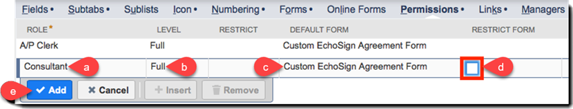

# [!DNL NetSuite] Handbok för installation och anpassning (v4.0.4) {#install-customize-NetSuite}

## Översikt {#overview}

Adobe Sign för [!DNL NetSuite] ger en komplett e-signaturintegrering med [!DNL NetSuite]. Du kan använda Adobe Sign för [!DNL NetSuite] integration för att skicka avtal som kontrakt, offerter och andra dokument som kräver elektroniska signaturer till mottagare direkt från [!DNL NetSuite]. Du kan skapa och skicka Adobe Sign-avtal från kunder, leads, offerter och andra [!DNL NetSuite] poster. Adobe Sign-uppdateringar [!DNL NetSuite] med status för avtal och lagrar avtalen med associerade [!DNL NetSuite] poster när de har körts. Du kan visa historiken för alla avtal som skickas från [!DNL NetSuite] inifrån produkten.

Se [Adobe Sign för [!DNL NetSuite] versionsinformation](https://experienceleague.adobe.com/docs/sign-integrations/using/netsuite/release-notes.html?lang=en) för mer information.

## Installera paketet och konfigurera OAuth {#install}

Endast en [!DNL NetSuite] kan administratören installera eller uppdatera paketet. Om du vill konfigurera OAuth [!DNL NetSuite] måste ha administratörsåtkomst till Adobe Sign. Innan du installerar paketet på ditt Production-konto bör du installera och testa det i en [!DNL NetSuite] Sandlådekonto.

Se [Skapa ett Adobe Sign-avtal](#createagreement) för mer information om testning.

>[!CAUTION]
>
>Kunder som uppgraderar till v4.0.4 bör INTE ta bort sin befintliga API-nyckel.
>
>Se [Ange egna inställningar](#configure) för mer information om hur API-nyckeln används.

### Installera paketet för första gången

1. Navigera till [!UICONTROL **Customization > SuiteBundler > Search &amp; Install Bundles**].

1. På *Paket för sökning och installation* sida, ange **Adobe Sign** som nyckelord och välj **[!UICONTROL Sök]**.

1. Välj **Adobe Sign** paketnamn.

   

1. På *[!UICONTROL Information om programpaket]* sida, markera **[!UICONTROL Installera]**.
1. I dialogrutan *[!UICONTROL Installera Preview Bundle]* sida, markera **[!UICONTROL Install Bundle]**.

   (Du måste inte ändra något av standardvärdena på sidan)

   

1. I dialogrutan Installera som visas väljer du **[!UICONTROL OK]** för att fortsätta.

   Under installationsprocessen visas paketets status som *[!UICONTROL Väntande]*.

   

1. Om du vill visa en uppdaterad status väljer du **[!UICONTROL Uppdatera]**.

   När paketinstallationen är klar *Adobe Sign för[!DNL NetSuite]* visas på *[!UICONTROL Installerade paket]* sida.

   

1. Om du redan är ett Adobe Sign-kundkonto följer du stegen för att  [Konfigurera OAuth efter installation eller uppgradering](#oauth).

   Om du inte har något Adobe Sign-konto kan du [registrera dig för en testversion av ett företag](https://esign.adobe.com/adobe-sign-[!DNL NetSuite]-trial-registration.html) för att testa systemet. Aktivera ditt Adobe Sign-konto genom att följa stegen för onlineregistrering.

## Konfigurera OAuth efter installation eller uppgradering {#oauth}

Adobe Sign använder OAuth 2.0 för att autentisera ditt Adobe Sign-konto inom [!DNL NetSuite].

Det här protokollet godkänner att du har installerat [!DNL NetSuite] för att kommunicera med Adobe Sign utan att behöva ange ditt lösenord. Eftersom känslig information inte delas direkt mellan programmen är det mindre troligt att ditt konto utsätts för risker.

Den här autentiseringen påverkar inte implementeringen, men du måste göra en engångskonfiguration efter att du har installerat eller uppgraderat paketet på ditt Production- eller Sandbox-konto.

The [!DNL NetSuite] Administratörer som konfigurerar OAuth måste också ha administratörsbehörighet på kontonivå för Adobe Sign.

1. I [!DNL NetSuite], navigera till *Adobe Sign Config* listsida.

1. Sök efter **[!UICONTROL Adobe Sign Config]** (en anpassad posttyp) med hjälp av fältet Sök i sidhuvudet.

1. På sidan Sökresultat väljer du **Visa** för *Adobe Sign Config* post.

   

1. På sidan Konfigurationslista för Adobe Sign väljer du **[!UICONTROL Visa]** för *Använda OAuth för att komma åt Adobe Sign API:er* post.

   

1. På sidan Adobe Sign Config väljer du **[!UICONTROL Logga in med Adobe Sign]**

   

1. På inloggningssidan för Adobe Sign som visas anger du dina uppgifter och väljer **[!UICONTROL Logga in]**.

   

1. På sidan Bekräfta åtkomst (för OAuth) som visas väljer du **[!UICONTROL Tillåt åtkomst]**

   

1. När auktoriseringen är klar omdirigeras du tillbaka till Adobe Sign Config-sidan i [!DNL NetSuite], enligt nedan.

   

   >[!NOTE]
   >
   >När du konfigurerar OAuth i ditt Sandbox-konto kan felet&quot;Det gick inte att avgöra kundens komp-ID&quot; uppstå när auktoriseringen har slutförts.
   >
   >
   >För att kunna fortsätta måste du ändra kontodomändelen av URL:en (systemet).[!DNL NetSuite].com) i webbläsaren för att peka tillbaka till [!DNL NetSuite] Sandlåda enligt följande:
   >
   >
   >Ändra:
   >
   >
   >system.[!DNL NetSuite].com/app/site/hosting/scriptlet.nl?script=745&amp;deploy=1&amp;web_access_point=https://echosign.com
   >
   >
   >Till:
   >
   >
   >system.**sandlåda.**[!DNL NetSuite].com/app/site/hosting/scriptlet.nl?script=745&amp;deploy=1&amp;web_access_point=https://echosign.com

## Uppdatera paketet (befintliga användare)

[!DNL NetSuite] uppdateringarna släpps regelbundet av Adobe. Befintliga användare av Adobe Sign för [!DNL NetSuite] integreringen kan uppdateras till det senaste paketet.

>[!CAUTION]
>
>Kunder som uppgraderar till en nyare version bör INTE ta bort sin befintliga API-nyckel.
>
>Se [Ange egna inställningar](#configure) för mer information om hur API-nyckeln används.

### Förutsättningar {#prerequisites}

Den tid som krävs för att uppdatera till v4.0.4-paketet beror på antalet avtal som för närvarande har statusen Skickat för signatur. Vanligtvis tar det 7-10 minuter att uppdatera 100 avtal. Notera antalet poster som beräknar uppdateringstiden.

Så här avgör du antalet avtal som skickats ut för signering:

1. Navigera till **[!UICONTROL Anpassning > Listor, poster och filer > Posttyper]** och sedan leta reda på *Adobe Sign Agreement.*

   Du kan också söka efter Adobe Sign-avtal i sökfältet.

1. För [!UICONTROL Adobe Sign-avtal] post, välj **[!UICONTROL Sök]**.

   

1. Från **[!UICONTROL Status]** nedrullningsbar meny, välj **[!UICONTROL Skickat för signatur]** och sedan markera **[!UICONTROL Skicka]**.

   

   Notera antalet poster som beräknar uppdateringstiden.

   

### Uppdatera paketet {#updating-the-bundle}

1. Navigera till **[!UICONTROL Customization > SuiteBundler > Search &amp; Install > List]** och hitta ditt nuvarande paket, enligt nedan.

   >[!NOTE]
   >
   >Om det finns en ny version av paketet visas ett utropstecken till höger om *Version* numret på det aktuella paketet.

1. I listrutan Åtgärd väljer du **[!UICONTROL Uppdatera]**.

   

1. På sidan Preview Bundle Update väljer du **[!UICONTROL Uppdateringspaket]** utan att ändra något av de standardvärden som visas på sidan.

   Under installationen visas paketets status som *Väntande*.

   .

   >[!NOTE]
   >
   >När du uppdaterar paketet kan du få ett varningsmeddelande enligt nedan. Om du inte har anpassat dina [!DNL NetSuite] Du kan fortsätta med e-signaturposter. Om du är osäker bör du installera paketet på ett Sandbox-konto för att testa det innan du uppdaterar paketet på ett produktionskonto.

   

1. Om du vill visa en uppdaterad status väljer du **[!UICONTROL Uppdatera]**.

   

   >[!NOTE]
   >
   >Om uppdateringen tar lång tid på grund av flera avtal med en *Skickat för signatur* status kan du kontrollera **[!UICONTROL Körningslogg]** underflik för *Installation av Adobe Sign Bundle* för att avgöra uppdateringens förlopp. Se [Kontrollera uppdateringens förlopp](#determineprogress) för mer information.

   När paketuppdateringen är klar, *Adobe Sign för[!DNL NetSuite]* visas på *Installerade paket* sida.

   

## Konfigurera paketet {#configure}

### Ange egna inställningar  {#set-custom-preferences}

Du kan använda anpassade inställningar för att ange hur avtal ska skapas och sparas i [!DNL NetSuite]. Dessutom innehåller *Automatisk etablering av användare i Adobe Sign* kan du ange om [!DNL NetSuite] användare etableras automatiskt i Sign-tjänster när de skickar avtal från [!DNL NetSuite].

1. Navigera till **[!UICONTROL Inställningar > Företag > Allmänna inställningar]**.
1. Bläddra nedåt på sidan och välj sedan alternativet **[!UICONTROL Anpassade inställningar]** underflik.

   

1. Aktivera och konfigurera dina Adobe Sign-inställningar efter behov:

   * **Ange EchoSign API-nyckel för ditt konto**: Lägg inte till eller redigera något värde i det här fältet.
   * **Använd överordnad postkontakt som signerare**: Om det här alternativet är aktiverat används den överordnade postens kontaktperson som första signerare när avtal skapas. Avsändaren kan enkelt ta bort eller redigera standardsigneraren eller lägga till ytterligare signerare i avtalet innan den skickas.
   * **Använd trans. Kontakta som signerare om det finns**: Den här inställningen är bara giltig om *Använd överordnad postkontakt som signerare* -inställningen är också aktiverad. Om det här alternativet är aktiverat används den primära transaktionskontakten som första signerare när ett avtal skapas från en transaktionspost (till exempel Offert). Se [Transaktionsposter](#transrecords) för mer information. Om det inte finns någon primär transaktionskontakt, eller om det skickas från [!DNL NetSuite] objektpost (t.ex. Kundpost, Partnerpost), standardmottagaren är den primära kontakten för kundens e-postadress. Avsändaren kan enkelt ta bort eller redigera standardsigneraren eller lägga till ytterligare signerare i avtalet innan den skickas.
   * **Tillåt markering av mottagare som godkännare**: Om det här alternativet är aktiverat kan avsändare markera mottagare som godkännare. Mottagare som har markerats som godkännare kan granska och godkänna avtal, men de behöver inte signera dem. Godkännare kan behöva ange data i fält under godkännandeprocessen.
   * **ID för föredragen avtalsmapp**: Används för att ange den mapp där de slutgiltiga signerade avtalen lagras. Om du inte anger ett värde för det här fältet sparas slutsignerade avtal i samma mapp som originaldokumentfilen som standard. Mappens ID måste vara ett nummer.
   * **Koppla transaktion automatiskt PDF**: Om det här alternativet är aktiverat bifogas Transaction PDF automatiskt till avtal när nya avtal skapas från transaktionsposter.
   * **Lägg till signerad PDF som (bilaga eller länk)**: Om *Lista* om du väljer det i listrutan läggs det signerade PDF automatiskt till som en länk till filen. Om *Bifogad fil* är markerat i listrutan och det signerade PDF lagras i [!DNL NetSuite] som en bilaga till avtalsposten.
   * **Inkludera granskningsspår PDF med avtal**: Om det här alternativet är aktiverat bifogas PDF för granskningsspår automatiskt till avtalsposter efter att avtalen har signerats.
   * **ID-verifieringsmetod gäller för**: Om du aktiverar någon av metoderna för identitetsverifiering bestämmer du vem som får använda ID-verifieringsmetoden. Alternativen är *Alla signerare, endast externa signerare*, eller *Endast interna signerare*.

   **Metoder för identitetsverifiering** {#identity-verification-methods}

   Du kan välja aktiverade metoder för identitetsverifiering när du skapar ett avtal. Om fler än en metod för identitetsverifiering är aktiverad här, visas en **[!UICONTROL Bekräfta signeraridentitet]** alternativ.

   * **Aktivera lösenord krävs för att signera**: Kräv att signerare anger ett engångslösenord som du anger.

   * **Aktivera kunskapsbaserad autentisering**: Kräv att signerare anger namn, adress och eventuellt de fyra sista siffrorna i sitt SSN och svara sedan på en lista med frågor som verifierar den information de lämnat. Finns endast i USA.

   * **Aktivera autentisering av webbidentitet**: Kräv att signerare verifierar sin identitet genom att logga in på någon av följande webbplatser: Facebook, Google, LinkedIn, Microsoft Live, Twitter eller Yahoo!

   * **Automatisk etablering av användare i Adobe Sign**: Om det här alternativet är aktiverat skickar användare avtal i [!DNL NetSuite] etableras automatiskt med ett Adobe Sign-användarkonto.

1. Välj **[!UICONTROL Spara]** för att spara dina inställningar.

## Konfigurera automatiska statusuppdateringar {#asu}

Med Adobe Sign integreringspaket kan du automatiskt få uppdateringar i [!DNL NetSuite] angående status för avtal som har skickats från [!DNL NetSuite]. När den här funktionen är aktiverad [!DNL NetSuite] speglar alltid avtalsstatus. Du kan aktivera automatiska statusuppdateringar enligt följande:

1. Navigera till **[!UICONTROL Inställningar > Företag > Aktivera funktioner].**
1. Välj **[!UICONTROL SuiteCloud]** underflik.
1. Aktivera följande alternativ:

   * Aktivera **[!UICONTROL Egna poster]** alternativ.

   * Aktivera alternativet **[!UICONTROL Client SuiteScript]** och **[!UICONTROL Server SuiteScript]** och godkänner användarvillkoren för båda.

1. Välj **[!UICONTROL Spara]**.

   Alternativen ställs in enligt bilden.

   

## Objekt och posttyper {#objects}

Adobe Sign integreringspaket visar redan Adobe Sign Agreement-objektet med många standardprogram [!DNL NetSuite] objekt, inklusive: Kund-, offert-, lead-, säljprojekt- och partnerposter. Du kan även använda Adobe Sign-paketet med andra posttyper, inklusive egna poster.

Avtalsfliken kan visas med två typer av [!DNL NetSuite] poster: Enhet- och transaktionsposter. Vi antar vanligtvis att en transaktionspost är en post (t.ex. en offert) som kan konverteras till ett PDF-dokument. En enhetspost kan inte konverteras till PDF.

## Transaktionsposter {#transrecords}

Om avtalet skapas från en transaktionspost är det första dokumentet i avtalsposten PDF-versionen av posten som det kom från och den första mottagaren är postens e-postadress. Om du inte vill att det första dokumentet ska vara en PDF-version av den post det kommer från går du till **[!UICONTROL Inställningar > Företag > Allmänna inställningar > Underfliken Anpassade inställningar]** och inaktivera **[!UICONTROL Koppla transaktion automatiskt PDF]** alternativ. Se [Ange egna inställningar](#configure) för mer information.

Under Egna inställningar kan du även aktivera **[!UICONTROL Använd trans. Kontakta som första signerare]** om du vill att den primära transaktionskontakten ska läggas till automatiskt som den första signeraren. När den är associerad med en transaktionspost visas **[!UICONTROL Avtal]** och **[!UICONTROL Send for Signature]** knappar.

## Enhetsposter {#entity-records}

Om avtalet skapas från en enhetspost är den första mottagaren e-postadressen från posten. När den är associerad med en enhetspost visas bara fliken Avtal.

## Anpassa paketet {#customize}

Att anpassa paketet innehåller följande:

* Distribuera skripten för underfliken Avtal och Send for Signature-knappen för lämpliga posttyper.
* Ange rollbehörigheter för dina Adobe Sign-posttyper.
* Ändra behörigheter för att bevilja åtkomst till *Avtal* underfliken och *Send for Signature* -knapp.

### Konfigurera Adobe Sign-avtal för ytterligare posttyper  {#configuring-adobe-sign-agreements-for-additional-record-types}

Så här distribuerar du *Avtal* underfliken och *Send for Signature* Knapp för lämpliga posttyper:

1. Navigera till **[!UICONTROL Anpassning > Skript > Skript].**

1. På *Skript* listsida som visas, leta upp skriptet som du måste distribuera och välj sedan ****[!UICONTROL Visa]****.

   * Så här lägger du till *Send for Signature* knapp, markera **[!UICONTROL Adobe Sign Estiup Button]** skript.

   * Så här lägger du till *Avtal* flik, välja **[!UICONTROL Adobe Sign Agreement Loader]** skript.

1. På skriptsidan väljer du **[!UICONTROL Distribuera skript]**.

   

1. Gör följande på sidan Skriptdistribution:

   * Från *Gäller för* väljer du posttyp.
   * Du kan också ange ett skriptdistributions-ID.

      Se *Skapa ett anpassat skriptdistributions-ID* ämne i [!DNL NetSuite] Hjälpcenter för mer information. Om du inte anger något ID genereras ett.

   * Kontrollera **[!UICONTROL Distribuerad]** kryssruta.

   

   * Uppsättning *Status* till **[!UICONTROL Släppt]**.

      Du måste inte ange en *Händelsetyp* eller *Loggnivå*.

   * Från [!UICONTROL *Kör som roll]* nedrullningsbar meny, välj **[!UICONTROL Kör som administratör]**.

   * Med **[!UICONTROL Målgrupp]** aktiv underflik (aktiv som standard), välj de specifika roller eller användare som du vill ge åtkomst till. Om du vill ge åtkomst till alla roller och användare aktiverar du respektive **[!UICONTROL Markera alla]** alternativ.

   * Välj **[!UICONTROL Spara]**. När ändringsbekräftelsen visas väljer du **[!UICONTROL Gå tillbaka]**.

1. välj **[!UICONTROL Lista]** överst på sidan Skriptdistribution för att komma tillbaka till *Skript* listsida.
1. Upprepa steg 2 och 3 ovan för det andra skriptet.

## Ange rollbehörigheter för Adobe Sign-posttyper {#setting-role-permissions-for-adobe-sign-record-types}

Mest [!DNL NetSuite] roller ska ha behörighet att använda Adobe Sign utan ytterligare anpassningar. Du kan dock behöva bevilja behörigheter för ytterligare anpassade roller som har skapats.

1. Navigera till **[!UICONTROL Anpassning > Listor, poster och filer > Posttyper]**.

   

   >[!NOTE]
   >
   >Om du inte ser *Posttyper* objekt, navigera till **[!UICONTROL Inställningar > Företag > Aktivera funktioner > fliken Creative Cloud]** och aktivera *Egna poster* alternativ.

1. På *Posttyper* sida, markera **[!UICONTROL Adobe Sign Agreement]** för att markera den

   

1. På *Anpassad posttyp* sida, markera **[!UICONTROL Använd behörighetslista]** från *Åtkomsttyp* nedrullningsbar meny.

   

   >[!NOTE]
   >
   >The *Adobe Sign Agreement* posttypen är den enda Adobe Sign-posttypen som kräver *Använder behörighetslista* åtkomsttyp.
   >
   >
   >I steg 6 finns instruktioner om hur du ställer in åtkomsttypen för andra posttyper i Adobe Sign.

1. Välj **[!UICONTROL Behörigheter]** underflik.

   Listan över roller och behörigheter visas.

   

1. Ange behörigheter enligt följande för ytterligare anpassade roller som lagts till i[!UICONTROL Adobe Sign Agreement]&quot; posttyp.

   >[!NOTE]
   >
   >Se *[Konfigurera en behörighetslista för en anpassad posttyp](https://system.[!DNL NetSuite].com/app/help/helpcenter.nl?fid=section_N2879931.html)* ämne i [!DNL NetSuite] Hjälpcenter för mer information

   1. Välj rollen från *Roll* lista.
   1. Uppsättning *Nivå* till **[!UICONTROL Fullständig]**.
   1. Uppsättning *Standardformulär* till **[!UICONTROL Anpassat EchoSign-avtalsformulär]**.
   1. Välj **[!UICONTROL Begränsa formulär]** kryssrutan.
   1. Välj **[!UICONTROL Lägg till]** om du vill spara ändringarna för rollraden.

   

   Den nya raden visas enligt nedan:

   

   Upprepa steg a till och med e ovan för alla andra anpassade roller.

   * välj **[!UICONTROL Spara]** på *Anpassad posttyp* sida när behörigheter för alla roller har angetts.
   The *[!UICONTROL Kundposttyp]* visas igen.

1. Upprepa steg 1 till 3 ovan för att ställa in *Åtkomsttyp* för alla andra posttyper i Adobe Sign till

   **[!UICONTROL Ingen behörighet krävs].** Detta gäller följande posttyper:

   * Adobe Sign Config
   * Adobe Sign-dokument
   * Adobe Sign Event
   * Adobe Sign
   * Adobe Sign-skriptfel
   * Adobe Sign Signerat avtal
   * Adobe Sign Signer

### Bevilja åtkomst till fliken Avtal och knappen Send for Signature  {#granting-access-to-the-agreement-tab-and-send-for-signature-button}

Adobe Sign integreringspaket visar redan Adobe Sign Agreement-objektet med många standardprogram [!DNL NetSuite] objekt (kund, uppskattning) [Citat], Lead med mera). The *Avtal* underfliken aktiveras automatiskt för följande typer av objekt: Kund, lead, säljprojekt, partner, potentiell kund, offert och leverantörsfaktura.

The *[!UICONTROL Send for Signature]* knapp aktiveras automatiskt **o[!UICONTROL Endast för Quote-objektet]**.

[!DNL NetSuite] administratörer kan utöka möjligheten att skapa avtal till ytterligare CRM-objekt genom att ändra behörigheter för att lägga till *Avtal* underflik, *Send for Signature* eller båda till dessa objekt.

#### Ändra behörigheter för att bevilja åtkomst till knappen Send for Signature  {#modifying-permissions-to-grant-access-to-the-send-for-signature-button}

1. Navigera till **[!UICONTROL Anpassning > Skript > Skript]**.

   The *Skript* listsidan visas.

   * Om det behövs använder du filtren för att hitta Adobe Sign-skripten

1. På *Skript* sidan, leta upp *Adobe Sign Estiup Button* skript (styr *Send for Signature* knapp) och sedan välja **Visa**.

   

1. På *Skript* gör du följande på sidan:

   * välj **[!UICONTROL Distributioner]** underflik

   * Under &quot;*Gäller för*&quot; välj länken för den enhet som du vill ändra.

      * **[!UICONTROL Citat]** i det här exemplet

   

   * välj **[!UICONTROL Redigera]** på *Skriptdistribution* page

   

   * Med **[!UICONTROL Målgrupp]** aktiv underflik, välj de specifika roller eller användare som du vill ge åtkomst till.

      * Om du vill ge åtkomst till alla roller och användare aktiverar du respektive **[!UICONTROL Markera alla]** alternativ
   * välj **[!UICONTROL Spara]**

   

#### Ändra behörigheter för att bevilja åtkomst till avtalsfliken  {#modifying-permissions-to-grant-access-to-the-agreements-tab}

1. Navigera till **[!UICONTROL Anpassning > Skript > Skript]**
1. På [!UICONTROL Skript] sidan, leta upp *[!UICONTROL Adobe Sign Agreement Loader]* skript (styr *Fliken Avtal*) och sedan väljer **[!UICONTROL Visa]**.
1. På *Skript* gör du följande på sidan:

   1. Välj **[!UICONTROL Distributioner]** underflik
   1. Under &quot;*[!UICONTROL Gäller för]*&quot; välj länken för den enhet som du vill ändra åtkomsten till
   1. På *[!UICONTROL Skriptdistribution]* väljer du **[!UICONTROL Redigera]** knapp
   1. Med **[!UICONTROL Målgrupp]** aktiv underflik (den är aktiv som standard), välj de specifika roller eller användare som du vill ge åtkomst till. Om du vill ge åtkomst till alla roller och användare aktiverar du respektive **[!UICONTROL Markera alla]** alternativ
   1. välj **[!UICONTROL Spara]**

## Använda Adobe Sign för [!DNL NetSuite] paket

För att skicka avtal från [!DNL NetSuite] och får uppdateringar för dessa avtal, måste användarna ha samma inloggnings-ID (e-postadress) i [!DNL NetSuite] och i Adobe Sign.

### Skapa ett Adobe Sign-avtal

När du har installerat ett nytt paket i en sandlåda eller ett produktionskonto bör du testa paketet genom att skapa ett nytt avtal. Du kan skapa Adobe Sign-avtal från en enhetspost, från en transaktionspost eller som ett fristående avtal.

>[!NOTE]
>
>Processen för att skapa ett avtal varierar något beroende på hur det skapas. Den allmänna processen är att ange alternativ för avtalet, lägga till ett eller flera avtalsdokument och ange mottagarna. Processen som beskrivs nedan förutsätter att du skapar avtalet från en kundpost.

1. Välj eller skapa en kundpost som du vill skicka ett avtal från eller välj en annan [!DNL NetSuite] posttyp som har fliken Avtal aktiverad.

1. I posten väljer du **[!UICONTROL Avtal]** underflik.
1. Välj **[!UICONTROL Nytt avtal]**.

   

1. På *[!UICONTROL Adobe Sign Agreement]* sida, markera **[!UICONTROL Redigera]**.

   

1. Ange alternativen för ditt avtal enligt följande:

   * **Avtalsnamn** — Ange ett namn för avtalet.
   * **Meddelande**-Ange ett eget meddelande till mottagaren.
   * **Typ av signatur** — Välj typ av signatur som accepteras för dokumentet. Alternativen är *e-signatur* och *Faxsignatur*.

   * **Jag måste också signera det här avtalet** — Aktivera det här alternativet för att ange att avsändaren också måste signera avtalet.
   * **Signaturordning**-Om *Jag måste också signera det här avtalet* markerar du i vilken ordning som avsändaren och mottagarna ska signera. Alternativen är&quot;Jag signerar, sedan mottagare signerar&quot;,&quot;Mottagare signerar, sedan signerar&quot; och&quot;Ingen&quot;.

   * **Förhandsgranska dokument- eller positionssignaturer (eller formulärfält)** — Aktivera det här alternativet om du vill tillåta avsändare att förhandsgranska avtalet och tillåta dem att lägga till fält (dra och släpp signatur, initialfält och andra formulärfält) i avtalet innan det skickas till mottagarna.
   * **Bekräfta signeraridentitet** — Aktivera det här alternativet och välj sedan ett av följande alternativ för identitetsverifiering

      * Det här alternativet visas bara när fler än en av de tre verifieringsmetoderna för signeraridentitet som anges nedan har aktiverats i Anpassade inställningar. (Se [Ange egna inställningar](#customize) för mer information.) Om bara en inställning är aktiverad visas **[!UICONTROL Bekräfta signeraridentitet]** alternativet visas inte.

   **Metoder för identitetsverifiering**

   * **Lösenord krävs för att signera** — Kräv att signerare anger ett engångslösenord som du anger.
   * **Kunskapsbaserad autentisering** — Kräv att signerare anger namn, adress och eventuellt de fyra sista siffrorna i sitt SSN och svara sedan på en lista med frågor som verifierar den information de lämnat. Finns endast i USA.
   * **Autentisering av webbidentitet** — Kräv att signerare verifierar sin identitet genom att logga in på någon av följande webbplatser: Facebook, Google, LinkedIn, Twitter, Yahoo! eller Microsoft Live.
   * **Lösenord krävs för att visa PDF** — Aktivera det här alternativet om du vill att en mottagare ska ange ett lösenord innan ett PDF i avtalet eller det signerade avtalet öppnas. PDF-filen som skickas till alla är krypterad och kräver lösenordet för att kunna öppna den. Tappa inte bort ditt lösenord eftersom det inte kan återställas. Om du tappar bort lösenordet måste du ta bort transaktionen och börja om.
   * **Lösenord/Bekräfta lösenord** — Om *Lösenord krävs för att visa PDF* är aktiverat anger du lösenordet som ska användas för att visa avtalet.
   * **Påminn mottagare att signera** — Ange om och hur ofta påminnelser skickas till mottagare. Alternativen är *Aldrig*, *Dagligen* eller *Vecka*.
   * **Språk:** Ange vilket språk som ska användas för att visa signeringssidan och e-postmeddelanden för mottagarna.
   * **Värdsignering för den första signeraren** — Aktivera det här alternativet om du vill tillåta avsändarens personliga signering för den första signeraren.
   * **Dagar till signeringsdeadline** — Ange ett heltal för att ange signeringsdeadline för avtalet (dagens datum + antal dagar).
   * **Överordnad post** — Du kan också välja en överordnad post för att länka den till avtalet.

   

1. Välj **[!UICONTROL Dokument]** -fliken.

   

1. På *Dokument* underflik, bifoga ett befintligt dokument från filskåpet med hjälp av *Adobe Sign-dokument* och välj **[!UICONTROL Bifoga]**.

   Eller klicka på **[!UICONTROL Nytt Adobe Sign-dokument]** för att komma åt *[!UICONTROL Adobe Sign-dokument]* och skriv sedan namnet på ett dokument i [!DNL NetSuite] filarkiv, välj filer från din transaktionspost (om det är tillämpligt) eller bifoga ett nytt dokument.

   Du kan lägga till flera dokument i ett avtal.

1. Välj **[!UICONTROL Mottagare]** och ange mottagare genom att antingen välja från kontaktlistan eller skriva en e-postadress.

   

   Var och en av dina mottagare kan markeras som signerare eller CC. Om *Tillåt markering av mottagare som godkännare* anpassad inställning är aktiverad kan mottagare också markeras som godkännare. Se [Ange egna inställningar](#customize) för mer information.

   * **Signerare** måste signera avtalet.
   * **Godkännare** måste godkänna, men inte signera avtalet, och kan också lägga till data i ett avtal.
   * **CC-mottagare** meddelas om avtalsuppdateringar och när avtalet signeras och slutförs. CC-mottagare är inte part i signatur- eller godkännandeprocessen.

      Om *Använd överordnad postkontakt som signerare* anpassad inställning är aktiverad fristående eller tillsammans med *Använd trans. Kontakta som signerare* den första mottagaren är standard, men kan ändras.

1. Välj **[!UICONTROL Lägg till]** efter att varje mottagare har angetts.

1. Välj **[!UICONTROL Spara]** för att spara avtalet.

### Skicka avtal för signering

När avtalet är klart att skickas väljer du **[!UICONTROL Send for Signature]** -knapp.

* Om *Förhandsgranska dokument- eller positionssignaturer* är aktiverat, klicka på **[!UICONTROL Send for Signature]**. Förhandsgranska dokumentet i det fönster som öppnas eller dra formulärfälten till dokumentet innan det skickas. Välj **[!UICONTROL Skicka]** för att skicka avtalet till mottagaren.

* Om *[!UICONTROL Värdsignering för första signerare]* är aktiverat, klicka på **[!UICONTROL Send for Signature]**. I det fönster som öppnas tillåter du att signeraren signerar dokumentet med avsändaren närvarande.

   A *Värdsignering för aktuell signerare* -länken visas också bredvid *Värdsignering för första signerare* -fält som kan nås tills dokumentet har signerats. Använd den här länken för att lagra avtalssignaturer för flera signerare eller för att öppna popup-fönstret igen om det stängs av misstag.

När avtalet har skickats får mottagarna ett e-postmeddelande som informerar dem om de dokument som väntar på att de ska signera.

När mottagarna har signerat dokumentet får avsändaren ett e-postmeddelande om att dokumentet har signerats.

#### Skicka från en offert

Adobe Sign är direkt integrerat med offerter i [!DNL NetSuite] så att en PDF av offerten automatiskt genereras och bifogas till avtalsposten.

När du visar en offert väljer du **[!UICONTROL Send for Signature]**. Den genererar och visar offerten som är kopplad till avtalet. Du kan också lägga till *Send for Signature* till andra transaktionsposttyper. Se [Objekt och posttyper](#objects) för mer information.

### Spåra status och skicka påminnelser

När du har skickat ett avtal:

* Dokumentstatus ändras till *Skickat för signatur* i avsnittet Avtalsinformation
* The *Send for Signature* ska ersättas med följande tre knappar:

   * **Uppdateringsstatus** — Om du vill uppdatera statusen manuellt om inga statusuppdateringar har konfigurerats. Se [Konfigurera automatiska statusuppdateringar](#asu) för mer information.
   * **Skicka påminnelse** — Så här skickar du en påminnelse till den aktuella signeraren.
   * **Avbryt avtal** — Om du vill avbryta ett avtal. Ett avtal kan avbrytas efter att det har skickats för en signatur om alla mottagare ännu inte har signerat.

En ny *Händelser* underfliken visas i avtalsposten där du kan spåra avtalets status.

Du kan se en historik över avtalshändelser, som innehåller information om när avtalet skickades, visades och signerades.

När avtalet har signerats:

* Dess status ändras till *Signerat*.
* Du kan länka tillbaka till den överordnade posten för det här avtalet med hjälp av länken.
* Du kan använda nedladdningslänkarna under Signerat dokument och Granskningsspår för att komma åt dessa dokument.
* Ytterligare *Signerat dokument* visas på underfliken för att visa miniatyrer av det signerade dokumentet.

>[!NOTE]
>
>När ett avtal har skickats för signering kan du inte redigera posten. Detta är för att bevara händelseregistret.

## Avinstallera paketet

Följ stegen i dialogrutan för att avinstallera paketet [!DNL NetSuite] Hjälp. Se *[Avinstallera ett paket](https://docs.oracle.com/cloud/latest/[!DNL NetSuite]cs_gs/NSBDL/NSBDL.pdf)* ämne i [!DNL NetSuite] Hjälpcenter för mer information.

När du avinstallerar paketet tas de osignerade avtalen bort. De signerade avtalen och deras motsvarande PDF-granskningsfiler påverkas inte.

Avinstallera INTE paketet om du måste behålla dina osignerade avtal.

## Felsökning

### Kontrollera uppdateringens förlopp

Om uppdateringen verkar ta längre tid än så kan du kontrollera uppdateringens förlopp på underfliken Körningslogg för Adobe Sign Bundle Installation-skriptet enligt följande:

1. Navigera till **[!UICONTROL Anpassning > Skript > Skript]**.
1. På [!UICONTROL Skript] sidan, leta upp *[!UICONTROL Installation av Adobe Sign Bundle]* skript, välj sedan **[!UICONTROL Redigera]**.
1. På [!UICONTROL Skript] väljer du **Körningslogg** underflik.
1. välj **Uppdatera**.

   Körningsloggen uppdateras med status. The *Detaljer* -kolumnen visar uppdateringarna av dina avtal.

   

### Lös problem med åtkomsttoken

Du kan stöta på ett meddelande om att den angivna åtkomsttoken är ogiltig eller har upphört att gälla vid interaktion med avtal.

Detta kan bero på följande:

* The [!DNL NetSuite]/Adobe Sign-administratör som har konfigurerat OAuth har återkallat åtkomsttoken
* Åtkomsttoken har upphört att gälla eftersom inga avtal har skickats från [!DNL NetSuite] de senaste 60 dagarna
* The [!DNL NetSuite]/Adobe Sign-administratören har inte slutfört den första OAuth-konfigurationen

Åtgärda problemet genom att köra OAuth-konfigurationsprocessen igen. Se [Konfigurera OAuth efter installation eller uppgradering](#oauth) för mer information.

### Åtgärda problem med dokumentstatus {#resolvestatus}

Om [automatiska statusuppdateringar](#asu) har konfigurerats men avtalsstatusen uppdateras inte efter att avtal har skickats. Försök med följande:

1. Kontrollera distributionsloggen för *Adobe Sign External Update* skript för att se om du får samtal från Adobe Sign enligt följande:

   1. Navigera till **[!UICONTROL Anpassning > Skript > Skriptdistributioner]**
   1. På *Skriptdistributioner* sidan, leta upp *Adobe Sign External Update* skript, välj sedan **[!UICONTROL Redigera]**
      1. På *[!UICONTROL Skriptdistribution]* väljer du **[!UICONTROL Körningslogg]** underflik.
      * Du borde se en *Uppdaterad avtalspost* post för varje avtals-ID

1. Kontrollera distributionsloggen för *Adobe Sign Update Agreements* skript för att se om det finns några fel enligt följande:

   1. Navigera till **[!UICONTROL Anpassning > Skript > Skriptdistributioner]**.
   1. På [!UICONTROL Skriptdistributioner] sidan, leta upp *[!UICONTROL Adobe Sign Update Agreements]* skript med &quot;[!UICONTROL Schemalagd]&quot; status, välj sedan **[!UICONTROL Redigera]**.
   1. På [!UICONTROL Skriptdistribution] väljer du **[!UICONTROL Körningslogg]** underflik.
   1. Under [!UICONTROL Typ], markera **[!UICONTROL Fel]** för att filtrera resultaten.

1. Kontrollera slutligen körningsloggen för *Adobe Sign Manager* genom att följa instruktionerna i steg 2 ovan.

### Åtgärda MIME-typfel  {#resolving-mime-type-errors}

Om du får ett MIME-typfel när du skickar ett avtal kan det bero på att namnet i fältet Filnamn inte matchar filnamnet och tillägget för den överförda filen. Om du lämnar fältet Filnamn tomt fylls automatiskt filnamnet och filnamnstillägget i.

### Visa skriptloggar {#viewing-script-logs}

Du kan också visa loggarna för distributionskörning för skript som inte är relaterade till dokumentstatusproblem. Se [Åtgärda problem med dokumentstatus](#resolvestatus) för mer information.

1. Navigera till **[!UICONTROL Anpassning > Skript > Skript]**.

   The *Skript* listsidan visas. Använd vid behov filtren för att hitta rätt skript.

1. Välj **[!UICONTROL Visa]** för motsvarande skript.

1. Välj **[!UICONTROL Körningslogg]** -fliken på sidan för att visa skriptloggen.

## Support {#support}

Gå till [Adobe Sign supportportal](https://adobe.com/go/adobesign-support-center_se) för att få tillgång till Frågor och svar, dokumentation, kunskapsbasartiklar eller kontakta Adobe Support.
