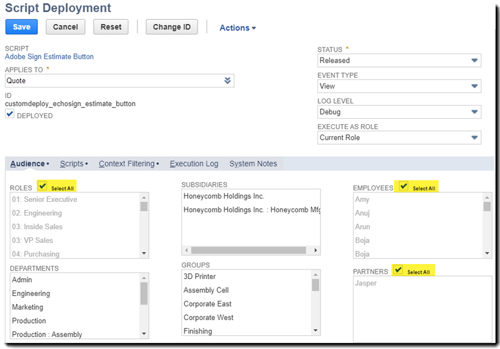

# [!DNL NetSuite] Handbok för installation och anpassning (v4.0.4) {#install-customize-NetSuite}

## Översikt {#overview}

Adobe Sign för [!DNL NetSuite] erbjuder en fullständig e-signaturintegrering med [!DNL NetSuite]. Du kan använda Adobe Sign för [!DNL NetSuite]-integrering för att skicka avtal som kontrakt, offerter och andra dokument som kräver elektroniska signaturer till mottagare direkt från [!DNL NetSuite]. Du kan skapa och skicka Adobe Sign-avtal från kund-, lead-, offert- och andra [!DNL NetSuite]-poster. Adobe Sign uppdaterar [!DNL NetSuite] med status för avtal och lagrar avtalen med de associerade [!DNL NetSuite] posterna när de har slutförts. Du kan visa historiken för alla avtal som har skickats från [!DNL NetSuite] inifrån produkten.

Mer information finns i [Adobe Sign for [!DNL NetSuite] versionsinformationen](https://experienceleague.adobe.com/docs/sign-integrations/using/netsuite/release-notes.html?lang=en).

## Installera paketet och konfigurera OAuth {#install}

Endast en [!DNL NetSuite]-administratör kan installera eller uppdatera paketet. För att konfigurera OAuth måste administratören för [!DNL NetSuite] ha administratörsåtkomst till Adobe Sign. Innan du installerar paketet på ditt Production-konto bör du installera och testa paketet på ett [!DNL NetSuite] Sandbox-konto.

Mer information om testning finns i [Skapa ett Adobe Sign-avtal](#createagreement).

>[!CAUTION]
>
>Kunder som uppgraderar till v4.0.4 bör INTE ta bort sin befintliga API-nyckel.
>
>Mer information om hur API-nyckeln används finns i [Ange anpassade inställningar](#configure).

### Installera paketet för första gången

1. Gå till [!UICONTROL **Customization > SuiteBundler > Search &amp; Install Bundles**].

1. På sidan *Sök- och installationspaket* anger du **Adobe Sign** som nyckelord och väljer **[!UICONTROL Sök]**.

1. Välj **Adobe Sign** paketnamn.

   

1. På sidan *[!UICONTROL Paketinformation]* väljer du **[!UICONTROL Installera]**.
1. På sidan *[!UICONTROL Preview Bundle Install]* väljer du **[!UICONTROL Install Bundle]**.

   (Du måste inte ändra något av standardvärdena på sidan)

   

1. I dialogrutan Install väljer du **[!UICONTROL OK]** för att fortsätta.

   Under installationsprocessen visas paketets status som *[!UICONTROL Väntande]*.

   

1. Om du vill visa en uppdaterad status väljer du **[!UICONTROL Uppdatera]**.

   När paketinstallationen är klar visas *Adobe Sign för[!DNL NetSuite]* på sidan *[!UICONTROL Installed Bundles]*.

   

1. Om du redan är ett Adobe Sign-kundkonto följer du stegen för att [konfigurera OAuth efter installation eller uppgradering](#oauth).

   Om du inte har något Adobe Sign-konto kan du [registrera dig för ett Enterprise trial](https://esign.adobe.com/adobe-sign-[!DNL NetSuite]-trial-registration.html)-konto för att testa systemet. Aktivera ditt Adobe Sign-konto genom att följa stegen för onlineregistrering.

## Konfigurera OAuth efter installation eller uppgradering {#oauth}

Adobe Sign använder OAuth 2.0 för att autentisera ditt Adobe Sign-konto inom [!DNL NetSuite].

Detta protokoll godkänner att det installerade [!DNL NetSuite]-paketet kommunicerar med Adobe Sign utan att behöva ange ditt lösenord. Eftersom känslig information inte delas direkt mellan programmen är det mindre troligt att ditt konto utsätts för risker.

Den här autentiseringen påverkar inte implementeringen, men du måste göra en engångskonfiguration efter att du har installerat eller uppgraderat paketet på ditt Production- eller Sandbox-konto.

Administratören [!DNL NetSuite] som konfigurerar OAuth måste också ha administratörsåtkomst på kontonivå till Adobe Sign.

1. I [!DNL NetSuite] navigerar du till listsidan *Adobe Sign Config*.

1. Sök efter **[!UICONTROL Adobe Sign Config]** (en anpassad posttyp) med sökfältet i rubriken.

1. På sidan Sökresultat väljer du **Visa** för posten *Adobe Sign Config*.

   

1. På sidan med konfigurationslistan i Adobe Sign väljer du **[!UICONTROL Visa]** för posten *Använda OAuth för att komma åt Adobe Sign API:er*.

   

1. På sidan Adobe Sign Config väljer du **[!UICONTROL Logga in med Adobe Sign]**

   

1. På inloggningssidan för Adobe Sign som visas anger du dina inloggningsuppgifter och väljer **[!UICONTROL Logga in]**.

   

1. På sidan Bekräfta åtkomst (för OAuth) som visas väljer du **[!UICONTROL Tillåt åtkomst]**

   

1. När auktoriseringen är klar omdirigeras du tillbaka till Adobe Sign Config-sidan om [!DNL NetSuite], som visas nedan.

   

   >[!NOTE]
   >
   >När du konfigurerar OAuth i ditt Sandbox-konto kan felet&quot;Det gick inte att avgöra kundens komp-ID&quot; uppstå när auktoriseringen har slutförts.
   >
   >
   >För att kunna fortsätta måste du ändra kontodomändelen av URL:en (systemet).[!DNL NetSuite].com) i webbläsaren för att peka tillbaka till  [!DNL NetSuite] sandlådan på följande sätt:
   >
   >
   >Ändra:
   >
   >
   >system.[!DNL NetSuite].com/app/site/hosting/scriptlet.nl?script=745&amp;deploy=1&amp;web_access_point=https://echosign.com
   >
   >
   >Till:
   >
   >
   >system.**sandlåda.**[!DNL NetSuite].com/app/site/hosting/scriptlet.nl?script=745&amp;deploy=1&amp;web_access_point=https://echosign.com

## Uppdatera paketet (befintliga användare)

[!DNL NetSuite] uppdateringarna släpps regelbundet av Adobe. Befintliga användare av Adobe Sign för [!DNL NetSuite]-integrering kan uppdatera till det senaste paketet.

>[!CAUTION]
>
>Kunder som uppgraderar till en nyare version bör INTE ta bort sin befintliga API-nyckel.
>
>Mer information om hur API-nyckeln används finns i [Ange anpassade inställningar](#configure).

### Förutsättningar {#prerequisites}

Den tid som krävs för att uppdatera till v4.0.4-paketet beror på antalet avtal som för närvarande har statusen Skickat för signatur. Vanligtvis tar det 7-10 minuter att uppdatera 100 avtal. Notera antalet poster som beräknar uppdateringstiden.

Så här avgör du antalet avtal som skickats ut för signering:

1. Navigera till **[!UICONTROL Anpassning > Listor, Poster och Filer > Posttyper]** och leta sedan reda på *Adobe Sign-avtal.*

   Du kan också söka efter Adobe Sign-avtal i sökfältet.

1. För posten [!UICONTROL Adobe Sign Agreements] väljer du **[!UICONTROL Sök]**.

   

1. I listrutan **[!UICONTROL Status]** väljer du **[!UICONTROL Skickat för signatur]** och sedan **[!UICONTROL Skicka]**.

   

   Notera antalet poster som beräknar uppdateringstiden.

   

### Uppdatera paketet {#updating-the-bundle}

1. Gå till **[!UICONTROL Customization > SuiteBundler > Search &amp; Install > List]** och leta reda på ditt aktuella paket, som visas nedan.

   >[!NOTE]
   >
   >Om det finns en ny version av paketet visas ett utropstecken till höger om *Versionsnumret* för det aktuella paketet.

1. Välj **[!UICONTROL Uppdatera]** i listrutan Åtgärd.

   

1. På sidan Preview Bundle Update väljer du **[!UICONTROL Update Bundle]** utan att ändra något av de standardvärden som visas på sidan.

   Under installationen visas paketets status som *Väntande*.

    av förhandsgranskningspaket.

   >[!NOTE]
   >
   >När du uppdaterar paketet kan du få ett varningsmeddelande enligt nedan. Om du inte har anpassat dina [!DNL NetSuite] e-signaturposter kan du fortsätta. Om du är osäker bör du installera paketet på ett Sandbox-konto för att testa det innan du uppdaterar paketet på ett produktionskonto.

   

1. Om du vill visa en uppdaterad status väljer du **[!UICONTROL Uppdatera]**.

   

   >[!NOTE]
   >
   >Om det tar lång tid att uppdatera på grund av flera avtal med statusen *Skickat för signatur* kan du kontrollera **[!UICONTROL körningsloggen]** för *Adobe Sign Bundle Installation*-skriptet för att avgöra uppdateringens förlopp. Mer information finns i [Bestämma uppdateringens förlopp](#determineprogress).

   När paketuppdateringen är klar visas *Adobe Sign för[!DNL NetSuite]* på sidan *Installed Bundles*.

   

## Konfigurera paketet {#configure}

### Ange egna inställningar  {#set-custom-preferences}

Du kan använda anpassade inställningar för att ange hur avtal ska skapas och sparas i [!DNL NetSuite]. Dessutom gör inställningen *Automatisk etablering av användare i Adobe Sign* att du kan ange om [!DNL NetSuite]-användare ska tilldelas automatiskt i Sign-tjänster när de skickar avtal från [!DNL NetSuite].

1. Navigera till **[!UICONTROL Inställningar > Företag > Allmänna inställningar]**.
1. Bläddra nedåt på sidan och välj sedan underfliken **[!UICONTROL Egna inställningar]**.

   

1. Aktivera och konfigurera dina Adobe Sign-inställningar efter behov:

   * **Ange EchoSign API-nyckel för ditt konto**: Lägg inte till eller redigera något värde i det här fältet.
   * **Använd överordnad postkontakt som signerare**: Om det här alternativet är aktiverat används den överordnade postens kontaktperson som första signerare när avtal skapas. Avsändaren kan enkelt ta bort eller redigera standardsigneraren eller lägga till ytterligare signerare i avtalet innan den skickas.
   * **Använd trans. Kontakta som signerare om det finns**: Den här inställningen är endast giltig om inställningen *Använd överordnad postkontakt som signerare* också är aktiverad. Om det här alternativet är aktiverat används den primära transaktionskontakten som första signerare när ett avtal skapas från en transaktionspost (till exempel Offert). Mer information finns i [Transaktionsposter](#transrecords). Om det inte finns någon primär transaktionskontakt eller om det skickas från [!DNL NetSuite]-objektposten (till exempel kundpost, partnerpost), är standardmottagaren den primära kontakten för kundens e-post. Avsändaren kan enkelt ta bort eller redigera standardsigneraren eller lägga till ytterligare signerare i avtalet innan den skickas.
   * **Tillåt markering av mottagare som godkännare**: Om det här alternativet är aktiverat kan avsändare markera mottagare som godkännare. Mottagare som har markerats som godkännare kan granska och godkänna avtal, men de behöver inte signera dem. Godkännare kan behöva ange data i fält under godkännandeprocessen.
   * **ID för** önskad avtalsmapp: Används för att ange den mapp där de slutgiltiga signerade avtalen lagras. Om du inte anger ett värde för det här fältet sparas slutsignerade avtal i samma mapp som originaldokumentfilen som standard. Mappens ID måste vara ett nummer.
   * **Koppla transaktion automatiskt PDF**: Om det här alternativet är aktiverat bifogas Transaction PDF automatiskt till avtal när nya avtal skapas från transaktionsposter.
   * **Lägg till signerad PDF som (bifogad fil eller länk)**: Om  ** Lista väljs i listrutan läggs det signerade PDF automatiskt till som en länk till filen. Om *Bifogad fil* väljs i listrutan sparas den signerade PDF i [!DNL NetSuite] som en bilaga i avtalsposten.
   * **Inkludera granskningsspår i PDF med avtal**: Om det här alternativet är aktiverat bifogas PDF för granskningsspår automatiskt till avtalsposter efter att avtalen har signerats.
   * **Identitetsverifieringsmetod gäller för**: Om du aktiverar någon av metoderna för identitetsverifiering bestämmer du vem som får använda ID-verifieringsmetoden. Alternativen är *Alla signerare, Endast externa signerare* eller *Endast interna signerare*.

   **Metoder för identitetsverifiering** {#identity-verification-methods}

   Du kan välja aktiverade metoder för identitetsverifiering när du skapar ett avtal. Om fler än en metod för identitetsverifiering är aktiverad här, visas alternativet **[!UICONTROL Verifiera signeraridentitet]** på Adobe Sign-avtalssidan.

   * **Aktivera lösenord som krävs för att signera**: Kräv att signerare anger ett engångslösenord som du anger.

   * **Aktivera kunskapsbaserad autentisering**: Kräv att signerare anger namn, adress och eventuellt de fyra sista siffrorna i sitt SSN och svara sedan på en lista med frågor som verifierar den information de lämnat. Finns endast i USA.

   * **Aktivera autentisering** av webbidentitet: Kräv att signerare verifierar sin identitet genom att logga in på någon av följande webbplatser: Facebook, Google, LinkedIn, Microsoft Live, Twitter eller Yahoo!

   * **Automatisk etablering av användare i Adobe Sign**: Om det här alternativet är aktiverat  [!DNL NetSuite] etableras användare som skickar avtal i automatiskt med ett Adobe Sign-användarkonto.

1. Välj **[!UICONTROL Spara]** för att spara dina inställningar.

## Konfigurera automatiska statusuppdateringar {#asu}

Med integreringspaketet för Adobe Sign kan du automatiskt få uppdateringar i [!DNL NetSuite] om status för avtal som har skickats från [!DNL NetSuite]. När den här funktionen är aktiverad återspeglar [!DNL NetSuite] alltid status för dina avtal. Du kan aktivera automatiska statusuppdateringar enligt följande:

1. Navigera till **[!UICONTROL Inställningar > Företag > Aktivera funktioner].**
1. Välj underfliken **[!UICONTROL SuiteCloud]**.
1. Aktivera följande alternativ:

   * Aktivera alternativet **[!UICONTROL Egna poster]** i SuiteBuilder-avsnittet.

   * I SuiteScript-avsnittet aktiverar du alternativen **[!UICONTROL Client SuiteScript]** och **[!UICONTROL Server SuiteScript]** och accepterar användarvillkoren för båda.

1. Välj **[!UICONTROL Spara]**.

   Alternativen ställs in enligt bilden.

   

## Objekt och posttyper {#objects}

Adobe Sign integreringspaket visar redan Adobe Sign Agreement-objektet med många vanliga [!DNL NetSuite]-objekt, inklusive: Kund-, offert-, lead-, säljprojekt- och partnerposter. Du kan även använda Adobe Sign-paketet med andra posttyper, inklusive egna poster.

Avtalsfliken kan visas med två typer av [!DNL NetSuite]-poster: Enhet- och transaktionsposter. Vi antar vanligtvis att en transaktionspost är en post (t.ex. en offert) som kan konverteras till ett PDF-dokument. En enhetspost kan inte konverteras till PDF.

## Transaktionsposter {#transrecords}

Om avtalet skapas från en transaktionspost är det första dokumentet i avtalsposten PDF-versionen av posten som det kom från och den första mottagaren är postens e-postadress. Om du inte vill att det första dokumentet ska vara en PDF-version av posten det kommer från går du till **[!UICONTROL Inställningar > Företag > Allmänna inställningar > Underfliken Anpassade inställningar]** och inaktiverar alternativet **[!UICONTROL Koppla transaktion automatiskt PDF]**. Mer information finns i [Ange egna inställningar](#configure).

Under Anpassade inställningar kan du även aktivera alternativet **[!UICONTROL Använd transaktion. Inställningen Kontakta första signeraren]** om du vill att den primära transaktionskontakten ska läggas till automatiskt som första signerare. När den är associerad med en transaktionspost visas knapparna **[!UICONTROL Avtal]** och **[!UICONTROL Send for Signature]**.

## Enhetsposter {#entity-records}

Om avtalet skapas från en enhetspost är den första mottagaren e-postadressen från posten. När den är associerad med en enhetspost visas bara fliken Avtal.

## Anpassa paketet {#customize}

Att anpassa paketet innehåller följande:

* Distribuera skripten för underfliken Avtal och Send for Signature-knappen för lämpliga posttyper.
* Ange rollbehörigheter för dina Adobe Sign-posttyper.
* Ändra behörigheter för att bevilja åtkomst till underfliken *Avtal* och knappen *Send for Signature*.

### Konfigurera Adobe Sign-avtal för ytterligare posttyper  {#configuring-adobe-sign-agreements-for-additional-record-types}

Så här distribuerar du underfliken *Avtal* och knappen *Send for Signature* för lämpliga posttyper:

1. Navigera till **[!UICONTROL Anpassning > Skript > Skript].**

1. På listsidan *Skript* som visas letar du reda på skriptet som du måste distribuera och väljer sedan ****[!UICONTROL Visa]****.

   * Om du vill lägga till *Send for Signature*-knappen väljer du **[!UICONTROL Adobe Sign Estimattningsknapp]**-skript.

   * Om du vill lägga till fliken *Avtal* väljer du **[!UICONTROL Adobe Sign Agreement Loader]**-skript.

1. Välj **[!UICONTROL Distribuera skript]** på skriptsidan.

   

1. Gör följande på sidan Skriptdistribution:

   * Välj posttyp i listan *Gäller för*.
   * Du kan också ange ett skriptdistributions-ID.

      Mer information finns i avsnittet *Skapa ett anpassat ID för skriptdistribution* i [!DNL NetSuite] Help Center. Om du inte anger något ID genereras ett.

   * Markera kryssrutan **[!UICONTROL Distribuerad]**.

   

   * Ange *Status* till **[!UICONTROL Släppt]**.

      Du måste inte ange en *händelsetyp* eller *loggnivå*.

   * I listrutan [!UICONTROL *Kör som roll]* väljer du **[!UICONTROL Kör som administratör]**.

   * Med underfliken **[!UICONTROL Målgrupp]** aktiv (aktiv som standard) väljer du de specifika roller eller användare som du vill ge åtkomst till. Om du vill ge åtkomst till alla roller och användare aktiverar du respektive **[!UICONTROL Välj alla]** alternativ.

   * Välj **[!UICONTROL Spara]**. När ändringsbekräftelsen visas väljer du **[!UICONTROL Gå tillbaka]**.

1. Välj **[!UICONTROL Lista]** högst upp på sidan Skriptdistribution för att komma tillbaka till listsidan *Skript*.
1. Upprepa steg 2 och 3 ovan för det andra skriptet.

## Ange rollbehörigheter för Adobe Sign-posttyper {#setting-role-permissions-for-adobe-sign-record-types}

De flesta [!DNL NetSuite]-roller bör ha behörighet att använda Adobe Sign utan ytterligare anpassningar. Du kan dock behöva bevilja behörigheter för ytterligare anpassade roller som har skapats.

1. Navigera till **[!UICONTROL Anpassning > Listor, Poster och filer > Posttyper]**.

   

   >[!NOTE]
   >
   >Om du inte kan se *Posttyper* går du till **[!UICONTROL Inställningar > Företag > Aktivera funktioner > fliken Creative Cloud]** och aktiverar alternativet *Anpassade poster*.

1. På sidan *Posttyper* väljer du **[!UICONTROL Adobe Sign Agreement]** för att välja det

   

1. På sidan *Anpassad posttyp* väljer du **[!UICONTROL Använd behörighetslista]** i listrutan *Åtkomsttyp*.

   

   >[!NOTE]
   >
   >Posttypen *Adobe Sign Agreement* är den enda Adobe Sign-posttypen som krävde åtkomsttypen *Använder behörighetslista*.
   >
   >
   >I steg 6 finns instruktioner om hur du ställer in åtkomsttypen för andra posttyper i Adobe Sign.

1. Välj underfliken **[!UICONTROL Behörigheter]**.

   Listan över roller och behörigheter visas.

   

1. Ange behörigheter enligt följande för de ytterligare anpassade roller som har lagts till i posttypen [!UICONTROL Adobe Sign Agreement].

   >[!NOTE]
   >
   >Se *[Konfigurera en behörighetslista för en anpassad posttyp](https://system.[!DNL NetSuite].com/app/help/helpcenter.nl?fid=section_N2879931.html)* om du vill ha mer information i  [!DNL NetSuite] hjälpcentret

   1. Välj rollen i listan *Roll*.
   1. Ange *Nivå* till **[!UICONTROL Fullständig]**.
   1. Ange *Standardformulär* till **[!UICONTROL EchoSign-avtalsformulär]**.
   1. Markera kryssrutan **[!UICONTROL Begränsa formulär]**.
   1. Välj **[!UICONTROL Lägg till]** om du vill spara ändringarna för rollraden.

   

   Den nya raden visas enligt nedan:

   

   Upprepa steg a till och med e ovan för alla andra anpassade roller.

   * Välj **[!UICONTROL Spara]** på sidan *Anpassad posttyp* när behörigheter för alla roller har angetts.
   Sidan *[!UICONTROL Kundposttyp]* visas igen.

1. Upprepa steg 1 till 3 ovan för att ställa in *åtkomsttypen* för alla andra Adobe Sign-posttyper till

   **[!UICONTROL Ingen behörighet krävs].** Detta gäller följande posttyper:

   * Adobe Sign Config
   * Adobe Sign-dokument
   * Adobe Sign Event
   * Adobe Sign
   * Adobe Sign-skriptfel
   * Adobe Sign Signerat avtal
   * Adobe Sign Signer

### Bevilja åtkomst till fliken Avtal och knappen Send for Signature  {#granting-access-to-the-agreement-tab-and-send-for-signature-button}

Adobe Sign integreringspaket visar redan Adobe Sign Agreement-objektet med många vanliga [!DNL NetSuite]-objekt (Kund, Uppskattning [Citat], Lead med flera). Underfliken *Avtal* aktiveras automatiskt för följande typer av objekt: Kund, lead, säljprojekt, partner, potentiell kund, offert och leverantörsfaktura.

Knappen *[!UICONTROL Send for Signature]* aktiveras automatiskt **o[!UICONTROL endast för offertobjektet]**.

[!DNL NetSuite] administratörer kan utöka möjligheten att skapa avtal till ytterligare CRM-objekt genom att ändra behörigheter för att lägga till underfliken  ** Avtal, knappen  *Skicka för* signering eller båda till dessa objekt.

#### Ändra behörigheter för att bevilja åtkomst till knappen Send for Signature  {#modifying-permissions-to-grant-access-to-the-send-for-signature-button}

1. Navigera till **[!UICONTROL Anpassning > Skript > Skript]**.

   Listsidan *Skript* visas.

   * Om det behövs använder du filtren för att hitta Adobe Sign-skripten

1. På sidan *Skript* letar du reda på skriptet *Adobe Sign Estimat Button* (styr *Send for Signature*-knappen) och väljer sedan **Visa**.

   

1. Gör följande på sidan *Skript*:

   * välj underfliken **[!UICONTROL Distributioner]**

   * Under &quot;*Gäller för*&quot; väljer du länken för den entitet som du vill ändra.

      * **** Citat i det här exemplet

   

   * välj knappen **[!UICONTROL Redigera]** på sidan *Skriptdistribution*

   

   * När underfliken **[!UICONTROL Målgrupp]** är aktiv väljer du de specifika roller eller användare som du vill ge åtkomst till.

      * Om du vill ge åtkomst till alla roller och användare aktiverar du respektive **[!UICONTROL Välj alla]** alternativ
   * välj **[!UICONTROL Spara]**

   

#### Ändra behörigheter för att bevilja åtkomst till avtalsfliken  {#modifying-permissions-to-grant-access-to-the-agreements-tab}

1. Navigera till **[!UICONTROL Anpassning > Skript > Skript]**
1. På sidan [!UICONTROL Skript] letar du reda på skriptet *[!UICONTROL Adobe Sign Agreement Loader]* (styr fliken *Avtal*) och väljer sedan **[!UICONTROL Visa]**.
1. Gör följande på sidan *Skript*:

   1. Välj underfliken **[!UICONTROL Distributioner]**
   1. Under &quot;*[!UICONTROL Gäller för]*&quot; väljer du länken för entiteten som du vill ändra åtkomsten till
   1. På sidan *[!UICONTROL Skriptdistribution]* väljer du knappen **[!UICONTROL Redigera]**
   1. Med underfliken **[!UICONTROL Målgrupp]** aktiv (den är aktiv som standard) väljer du de specifika roller eller användare som du vill ge åtkomst till. Om du vill ge åtkomst till alla roller och användare aktiverar du respektive **[!UICONTROL Välj alla]** alternativ
   1. välj **[!UICONTROL Spara]**

## Använda Adobe Sign för [!DNL NetSuite]-paketet

För att kunna skicka avtal från [!DNL NetSuite] och få uppdateringar för dessa avtal måste användarna ha samma inloggnings-ID (e-postadress) i [!DNL NetSuite] och i Adobe Sign.

### Skapa ett Adobe Sign-avtal

När du har installerat ett nytt paket i en sandlåda eller ett produktionskonto bör du testa paketet genom att skapa ett nytt avtal. Du kan skapa Adobe Sign-avtal från en enhetspost, från en transaktionspost eller som ett fristående avtal.

>[!NOTE]
>
>Processen för att skapa ett avtal varierar något beroende på hur det skapas. Den allmänna processen är att ange alternativ för avtalet, lägga till ett eller flera avtalsdokument och ange mottagarna. Processen som beskrivs nedan förutsätter att du skapar avtalet från en kundpost.

1. Välj eller skapa en kundpost som du vill skicka ett avtal från eller välj en annan [!DNL NetSuite]-posttyp som har fliken Avtal aktiverad.

1. Välj underfliken **[!UICONTROL Avtal]** i posten.
1. Välj **[!UICONTROL Nytt avtal]**.

   

1. På sidan *[!UICONTROL Adobe Sign Agreement]* väljer du **[!UICONTROL Redigera]**.

   

1. Ange alternativen för ditt avtal enligt följande:

   * **Avtalsnamn** — Ange ett namn för avtalet.
   * **Meddelande**-Ange ett anpassat meddelande för mottagaren.
   * **Typ av signatur** — Välj typ av signatur som accepteras för dokumentet. Alternativen är *e-signatur* och *Fax-signatur*.

   * **Jag måste också signera det här avtalet** — Aktivera det här alternativet för att ange att avsändaren också måste signera avtalet.
   * **Signaturordning**- Om alternativet  *Jag måste också signera det här* avtalet är aktiverat väljer du i vilken ordning som avsändaren och mottagarna ska signera. Alternativen är&quot;Jag signerar, sedan mottagare signerar&quot;,&quot;Mottagare signerar, sedan signerar&quot; och&quot;Ingen&quot;.

   * **Förhandsgranska dokument- eller positionssignaturer (eller formulärfält)** — Aktivera det här alternativet om du vill tillåta avsändare att förhandsgranska avtalet och tillåta dem att lägga till fält (dra och släpp signatur, initialfält och andra formulärfält) i avtalet innan det skickas till mottagarna.
   * **Bekräfta signeraridentitet** — Aktivera det här alternativet och välj sedan ett av följande alternativ för identitetsverifiering

      * Det här alternativet visas bara när fler än en av de tre verifieringsmetoderna för signeraridentitet som anges nedan har aktiverats i Anpassade inställningar. (Mer information finns i [Ange egna inställningar](#customize).) Om endast en inställning är aktiverad visas inte alternativet **[!UICONTROL Verifiera signeraridentitet]**.

   **Metoder för identitetsverifiering**

   * **Lösenord krävs för att signera** — Kräv att signerare anger ett engångslösenord som du anger.
   * **Kunskapsbaserad autentisering** — Kräv att signerare anger namn, adress och eventuellt de fyra sista siffrorna i sitt SSN och svara sedan på en lista med frågor som verifierar den information de lämnat. Finns endast i USA.
   * **Webbidentitetsautentisering**  - Kräv att signerare verifierar sin identitet genom att logga in på någon av följande webbplatser: Facebook, Google, LinkedIn, Twitter, Yahoo! eller Microsoft Live.
   * **Lösenord krävs för att visa PDF** — Aktivera det här alternativet om du vill att en mottagare ska ange ett lösenord innan ett PDF i avtalet eller det signerade avtalet öppnas. PDF-filen som skickas till alla är krypterad och kräver lösenordet för att kunna öppna den. Tappa inte bort ditt lösenord eftersom det inte kan återställas. Om du tappar bort lösenordet måste du ta bort transaktionen och börja om.
   * **Lösenord/Bekräfta lösenord** — Om  *Lösenordet som krävs för att visa* PDF-alternativet är aktiverat anger du lösenordet som ska användas för att visa avtalet.
   * **Påminn mottagare att signera** — Ange om och hur ofta påminnelser skickas till mottagare. Alternativen är *Aldrig*, *Dagligen* eller *Veckovis*.
   * **Språk:** Ange vilket språk som ska användas för att visa signeringssidan och e-postmeddelanden för mottagarna.
   * **Värdsignering för den första signeraren**  - Aktivera det här alternativet om du vill tillåta avsändarens personliga signering för den första signeraren.
   * **Dagar till signeringsdeadline** — Ange ett heltal för att ange signeringsdeadline för avtalet (dagens datum + antal dagar).
   * **Överordnad post** — Du kan också välja en överordnad post för att länka den till avtalet.

   

1. Välj fliken **[!UICONTROL Dokument]**.

   

1. Bifoga ett befintligt dokument från filskåpet med listrutan *Adobe Sign-dokument* på underfliken **[!UICONTROL Dokument]** och välj sedan *Bifoga*.

   Du kan också klicka på **[!UICONTROL Nytt Adobe Sign-dokument]** för att komma åt sidan *[!UICONTROL Adobe Sign-dokument]* och sedan skriva namnet på ett dokument i ditt [!DNL NetSuite]-arkiv, välja filer från din transaktionspost (om tillämpligt) eller bifoga ett nytt dokument.

   Du kan lägga till flera dokument i ett avtal.

1. Välj **[!UICONTROL Underfliken Mottagare]** och ange mottagare genom att antingen välja från kontaktlistan eller skriva en e-postadress.

   

   Var och en av dina mottagare kan markeras som signerare eller CC. Om den anpassade inställningen *Tillåt markering av mottagare som godkännare* är aktiverad, kan mottagare även markeras som godkännare. Mer information finns i [Ange egna inställningar](#customize).

   * **** Signerare måste signera avtalet.
   * **** Godkännare måste godkänna, men inte signera avtalet, och kan också lägga till data i ett avtal.
   * **CC-** mottagare meddelas om avtalsuppdateringar och när avtalet har signerats och slutförts. CC-mottagare är inte part i signatur- eller godkännandeprocessen.

      Om den anpassade inställningen *Använd överordnad postkontakt som signerare* är aktiverad fristående eller tillsammans med *Använd trans. Kontakt som signerare*-inställning. Den första mottagaren är standardinställd, men kan ändras.

1. Välj **[!UICONTROL Lägg till]** efter varje mottagares inmatning.

1. Välj **[!UICONTROL Spara]** för att spara avtalet.

### Skicka avtal för signering

När avtalet är klart att skickas väljer du knappen **[!UICONTROL Send for Signature]**.

* Om alternativet *Förhandsgranska dokument- eller positionssignaturer* är aktiverat klickar du på **[!UICONTROL Send for Signature]**. Förhandsgranska dokumentet i det fönster som öppnas eller dra formulärfälten till dokumentet innan det skickas. Välj **[!UICONTROL Skicka]** för att skicka avtalet till mottagaren.

* Om alternativet *[!UICONTROL Värdsignering för första signeraren]* är aktiverat klickar du på **[!UICONTROL Send for Signature]**. I det fönster som öppnas tillåter du att signeraren signerar dokumentet med avsändaren närvarande.

   En *värdsignering för aktuell signerare*-länk visas också bredvid fältet *Värdsignering för första signeraren*, som kan nås tills dokumentet har signerats. Använd den här länken för att lagra avtalssignaturer för flera signerare eller för att öppna popup-fönstret igen om det stängs av misstag.

När avtalet har skickats får mottagarna ett e-postmeddelande som informerar dem om de dokument som väntar på att de ska signera.

När mottagarna har signerat dokumentet får avsändaren ett e-postmeddelande om att dokumentet har signerats.

#### Skicka från en offert

Adobe Sign har en direkt integrering med offerter i [!DNL NetSuite] så att en PDF av offerten automatiskt genereras och bifogas till avtalsposten.

När du visar en offert väljer du **[!UICONTROL Send for Signature]**. Den genererar och visar offerten som är kopplad till avtalet. Du kan också lägga till knappen *Send for Signature* till andra transaktionsposttyper. Mer information finns i [Objekt och posttyper](#objects).

### Spåra status och skicka påminnelser

När du har skickat ett avtal:

* Dokumentstatusen ändras till *Skickat för signatur* i avsnittet Avtalsinformation
* Knappen *Send for Signature* ska ersättas med följande tre knappar:

   * **Uppdateringsstatus** — Om du vill uppdatera statusen manuellt om inga statusuppdateringar har konfigurerats. Mer information finns i [Konfigurera automatiska statusuppdateringar](#asu).
   * **Skicka påminnelse** — Så här skickar du en påminnelse till den aktuella signeraren.
   * **Avbryt avtal** — Om du vill avbryta ett avtal. Ett avtal kan avbrytas efter att det har skickats för en signatur om alla mottagare ännu inte har signerat.

En ny underflik i *Händelser* visas i avtalsposten där du kan spåra avtalets status.

Du kan se en historik över avtalshändelser, som innehåller information om när avtalet skickades, visades och signerades.

När avtalet har signerats:

* Dess status ändras till *Signerad*.
* Du kan länka tillbaka till den överordnade posten för det här avtalet med hjälp av länken.
* Du kan använda nedladdningslänkarna under Signerat dokument och Granskningsspår för att komma åt dessa dokument.
* Ytterligare en underflik i *Signerat dokument* visar miniatyrer av det signerade dokumentet.

>[!NOTE]
>
>När ett avtal har skickats för signering kan du inte redigera posten. Detta är för att bevara händelseregistret.

## Avinstallera paketet

Följ stegen i [!DNL NetSuite]-hjälpen för att avinstallera paketet. Mer information finns i avsnittet *[Avinstallera ett paket](https://docs.oracle.com/cloud/latest/[!DNL NetSuite]cs_gs/NSBDL/NSBDL.pdf)* i [!DNL NetSuite] Help Center.

När du avinstallerar paketet tas de osignerade avtalen bort. De signerade avtalen och deras motsvarande PDF-granskningsfiler påverkas inte.

Avinstallera INTE paketet om du måste behålla dina osignerade avtal.

## Felsökning

### Kontrollera uppdateringens förlopp

Om uppdateringen verkar ta längre tid än så kan du kontrollera uppdateringens förlopp på underfliken Körningslogg för Adobe Sign Bundle Installation-skriptet enligt följande:

1. Navigera till **[!UICONTROL Anpassning > Skript > Skript]**.
1. På sidan [!UICONTROL Skript] letar du reda på skriptet *[!UICONTROL Adobe Sign Bundle Installation]* och väljer sedan **[!UICONTROL Redigera]**.
1. På sidan [!UICONTROL Skript] väljer du underfliken **Körningslogg**.
1. Välj **Uppdatera**.

   Körningsloggen uppdateras med status. Kolumnen *Detaljer* visar status för uppdateringar av dina avtal.

   

### Lös problem med åtkomsttoken

Du kan stöta på ett meddelande om att den angivna åtkomsttoken är ogiltig eller har upphört att gälla vid interaktion med avtal.

Detta kan bero på följande:

* [!DNL NetSuite]/Adobe Sign-administratören som konfigurerade OAuth har återkallat åtkomsttoken
* Åtkomsttoken har upphört att gälla eftersom inga avtal har skickats från [!DNL NetSuite] under de senaste 60 dagarna
* [!DNL NetSuite]/Adobe Sign-administratören har inte slutfört den ursprungliga OAuth-konfigurationen

Åtgärda problemet genom att köra OAuth-konfigurationsprocessen igen. Mer information finns i [Konfigurera OAuth efter installation eller uppgradering](#oauth).

### Åtgärda problem med dokumentstatus {#resolvestatus}

Om [automatiska statusuppdateringar](#asu) har konfigurerats men avtalsstatusen inte uppdateras efter att avtalen har skickats kan du prova följande:

1. Kontrollera körningsloggen för distributionen av *Adobe Sign External Update*-skriptet för att se om du tar emot samtal från Adobe Sign på följande sätt:

   1. Navigera till **[!UICONTROL Anpassning > Skript > Skriptdistributioner]**
   1. På sidan *Skriptdistributioner* letar du reda på skriptet *Adobe Sign External Update* och väljer sedan **[!UICONTROL Redigera]**
      1. På sidan *[!UICONTROL Skriptdistribution]* väljer du underfliken **[!UICONTROL Körningslogg]**.
      * Du bör se en *Uppdaterad avtalspost*-post för varje avtals-ID

1. Kontrollera om det finns några fel i distributionsloggen för *Adobe Sign Update Agreements*-skriptet:

   1. Navigera till **[!UICONTROL Anpassning > Skript > Skriptdistributioner]**.
   1. På sidan [!UICONTROL Skriptdistributioner] letar du reda på skriptet *[!UICONTROL Adobe Sign Update Agreements]* med statusen [!UICONTROL Schemalagd] och väljer sedan **[!UICONTROL Redigera]**.
   1. På sidan [!UICONTROL Skriptdistribution] väljer du underfliken **[!UICONTROL Körningslogg]**.
   1. Under [!UICONTROL Skriv] väljer du **[!UICONTROL Fel]** för att filtrera resultaten.

1. Slutligen kontrollerar du om det finns fel i körningsloggen för *Adobe Sign Manager*-skriptet genom att följa instruktionerna i steg 2 ovan.

### Åtgärda MIME-typfel  {#resolving-mime-type-errors}

Om du får ett MIME-typfel när du skickar ett avtal kan det bero på att namnet i fältet Filnamn inte matchar filnamnet och tillägget för den överförda filen. Om du lämnar fältet Filnamn tomt fylls automatiskt filnamnet och filnamnstillägget i.

### Visa skriptloggar {#viewing-script-logs}

Du kan också visa loggarna för distributionskörning för skript som inte är relaterade till dokumentstatusproblem. Mer information finns i [Lösa problem med dokumentstatus](#resolvestatus).

1. Navigera till **[!UICONTROL Anpassning > Skript > Skript]**.

   Listsidan *Skript* visas. Använd vid behov filtren för att hitta rätt skript.

1. Välj **[!UICONTROL Visa]** för motsvarande skript.

1. Markera underfliken **[!UICONTROL Körningslogg]** på sidan för att visa skriptloggen.

## Support {#support}

Gå till [Adobe Sign supportportal](https://adobe.com/go/adobesign-support-center_se) för att få tillgång till Frågor och svar, dokumentation, kunskapsbasartiklar eller kontakta Adobe Support.
