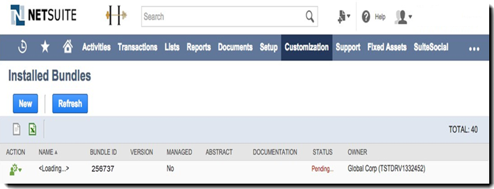
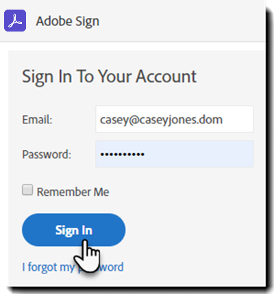
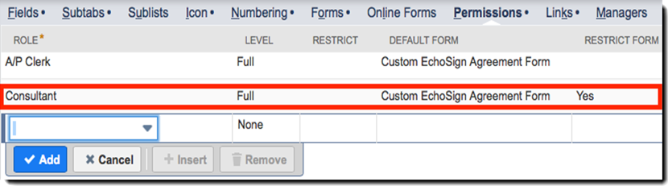
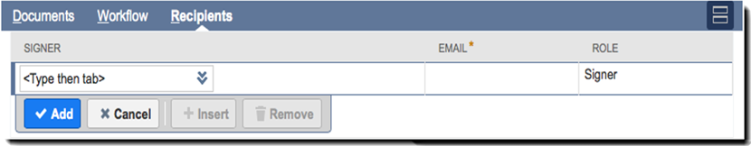

# [!DNL NetSuite] Installations- och anpassningsguide (v4.0.4) {#install-customize-NetSuite}

## Översikt {#overview}

Adobe Sign för [!DNL NetSuite] ger en komplett e-signaturintegrering med [!DNL NetSuite]. Du kan använda Adobe Sign för [!DNL NetSuite] integration för att skicka avtal som kontrakt, offerter och andra dokument som kräver elektroniska signaturer till mottagare direkt från [!DNL NetSuite]. Du kan skapa och skicka Adobe Sign-avtal från kunder, lead, offert och andra [!DNL NetSuite] register. Adobe Sign-uppdateringar [!DNL NetSuite] med status för avtal och lagrar avtalen med de associerade [!DNL NetSuite] poster när de har körts helt. Du kan visa historiken för alla avtal som skickats från [!DNL NetSuite] direkt i produkten.

Se [Versionsinformation för Adobe Sign för NetSuite](https://experienceleague.adobe.com/docs/sign-integrations/using/netsuite/release-notes.html?lang=en) för mer information.

## Installera paketet och konfigurera OAuth {#install}

Endast en [!DNL NetSuite] administratören kan installera eller uppdatera paketet. Om du vill konfigurera OAuth [!DNL NetSuite] måste ha administratörsåtkomst till Adobe Sign. Innan du installerar paketet i produktionskontot bör du installera och testa paketet i en [!DNL NetSuite] Sandlådekonto.

Se [Skapa ett Adobe Sign-avtal](#createagreement) för mer information om testning.

>[!CAUTION]
>
>Kunder som uppgraderar till v4.0.4 bör INTE ta bort sina befintliga API-nycklar.
>
>Se [Ange anpassade inställningar](#configure) för mer information om hur API-nyckeln används.

### Installera paketet för första gången

1. Gå till [!UICONTROL **Anpassning > SuiteBundler > Sök- och installationspaket**].

1. På *Sök efter och installera paket* sida, ange **Adobe Sign** som nyckelord och välj **[!UICONTROL Sök]**.

1. Välj **Adobe Sign** paketnamn.

   

1. På *[!UICONTROL Paketinformation]* sidan väljer du **[!UICONTROL Installera]**.
1. I dialogrutan *[!UICONTROL Installation av förhandsgranskningspaket]* sidan väljer du **[!UICONTROL Installera paketet]**.

   (Inget måste ändra något av standardvärdena på sidan)

   

1. I dialogrutan Installera som visas väljer du **[!UICONTROL OK]** att fortsätta.

   Under installationsprocessen visas paketets status som *[!UICONTROL Väntande]*.

   

1. Om du vill visa en uppdaterad status väljer du **[!UICONTROL Uppdatera]**.

   När paketinstallationen är klar *Adobe Sign för[!DNL NetSuite]* visas på *[!UICONTROL Installerade paket]* sidan.

   

1. Om du redan är Adobe Sign-kundkonto följer du stegen för att  [Konfigurera OAuth efter installation eller uppgradering](#oauth).

   Om du inte har något Adobe Sign-konto kan du [registrera dig för en Enterprise-testversion](https://esign.adobe.com/adobe-sign-netsuite-trial-registration.html) för att testa systemet. Aktivera ditt Adobe Sign-konto genom att följa registreringsstegen online.

## Konfigurera OAuth efter installation eller uppgradering {#oauth}

Adobe Sign använder OAuth 2.0 för att autentisera ditt Adobe Sign-konto inom [!DNL NetSuite].

Detta protokoll godkänner din installerade [!DNL NetSuite] paket för att kommunicera med Adobe Sign utan att begära ditt lösenord. Eftersom känslig information inte delas direkt mellan programmen är det mindre troligt att ditt konto utsätts för risker.

Den här autentiseringen påverkar inte implementeringen, men du måste göra en engångskonfiguration efter att ha installerat eller uppgraderat paketet i ditt konto för produktion eller sandlåda.

Den [!DNL NetSuite] administratör som konfigurerar OAuth måste också ha administratörsåtkomst på kontonivå till Adobe Sign.

1. I [!DNL NetSuite]navigerar du till *Adobe Sign Config* listsida.

1. Sök efter **[!UICONTROL Adobe Sign Config]** (en anpassad posttyp) med sökfältet i huvudet.

1. På sidan Sökresultat väljer du **Visa** för *Adobe Sign Config* post.

   

1. På sidan Adobe Sign Config List väljer du **[!UICONTROL Visa]** för *Använda OAuth för att komma åt Adobe Sign API:er* post.

   

1. På sidan Adobe Sign Config väljer du **[!UICONTROL Logga in med Adobe Sign]**

   

1. På inloggningssidan för Adobe Sign som visas anger du dina inloggningsuppgifter och väljer **[!UICONTROL Logga in]**.

   

1. På sidan Bekräfta åtkomst (för OAuth) som visas väljer du **[!UICONTROL Tillåt åtkomst]**

   

1. När auktoriseringen är klar omdirigeras du tillbaka till Adobe Sign konfigurationssida i [!DNL NetSuite]som visas nedan.

   

   >[!NOTE]
   >
   >När du konfigurerar OAuth i ditt sandlådekonto kan du stöta på felet &quot;Kunde inte fastställa kundens kompositions-ID&quot; när auktoriseringen har slutförts.
   >
   >
   >Om du vill fortsätta måste du ändra kontodomändelen av URL:en (system.netsuite.com) i webbläsaren så att den pekar tillbaka på [!DNL NetSuite] Sandlåda enligt följande:
   >
   >
   >Ändra:
   >
   >
   >system.netsuite.com/app/site/hosting/scriptlet.nl?script=745&amp;deploy=1&amp;web_access_point=https://echosign.com
   >
   >
   >Till:
   >
   >
   >systemet.**sandlådan.** netsuite.com/app/site/hosting/scriptlet.nl?script=745&amp;deploy=1&amp;web_access_point=https://echosign.com

## Uppdatera paketet (befintliga användare)

[!DNL NetSuite] buntuppdateringar släpps regelbundet av Adobe. Befintliga användare av Adobe Sign för [!DNL NetSuite] integreringen kan uppdateras till det senaste paketet.

>[!CAUTION]
>
>Kunder som uppgraderar till en nyare version bör INTE ta bort sin befintliga API-nyckel.
>
>Se [Ange anpassade inställningar](#configure) för mer information om hur API-nyckeln används.

### Förutsättningar {#prerequisites}

Den tid som krävs för att uppdatera till v4.0.4-paketet beror på antalet avtal som för närvarande har statusen Skickat för signatur. Vanligtvis tar det 7-10 minuter att uppdatera 100 avtal. Notera antalet poster för att uppskatta uppdateringstiden.

Så här fastställer du antalet avtal som skickats för signering:

1. Gå till **[!UICONTROL Anpassning > Listor, poster och filer > Posttyper]** och sedan leta upp *Adobe Sign-avtal.*

   Du kan också söka efter Adobe Sign-avtal i sökfältet.

1. För [!UICONTROL Adobe Sign-avtal] spela in, välj **[!UICONTROL Sök]**.

   

1. Från **[!UICONTROL Status]** listruta, välj **[!UICONTROL Skickat för signering]** och välj sedan **[!UICONTROL Skicka]**.

   

   Notera antalet poster för att uppskatta uppdateringstiden.

   

### Uppdatera paketet {#updating-the-bundle}

1. Gå till **[!UICONTROL Anpassning > SuiteBundler > Sök och installera > Lista]** och hitta ditt nuvarande paket, som visas nedan.

   >[!NOTE]
   >
   >Om det finns en ny version av paketet visas ett utropstecken till höger om *Version* numret på ditt nuvarande paket.

1. I listrutan Åtgärd väljer du **[!UICONTROL Uppdatera]**.

   

1. På sidan Preview Bundle Update väljer du **[!UICONTROL Uppdateringspaket]** utan att ändra något av de standardvärden som visas på sidan.

   Under installationen visas paketets status som *Väntande*.

   .

   >[!NOTE]
   >
   >När du uppdaterar paketet kan du få ett varningsmeddelande som visas nedan. Om du inte har anpassat [!DNL NetSuite] e-signaturposter kan du fortsätta. Om du är osäker bör du installera paketet på ett Sandbox-konto för att testa det innan du uppdaterar paketet på ett produktionskonto.

   

1. Om du vill visa en uppdaterad status väljer du **[!UICONTROL Uppdatera]**.

   

   >[!NOTE]
   >
   >Om uppdateringen tar lång tid på grund av flera avtal med en *Skickat för signering* status kan du kontrollera **[!UICONTROL Körningslogg]** underfliken för *Installation av Adobe Sign Bundle* skript för att bestämma uppdateringens förlopp. Se [Fastställa uppdateringsförloppet](#determineprogress) för mer information.

   När paketuppdateringen är klar *Adobe Sign för[!DNL NetSuite]* visas på *Installerade paket* sidan.

   

## Konfigurera paketet {#configure}

### Ange anpassade inställningar  {#set-custom-preferences}

Du kan använda anpassade inställningar för att ange hur avtal skapas och lagras i [!DNL NetSuite]. Dessutom bör *Etablera användare automatiskt i Adobe Sign* inställning kan du ange om [!DNL NetSuite] användare etableras automatiskt i Sign-tjänsterna när de skickar avtal från [!DNL NetSuite].

1. Gå till **[!UICONTROL Inställningar > Företag > Allmänna inställningar]**.
1. Bläddra nedåt på sidan och välj sedan **[!UICONTROL Anpassade inställningar]** underfliken.

   

1. Aktivera och konfigurera dina Adobe Sign-inställningar efter behov:

   * **Ange EchoSign API-nyckel för ditt konto**: Lägg inte till eller redigera något värde i det här fältet.
   * **Använd överordnad postkontakt som signerare**: Om det här alternativet är aktiverat används den överordnade postkontaktpersonens standard som den första signeraren när avtal skapas. Avsändaren kan enkelt ta bort eller redigera standardsigneraren eller lägga till ytterligare signerare i avtalet innan det skickas.
   * **Använd trans. Kontakta som signerare om det finns**: Den här inställningen gäller endast om *Använd överordnad postkontakt som signerare* inställningen är också aktiverad. Om det här alternativet är aktiverat, används den primära transaktionskontakten som första signerare när ett avtal genereras från en transaktionspost (till exempel offert). Se [Transaktionsposter](#transrecords) för mer information. Om det inte finns någon primär transaktionskontakt, eller om du skickar från [!DNL NetSuite] objektpost (t.ex. kundpost, partnerpost) är standardmottagaren den primära kontakten för kundens e-post. Avsändaren kan enkelt ta bort eller redigera standardsigneraren eller lägga till ytterligare signerare i avtalet innan det skickas.
   * **Tillåt att mottagare markeras som godkännare**: Om det här alternativet är aktiverat kan avsändare markera mottagare som godkännare. Mottagare som är markerade som godkännare kan granska och godkänna avtal, men de behöver inte signera dem. Godkännare kan behöva ange data i fält under godkännandeprocessen.
   * **ID för föredragen avtalsmapp**: Används för att ange mappen där de slutgiltiga signerade avtalen lagras. Om du inte anger ett värde för det här fältet sparas slutgiltiga signerade avtal som standard i samma mapp som den ursprungliga dokumentfilen. Mapp-ID måste vara ett nummer.
   * **Bifoga transaktion automatiskt PDF**: Om det här alternativet är aktiverat bifogas Transaction PDF automatiskt till avtal när nya avtal skapas från transaktionsposter.
   * **Lägg till signerad PDF som (bifogad fil eller länk)**: Om *Lista* Om du väljer det i listrutan läggs det signerade PDF till automatiskt som en länk till filen. Om *Bilaga* väljs i listrutan sparas det signerade PDF i [!DNL NetSuite] som en bilaga i avtalsposten.
   * **Inkludera granskningsspår i PDF med avtal**: Om det här alternativet är aktiverat bifogas granskningsspåret PDF automatiskt till avtalsposter efter att avtalen har signerats.
   * **Metoden för identitetsverifiering gäller för**: Om du aktiverar någon av metoderna för identitetsverifiering bestämmer du vem som ska använda identifieringsverifieringsmetoden. Alternativen är *Alla signerare, endast externa signerare* eller *Endast interna signerare*.

   **Metoder för identitetsverifiering** {#identity-verification-methods}

   Aktiverade metoder för identitetsverifiering kan väljas när ett avtal skapas. Adobe Sign Om mer än en metod för identitetsverifiering aktiveras här, visas en **[!UICONTROL Verifiera signeraridentitet]** alternativ.

   * **Aktivera lösenord krävs för signering**: Kräv att signerare anger ett engångslösenord som du anger.

   * **Aktivera kunskapsbaserad autentisering**: Kräv att signerare uppger namn, adress och valfritt de fyra sista siffrorna i sitt SSN och sedan besvarar en lista med frågor som verifierar den information som de tillhandahållit. Finns endast i USA.

   * **Aktivera autentisering av webbidentitet**: Kräv att signerare verifierar sin identitet genom att logga in på en av följande webbplatser: Facebook, Google, LinkedIn, Microsoft Live, Twitter eller Yahoo!.

   * **Etablera användare automatiskt i Adobe Sign**: Om det här alternativet är aktiverat kan användare som skickar avtal [!DNL NetSuite] automatiskt tilldelas ett Adobe Sign-användarkonto.

1. Välj **[!UICONTROL Spara]** för att spara inställningarna.

## Konfigurera automatiska statusuppdateringar {#asu}

Med Adobe Sign integreringspaket kan du automatiskt få uppdateringar i [!DNL NetSuite] om statusen för de avtal som har skickats från [!DNL NetSuite]. När den här funktionen är aktiverad [!DNL NetSuite] återspeglar alltid statusen för dina avtal. Du kan aktivera automatiska statusuppdateringar på följande sätt:

1. Gå till **[!UICONTROL Inställningar > Företag > Aktivera funktioner].**
1. Välj **[!UICONTROL SuiteCloud]** underfliken.
1. Aktivera följande alternativ:

   * Aktivera i avsnittet SuiteBuilder **[!UICONTROL Anpassade poster]** alternativ.

   * I avsnittet SuiteScript aktiverar du **[!UICONTROL Client SuiteScript]** och **[!UICONTROL Server SuiteScript]** för båda.

1. Välj **[!UICONTROL Spara]**.

   Alternativen anges så som visas på bilden.

   

## Objekt och posttyper {#objects}

Integreringspaketet för Adobe Sign visar redan avtalsobjektet för Adobe Sign med många [!DNL NetSuite] objekt, inklusive: Poster för kunder, uppskattningar, lead, affärsmöjligheter och partner. Du kan också använda Adobe Sign-paketet med andra posttyper, inklusive anpassade poster.

Avtalsfliken kan visas med två typer av [!DNL NetSuite] poster: Enhets- och transaktionsposter. Vi antar vanligtvis att en transaktionspost är en post (t.ex. offert) som kan konverteras till ett PDF-dokument; En Enhetspost kan inte konverteras till en PDF.

## Transaktionsposter {#transrecords}

Om avtalet skapas från en transaktionspost är det första dokumentet i avtalsposten postens PDF-version och den första mottagaren postens e-postadress. Om du inte vill att det första dokumentet ska vara en PDF-version av posten som det kommer från går du till **[!UICONTROL Inställningar > Företag > Allmänna inställningar > Underfliken Anpassade inställningar]** och inaktivera **[!UICONTROL Bifoga transaktion automatiskt PDF]** alternativ. Se [Ange anpassade inställningar](#configure) för mer information.

Under Anpassade inställningar kan du även aktivera **[!UICONTROL Använd trans. Kontakt som första signerare]** inställning om du vill att den primära transaktionskontakten ska läggas till automatiskt som den första signeraren. När den associeras med en transaktionspost visas **[!UICONTROL Avtal]** och **[!UICONTROL Send for Signature]** knappar.

## Enhetsposter {#entity-records}

Om avtalet skapas från en enhetspost är den första mottagaren e-postadressen från posten. När den associeras med en enhetspost visas bara fliken Avtal.

## Anpassa paketet {#customize}

Att anpassa paketet inkluderar följande:

* Distribuera skript för underfliken Avtal och Send for Signature för rätt posttyper.
* Ange rollbehörigheter för dina Adobe Sign-posttyper.
* Ändra behörigheter för att bevilja åtkomst till *Avtal* underfliken och *Send for Signature* -knappen.

### Konfigurera Adobe Sign-avtal för ytterligare posttyper  {#configuring-adobe-sign-agreements-for-additional-record-types}

För att driftsätta *Avtal* underfliken och *Send for Signature* knapp för lämpliga posttyper:

1. Gå till **[!UICONTROL Anpassning > Skript > Skript].**

1. På *Skript* listsidan som visas letar du reda på skriptet du måste distribuera och väljer sedan ****[!UICONTROL Visa]****.

   * Så här lägger du till *Send for Signature* knapp väljer du **[!UICONTROL Knappen Adobe Sign-offert]** skriptet.

   * Så här lägger du till *Avtal* -fliken väljer du **[!UICONTROL Avtalsinläsare för Adobe Sign]** skriptet.

1. På sidan Skript väljer du **[!UICONTROL Distribuera skript]**.

   

1. Gör följande på sidan Skriptdriftsättning:

   * Från *Gäller* väljer du typ av post.
   * Du kan även ange ett skriptdistributions-ID.

      Se *Skapa ett anpassat skriptdistributions-ID* i [!DNL NetSuite] Hjälpcenter för mer information. Om du inte anger ett ID genereras ett.

   * Kontrollera **[!UICONTROL Distribuerad]** -kryssrutan.

   

   * Uppsättning *Status* till **[!UICONTROL Frisläppt]**.

      Du måste inte ange en *Händelsetyp* eller *Loggnivå*.

   * Från [!UICONTROL *Kör som roll]* väljer du **[!UICONTROL Kör som administratör]**.

   * Med **[!UICONTROL Målgrupp]** underfliken aktiv (aktiv som standard) väljer du de specifika roller eller användare som du vill ge åtkomst till. Om du vill ge åtkomst till alla roller och användare aktiverar du respektive **[!UICONTROL Markera alla]** alternativ.

   * Välj **[!UICONTROL Spara]**. När ändringsbekräftelsen visas väljer du **[!UICONTROL Gå tillbaka]**.

1. markera **[!UICONTROL Lista]** längst upp på sidan Skriptdriftsättning för att komma tillbaka till *Skript* listsida.
1. Upprepa steg 2 och 3 ovan för det andra skriptet.

## Ange rollbehörigheter för Adobe Sign-posttyper {#setting-role-permissions-for-adobe-sign-record-types}

Mest [!DNL NetSuite] -roller måste ha behörighet att använda Adobe Sign utan ytterligare anpassning. Du kan dock behöva bevilja behörigheter för alla ytterligare anpassade roller som har skapats.

1. Gå till **[!UICONTROL Anpassning > Listor, poster och filer > Posttyper]**.

   

   >[!NOTE]
   >
   >Om du inte ser *Posttyper* objekt, navigera till **[!UICONTROL Inställningar > Företag > Aktivera funktioner > fliken Suite Cloud]** och möjliggöra *Anpassade poster* alternativ.

1. På *Posttyper* sidan väljer du **[!UICONTROL Adobe Sign-avtal]** för att välja den

   

1. På *Anpassad posttyp* sidan väljer du **[!UICONTROL Använd behörighetslista]** från *Åtkomsttyp* listruta.

   

   >[!NOTE]
   >
   >Den *Adobe Sign-avtal* posttypen är den enda posttypen i Adobe Sign som kräver *Använder behörighetslista* åtkomsttyp.
   >
   >
   >Se steg 6 för anvisningar om hur du anger åtkomsttypen för de andra Adobe Sign-posttyperna.

1. Välj **[!UICONTROL Behörigheter]** underfliken.

   Listan med roller och behörigheter visas.

   

1. Ange behörigheter enligt följande för de ytterligare anpassade roller som läggs till i &quot;[!UICONTROL Adobe Sign-avtal]&quot; posttyp.

   >[!NOTE]
   >
   >Se *[Konfigurera en behörighetslista för en anpassad posttyp](https://system.netsuite.com/app/help/helpcenter.nl?fid=section_N2879931.html)* för mer information

   1. Välj rollen från *Roll* lista.
   1. Uppsättning *Nivå* till **[!UICONTROL Fullständig]**.
   1. Uppsättning *Standardformulär* till **[!UICONTROL Anpassat formulär för EchoSign-avtal]**.
   1. Välj **[!UICONTROL Begränsa formulär]** -kryssrutan.
   1. Välj **[!UICONTROL Lägg till]** för att spara ändringarna för rollraden.

   

   Den nya raden visas enligt nedan:

   

   Upprepa stegen a till e ovan för alla ytterligare anpassade roller.

   * markera **[!UICONTROL Spara]** om *Anpassad posttyp* när behörigheter för alla roller har angetts.
   Den *[!UICONTROL Kundposttyp]* sidan visas igen.

1. Upprepa steg 1 till 3 ovan för att ställa in *Åtkomsttyp* för alla andra Adobe Sign-posttyper till

   **[!UICONTROL Ingen behörighet krävs].** Detta gäller följande posttyper:

   * Adobe Sign Config
   * Adobe Sign-dokument
   * Adobe Sign-händelse
   * Adobe Sign-språk
   * Adobe Sign-skriptfel
   * Signerat Adobe Sign-avtal
   * Adobe Sign-signerare

### Bevilja åtkomst till avtalsfliken och Send for Signature  {#granting-access-to-the-agreement-tab-and-send-for-signature-button}

Integreringspaketet för Adobe Sign visar redan avtalsobjektet för Adobe Sign med många [!DNL NetSuite] objekt (kund, uppskattning [Offert], bly med mera). Den *Avtal* underfliken aktiveras automatiskt för följande typer av objekt: Kund, lead, affärsmöjlighet, partner, potentiell kund, offert och leverantörsfaktura.

Den *[!UICONTROL Send for Signature]* knappen aktiveras automatiskt **o[!UICONTROL Endast för objektet Offert]**.

[!DNL NetSuite] kan administratörer utöka möjligheten att skapa avtal för ytterligare CRM-objekt genom att ändra behörigheterna för att lägga till *Avtal* underflik, *Send for Signature* eller båda till dessa objekt.

#### Ändra behörigheter för att bevilja åtkomst till knappen Send for Signature  {#modifying-permissions-to-grant-access-to-the-send-for-signature-button}

1. Gå till **[!UICONTROL Anpassning > Skript > Skript]**.

   Den *Skript* listsidan visas.

   * Om det behövs använder du filtren för att hitta Adobe Sign-skripten

1. På *Skript* sidan letar du reda på *Knappen Adobe Sign-offert* skript (styr *Send for Signature* -knappen) och väljer sedan **Visa**.

   

1. På *Skript* gör du så här:

   * välj **[!UICONTROL Driftsättningar]** underflik

   * Under &quot;*Gäller*&quot; välj länken till entiteten som du vill ändra.

      * **[!UICONTROL Offert]** i det här exemplet

   

   * välj **[!UICONTROL Redigera]** knappen på *Skriptdriftsättning* sida

   

   * Med **[!UICONTROL Målgrupp]** underfliken är aktiv väljer du de specifika roller eller användare som du vill ge åtkomst till.

      * Om du vill ge åtkomst till alla roller och användare aktiverar du respektive **[!UICONTROL Markera alla]** alternativ
   * markera **[!UICONTROL Spara]**

   

#### Ändra behörigheter för att bevilja åtkomst till fliken Avtal  {#modifying-permissions-to-grant-access-to-the-agreements-tab}

1. Gå till **[!UICONTROL Anpassning > Skript > Skript]**
1. På [!UICONTROL Skript] sidan letar du reda på *[!UICONTROL Avtalsinläsare för Adobe Sign]* skript (styr *Fliken Avtal*) och välj sedan **[!UICONTROL Visa]**.
1. På *Skript* gör du så här:

   1. Välj **[!UICONTROL Driftsättningar]** underflik
   1. Under &quot;*[!UICONTROL Gäller]*&quot; välj länken till entiteten som du vill ändra åtkomst för
   1. På *[!UICONTROL Skriptdriftsättning]* väljer du **[!UICONTROL Redigera]** knapp
   1. Med **[!UICONTROL Målgrupp]** underfliken är aktiv (den är aktiv som standard) och väljer de specifika roller eller användare som du vill ge åtkomst till. Om du vill ge åtkomst till alla roller och användare aktiverar du respektive **[!UICONTROL Markera alla]** alternativ
   1. markera **[!UICONTROL Spara]**

## Använda Adobe Sign för [!DNL NetSuite] bunt

För att skicka avtal från [!DNL NetSuite] och får uppdateringar till dessa avtal, måste användarna ha samma inloggnings-ID (e-postadress) i [!DNL NetSuite] och i Adobe Sign.

### Skapa ett Adobe Sign-avtal

När du har installerat ett nytt paket på ett Sandbox- eller Production-konto bör du testa paketet genom att skapa ett nytt avtal. Du kan skapa Adobe Sign-avtal från en enhetspost, från en transaktionspost eller som ett fristående avtal.

>[!NOTE]
>
>Processen för att skapa ett avtal skiljer sig åt något beroende på hur det skapas. Den allmänna processen består i att ange alternativ för avtalet, lägga till ett eller flera avtalsdokument och ange mottagarna. Den process som beskrivs nedan förutsätter att du skapar avtalet från en kundpost.

1. Välj eller skapa en kundpost som du vill skicka ett avtal från, eller så kan du välja en annan [!DNL NetSuite] posttyp som har fliken Avtal aktiverad.

1. Välj posten **[!UICONTROL Avtal]** underfliken.
1. Välj **[!UICONTROL Nytt avtal]**.

   

1. På *[!UICONTROL Adobe Sign-avtal]* sidan väljer du **[!UICONTROL Redigera]**.

   

1. Ange alternativen för avtalet enligt följande:

   * **Avtalsnamn** — Ange ett namn på avtalet.
   * **Meddelande**-Ange ett anpassat meddelande för mottagaren.
   * **Signaturtyp** — Välj den typ av signatur som accepteras för dokumentet. Alternativen är *e-signatur* och *Faxsignatur*.

   * **Jag måste också underteckna detta avtal** — Aktivera det här alternativet om du vill ange att avsändaren även måste signera avtalet.
   * **Signaturordning**-Om *Jag måste också underteckna detta avtal* Om alternativet är aktiverat väljer du i vilken ordning avsändare och mottagare ska signera. Alternativen är &quot;Jag signerar, sedan signerar mottagarna&quot;, &quot;Mottagarna signerar, sedan signerar jag&quot; och &quot;Ingen&quot;.

   * **Förhandsvisa dokument eller placera signaturer (eller formulärfält)** — Aktivera det här alternativet om du vill tillåta avsändare att förhandsgranska avtalet och tillåta dem att lägga till fält (dra och släpp signaturer, initialfält och andra formulärfält) i avtalet innan det skickas till mottagarna.
   * **Verifiera signeraridentitet** — Aktivera det här alternativet och välj sedan något av följande alternativ för identitetsverifiering

      * Det här alternativet visas bara när mer än en av de tre verifieringsmetoderna för signeraridentitet nedan är aktiverat i Anpassade inställningar. (Se [Ange anpassade inställningar](#customize) för mer information.) Om bara en inställning är aktiverad väljer du **[!UICONTROL Verifiera signeraridentitet]** visas inte.

   **Metoder för identitetsverifiering**

   * **Lösenord krävs för att signera** — Kräv att signerare anger ett engångslösenord som du anger.
   * **Kunskapsbaserad autentisering** — Kräv att signerare uppger namn, adress och valfritt de fyra sista siffrorna i sitt SSN och sedan besvarar en lista med frågor som verifierar den information som de tillhandahållit. Finns endast i USA.
   * **Autentisering av webbidentitet** — Kräv att signerare verifierar sin identitet genom att logga in på en av följande webbplatser: Facebook, Google, LinkedIn, Twitter, Yahoo! eller Microsoft Live.
   * **Lösenord krävs för att visa PDF** — Aktivera det här alternativet om du vill kräva att en mottagare anger ett lösenord innan ett PDF i avtalet eller det signerade avtalet öppnas. PDF-filen som skickas till alla är krypterad och måste ha ett lösenord för att kunna öppna den. Tappa inte bort lösenordet eftersom det inte går att återställa. Om du förlorar lösenordet måste du ta bort transaktionen och börja om.
   * **Lösenord/bekräfta lösenord** — Om *Lösenord krävs för att visa PDF* Om alternativet är aktiverat anger du det lösenord som ska användas för att visa avtalet.
   * **Påminn mottagare att signera** — Ange om och hur ofta påminnelser skickas till mottagare. Alternativen är *Aldrig*, *Dagligen* eller *Veckovis*.
   * **Språk:** Ange vilket språk signeringssidan och e-postmeddelanden ska visas för mottagarna.
   * **Värdsignering för den första signeraren** — Aktivera det här alternativet om du vill tillåta att avsändaren signerar den första signeraren personligen.
   * **Dagar till signeringsdeadline** — Ange ett heltal för att ange avtalets signeringsdeadline (dagens datum + antal dagar).
   * **Överordnad post** — Du kan också markera en överordnad post för att länka den till avtalet.

   

1. Välj **[!UICONTROL Dokument]** -fliken.

   

1. På *Dokument* underfliken, bifoga ett befintligt dokument från filskåpet med hjälp av *Adobe Sign-dokument* och välj sedan **[!UICONTROL Bifoga]**.

   Eller klicka på **[!UICONTROL Nytt Adobe Sign-dokument]** för att få tillgång till *[!UICONTROL Adobe Sign-dokument]* och skriver sedan namnet på ett dokument i [!DNL NetSuite] kan du välja filer från din transaktionspost (om tillämpligt) eller bifoga ett nytt dokument.

   Du kan lägga till flera dokument i ett avtal.

1. Välj **[!UICONTROL Mottagare]** underfliken och ange mottagare genom att antingen välja från kontaktlistan eller skriva en e-postadress.

   

   Var och en av dina mottagare kan markeras som signerare eller CC. Om *Tillåt att mottagare markeras som godkännare eller signerare* anpassade inställningar är aktiverade, mottagare kan också markeras som godkännare. Se [Ange anpassade inställningar](#customize) för mer information.

   * **Signerare** måste signera avtalet.
   * **Godkännare** måste godkänna, men inte signera, avtalet och kan valfritt lägga till data i ett avtal.
   * **Kopiemottagare** får meddelande om avtalsuppdateringar och när avtalet har signerats och slutförts. CC-mottagare är inte part i signatur- eller godkännandeprocessen.

      Om *Använd överordnad postkontakt som signerare* anpassade inställningar aktiveras fristående eller i samband med *Använd trans. Kontakta som signerare* standardinställningen används den första mottagaren, men den kan ändras.

1. Välj **[!UICONTROL Lägg till]** efter att du angett varje mottagare.

1. Välj **[!UICONTROL Spara]** för att spara avtalet.

### Skicka avtal för signering

När avtalet är klart att skickas väljer du **[!UICONTROL Send for Signature]** -knappen.

* Om *Förhandsgranska dokument eller placera signaturer* är aktiverat klickar du på **[!UICONTROL Send for Signature]**. Förhandsgranska dokumentet i fönstret som öppnas eller dra formulärfälten till dokumentet innan det skickas. Välj **[!UICONTROL Skicka]** för att skicka avtalet till mottagaren.

* Om *[!UICONTROL Värdsignering för första signerare]* är aktiverat klickar du på **[!UICONTROL Send for Signature]**. I fönstret som öppnas låter du signeraren signera dokumentet med avsändaren närvarande.

   A *Värdsignering för aktuell signerare* visas även bredvid *Värdsignering för första signerare* som kan användas tills dokumentet har signerats. Använd den här länken om du vill vara värd för avtalssignering för flera signerare, eller öppna popup-fönstret igen om det stängdes av misstag.

När avtalet har skickats får mottagarna ett e-postmeddelande som informerar dem om dokumenten som väntar på att signeras.

När mottagarna har signerat dokumentet får avsändaren ett meddelande via e-post om att dokumentet har signerats.

#### Skicka från en offert

Adobe Sign är direkt integrerat med Quotes i [!DNL NetSuite] så att en PDF av offerten automatiskt genereras och bifogas till avtalsposten.

När du visar en offert väljer du **[!UICONTROL Send for Signature]**. Det genererar och visar offerten som är kopplad till avtalet. Du kan också lägga till *Send for Signature* till andra transaktionsposttyper. Se [Objekt och posttyper](#objects) för mer information.

### Spåra status och skicka påminnelser

När du har skickat ett avtal:

* Dokumentstatusen ändras till *Skickat för signering* i avsnittet Avtalsinformation
* Den *Send for Signature* -knappen ersätts med följande tre knappar:

   * **Uppdateringsstatus** — Uppdatera statusen manuellt om statusuppdateringarna inte har konfigurerats. Se [Konfigurera automatiska statusuppdateringar](#asu) för mer information.
   * **Skicka påminnelse** — Skicka en påminnelse till den aktuella signeraren.
   * **Avbryt avtal** — Avbryta ett avtal. Ett avtal kan avbrytas efter att det har skickats för en signatur om alla mottagare ännu inte har signerat.

En ny *Händelser* underfliken visas i avtalsposten där du kan spåra avtalets status.

Du kan se en historik över avtalshändelserna, som innehåller information om när avtalet skickades, visades och signerades.

När avtalet har signerats:

* Dess status ändras till *Signerat*.
* Du kan använda länken för att länka tillbaka till den överordnade posten för det här avtalet.
* Du kan använda hämtningslänkarna under Signerat dokument och Granskningsspår för att komma åt dessa dokument.
* Ytterligare *Signerat dokument* underfliken visas för att visa miniatyrer av det signerade dokumentet.

>[!NOTE]
>
>När ett avtal har skickats för signering kan du inte redigera posten. Detta för att bevara händelseregistret.

## Avinstallera paketet

Följ stegen i [!DNL NetSuite] Hjälp. Se *[Avinstallera ett paket](https://docs.oracle.com/en/cloud/saas/netsuite/ns-online-help/section_N3400972.html)* i [!DNL NetSuite] Hjälpcenter för mer information.

När du avinstallerar paketet tas de osignerade avtalen bort. De signerade avtalen och motsvarande gransknings-PDF-filer påverkas inte.

Avinstallera INTE paketet om du måste behålla dina osignerade avtal.

## Felsökning

### Fastställ uppdateringsförloppet  {#determineprogress}

Om uppdateringen verkar ta längre tid än kan du kontrollera underfliken Körningslogg för installationsskriptet för Adobe Sign Bundle för att se hur det går med uppdateringen på följande sätt:

1. Gå till **[!UICONTROL Anpassning > Skript > Skript]**.
1. På [!UICONTROL Skript] sidan letar du reda på *[!UICONTROL Installation av Adobe Sign Bundle]* skriptet och välj sedan **[!UICONTROL Redigera]**.
1. På [!UICONTROL Skript] väljer du **Körningslogg** underfliken.
1. markera **Uppdatera**.

   Körningsloggen uppdateras för att visa status. Den *Information* -kolumnen visar förloppet för uppdateringarna av dina avtal.

   

### Lös problem med åtkomsttoken

Du kan få meddelandet &quot;Åtkomsttoken som har angetts är ogiltig eller har upphört&quot; när du interagerar med avtal.

Detta kan inträffa av följande orsaker:

* Den [!DNL NetSuite]/Adobe Sign-administratör som konfigurerade OAuth har återkallat åtkomsttoken
* Åtkomsttoken har upphört att gälla eftersom inga avtal har skickats från [!DNL NetSuite] under de senaste 60 dagarna
* Den [!DNL NetSuite]/Adobe Sign administrator har inte slutfört den initiala OAuth-konfigurationen

Lös problemet genom att köra OAuth-konfigurationsprocessen igen. Se [Konfigurera OAuth efter installation eller uppgradering](#oauth) för mer information.

### Lös problem med dokumentstatus {#resolvestatus}

Om [automatiska statusuppdateringar](#asu) är konfigurerade men avtalsstatusen uppdateras inte efter att avtal har skickats, prova följande:

1. Kontrollera körningsloggen för distribution för *Extern Adobe Sign-uppdatering* skripta för att se om du får samtal från Adobe Sign enligt följande:

   1. Gå till **[!UICONTROL Anpassning > Skript > Skriptdriftsättning]**
   1. På *Skriptdistributioner* sidan letar du reda på *Extern Adobe Sign-uppdatering* skriptet och välj sedan **[!UICONTROL Redigera]**
      1. På *[!UICONTROL Skriptdriftsättning]* väljer du **[!UICONTROL Körningslogg]** underfliken.
      * Du bör se en *Uppdaterad avtalspost* post för varje avtals-ID

1. Kontrollera körningsloggen för distribution för *Adobe Sign Update Agreements* skripta för att se om det finns några fel enligt följande:

   1. Gå till **[!UICONTROL Anpassning > Skript > Skriptdriftsättning]**.
   1. På [!UICONTROL Skriptdistributioner] sidan letar du reda på *[!UICONTROL Adobe Sign Update Agreements]* skriptet med[!UICONTROL Schemalagd]&quot; och välj sedan **[!UICONTROL Redigera]**.
   1. På [!UICONTROL Skriptdriftsättning] väljer du **[!UICONTROL Körningslogg]** underfliken.
   1. Under [!UICONTROL Text]väljer du **[!UICONTROL Fel]** för att filtrera resultaten.

1. Kontrollera slutligen körningsloggen för *Adobe Sign Manager* skripta för fel genom att följa instruktionerna i steg 2 ovan.

### Lös MIME-typfel  {#resolving-mime-type-errors}

Om du får ett MIME-typfel när du skickar ett avtal kan det bero på att namnet i fältet Filnamn inte matchar filnamnet och tillägget för den överförda filen. Om du lämnar fältet Filnamn tomt fylls det automatiskt i med rätt filnamn och filnamnstillägg.

### Visa skriptloggar {#viewing-script-logs}

Du kan även visa körningsloggar för distribution för skript som inte är relaterade till dokumentstatusproblem. Se [Lösa problem med dokumentstatus](#resolvestatus) för mer information.

1. Gå till **[!UICONTROL Anpassning > Skript > Skript]**.

   Den *Skript* listsidan visas. Om det behövs använder du filtren för att hitta rätt skript.

1. Välj **[!UICONTROL Visa]** för motsvarande skript.

1. Välj **[!UICONTROL Körningslogg]** underfliken på sidan för att visa skriptloggen.

## Support {#support}

Gå till [Adobe Sign supportportal](https://adobe.com/go/adobesign-support-center_se) få åtkomst till vanliga frågor, dokumentation och artiklar i kunskapsbasen eller kontakta Adobe Support.
