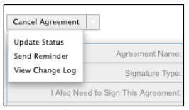

# [!DNL SugarCRM] Installationshandbok {#sugarcrm-install-guide}

[Kontakta kundtjänst](https://adobe.com/go/adobesign-support-center_se)

Adobe [!DNL EchoSign] för [!DNL SugarCRM] är en ledande lösning för e-signaturer och webbkontrakt som levererar automatiserad elektronisk signatur i [!DNL SugarCRM] för e-signaturer och faxsignaturer. Användare kan direkt skicka kontrakt från SugarCRM, visa kontraktshistorik och spara e-signerade kontrakt med tillhörande konton, kontakter, offerter och mer.
Adobe [!DNL EchoSign] för [!DNL SugarCRM] finns för alla versioner av SugarCRM som stöds, inklusive 6.3 - 6.7 för on-demand- eller on-premise-lösningar.

Det här dokumentet är en handbok för [!DNL SugarCRM] för att lära sig hur man installerar och konfigurerar Adobe [!DNL EchoSign] för [!DNL SugarCRM] plugin.

## Installera det här plugin-programmet {#install-plugin}

1. Hämta Adobe [!DNL EchoSign] för [!DNL SugarCRM]  arkivera filen från [SugarExchange](http://www.sugarexchange.com/product_details.php?product=1123).
1. Logga in på [!DNL SugarCRM] med ditt administratörskonto.
1. Gå till **[!UICONTROL Administration]** > **[!UICONTROL Modulinläsare]**.

   

1. Så här överför du arkivfilen för Adobe [!DNL EchoSign] för [!DNL SugarCRM] plugin, välj **[!UICONTROL Bläddra]**, markera arkivfilen och välj sedan **[!UICONTROL Överföra]**.
1. När arkivfilen har överförts väljer du **[!UICONTROL Installera]** för att påbörja installationen.
1. Granska villkoren och välj sedan **[!UICONTROL Acceptera]** > **[!UICONTROL Genomför]**.
1. Om plugin-programmet installeras utan problem visar förloppsindikatorn 100 % att det lyckades.  Om förloppsindikatorn inte når 100 % väljer du **[!UICONTROL Visningslogg]** för att se felet som SugarCRM har stött på.

   

1. Efter installationen går du till **[!UICONTROL Administration > Reparera]** och Välj **[!UICONTROL Snabbreparation och återskapande]**.

>[!NOTE]
>
>Om du installerar plugin-programmet på [!DNL SugarCRM] OnDemand, skapa ett supportärende med [!DNL SugarCRM] om du tillfälligt vill ta bort begränsningarna i paketkontrollen för OnDemand så att paketet kan installeras. Detta är en del av standardprocessen.

## Uppgradera plugin-programmet {#upgrade-plugin}

Om du uppdaterar Adobe [!DNL EchoSign] för [!DNL SugarCRM] till en nyare version bör du installera tillägget utan att avinstallera den tidigare versionen.
När du har uppgraderat plugin-programmet går du till **[!UICONTROL Administration]** > **[!UICONTROL Reparera]** och välja **[!UICONTROL Snabbreparation och återskapande]**.

**Obs!** Om du avinstallerar ett tidigare plugin-program ska du inte ta bort tabellerna under avinstallationen. Annars kan du förlora [!DNL EchoSign] avtalsdata.

## Konfigurera plugin-programmet {#configure-plugin}

1. Om du redan är Adobe [!DNL EchoSign] Fortsätt till steg 2.

   Om du inte har ett [!DNL EchoSign] konto, [registrera dig för en kostnadsfri 14-dagars testversion](https://sugarcrmintegration.echosign.com/public/login) och följ registreringsstegen online för att aktivera Adobe [!DNL EchoSign] konto.
1. Logga in på [Echo Sign-konto](http://www.echosign.com) och gör så här:
   1. Välj **[!UICONTROL Konto]** -fliken.
   1. Välj **[!UICONTROL EchoSign API]** nere till vänster.
   1. Välj **[!UICONTROL Aktivera API-åtkomst]** och hämta API-nyckeln från sidan.

   

1. I SugarCRM går du till **[!UICONTROL Administration]** > **[!UICONTROL Inställningar för Adobe EchoSign]** och ange API-nyckeln i fältet med etiketten **[!UICONTROL EchoSign API-nyckel]**.
1. Om du vill kan du konfigurera plugin-programmet med följande inställningar:

   1. Bifoga PDF automatiskt när du skapar ett avtal från en offert: Ange om en PDF av offerten ska kopplas automatiskt om en [!DNL SugarCRM] användaren skapar ett EchoSign-avtal från modulen Offerter.
   1. Hantera mottagarlista: Välj vilka moduler som ska visas på underpanelen Mottagare i [!DNL EchoSign] Modulen Avtal. Detta lägger också till [!DNL EchoSign] Underpanelen Avtal till dessa moduler.
   1. Lägg till sändningsknapparna i dessa moduler: Välj om du vill skapa [!DNL EchoSign] Avtalsknapp/åtgärd som ska inkluderas med primära åtgärder i modulen Offert.
   1. Välj **[!UICONTROL Spara]** för att lagra dina inställningar.

**Obs!** Adobe [!DNL EchoSign] för [!DNL SugarCRM] plugin-programmet kräver [PHP SOAP-tillägg](http://www.php.net/manual/en/book.soap.php). Om du vill aktivera SOAP-stöd konfigurerar du PHP med enable-soap.

## Hämta avtalsuppdateringar (för [!DNL SugarCRM] version 6.3 eller senare) {#get-agreement-updates}

För version 6.3 och senare kan du använda följande två alternativ för att hämta avtalsuppdateringar. I tidigare versioner av SugarCRM erbjuder plugin-programmet som standard bara återanropsmetoden (alternativ 1).

### Alternativ 1: Ställ in återanropsmetoden för överföring av uppdateringar till EchoSign

Om webbplatsen är offentlig kan du låta Adobe EchoSign pinga [!DNL SugarCRM] när en ny händelse inträffar. [!DNL SugarCRM] uppdaterar sedan avtalsstatus, händelser och hämtar det signerade dokumentet (om det är signerat) automatiskt och i realtid. (Om du är bakom en brandvägg måste du vitlista [!DNL EchoSign] server-IP-adresser eller använd metoden för schemalagda jobb för att uppdatera EchoSign-avtal som beskrivs i nästa avsnitt i den här guiden).

1. Gå till **[!UICONTROL Administration]** > **[!UICONTROL Inställningar för Adobe EchoSign]**.
1. Markera kryssrutan **[!UICONTROL Använd återanropsmetoden EchoSign]** för att uppdatera avtalshändelser och avtalsstatus.
1. Välj **[!UICONTROL Spara]**.

### Alternativ 2: Konfigurera ett schemalagt jobb för [!DNL SugarCRM] Instanser bakom en brandvägg

Den [!DNL EchoSign] för [!DNL SugarCRM] plugin-programmet kan också använda ett schemalagt jobb för att fråga [!DNL EchoSign] för uppdateringar av avtal som skickats för signering. Metoden för schemalagd jobbfråga kan användas om du har en lokal [!DNL SugarCRM] installationen sker bakom en brandvägg.

Så här konfigurerar du:

1. Gå till **[!UICONTROL Administration]** > **[!UICONTROL Schemaläggare]**.
1. I listrutan flik väljer du **[!UICONTROL Skapa schemaläggare]**.
1. Ange ett jobbnamn.
1. För fältet Jobb väljer du **[!UICONTROL Adobe EchoSign statusuppdaterare]**.
1. Ställ in att jobbet ska köras så ofta som behövs. Vi föreslår att du ställer in det så att det körs var 10:e minut, vilket innebär att efter att ett avtal har öppnats, lästs eller undertecknats kan det ta upp till 10 minuter för [!DNL SugarCRM] uppdateras med denna information.

   **Obs!** Om du har skickat ut många avtal för signering kan systemet bli långsammare om det körs för ofta.

   

1. Gå till **[!UICONTROL Administration]** > **[!UICONTROL Inställningar för Adobe EchoSign]**.
1. Avmarkera rutan **[!UICONTROL Använd återanropsmetoden EchoSign]** för att uppdatera avtalshändelser och avtalsstatus.
1. Välj **[!UICONTROL Spara]**.
Obs! Aktivera schemaläggare i [!DNL SugarCRM] för att detta ska fungera.

Så här lägger du till EchoSign-avtal i andra [!DNL SugarCRM] moduler:

1. Gå till **[!UICONTROL Administration]** > **[!UICONTROL Studio]**.
1. I det vänstra kolumnmappsträdet väljer du modul för att lägga till [!DNL EchoSign] Avtal.
1. Välj **[!UICONTROL Relationer]**> **[!UICONTROL Lägg till relationer]**.
1. I listrutan väljer du Skriv som **[!UICONTROL En till många]** och modul som **[!UICONTROL EchoSign-avtal]**.
1. Välj **[!UICONTROL Spara och distribuera]**.

   

   [!DNL EchoSign] Avtal visas nu i modulen och avtal kan skapas och spåras där.

   

**Andra konfigurationssteg**

* **Dölj [!DNL EchoSign] Moduler**: Du kan dölja [!DNL EchoSign] Mottagare och [!DNL EchoSign] Händelsemoduler genom att gå till Administration&quot; Visa modulflikar och underpaneler och flytta dem till den dolda kolumnen.
* **Inaktiverar packageScan**: Om du har aktiverat packageScan på ditt eget system måste du inaktivera det under installationen. Om du använder [!DNL SugarCRM] On-Demand, kontakta [!DNL SugarCRM] support för att inaktivera packageScan åt dig.

## Avinstallera tillägget {#uninstall-plugin}

1. Logga in på [!DNL SugarCRM] med ditt administratörskonto.
1. Gå till **[!UICONTROL Administration]** > **[!UICONTROL Modulinläsare]**.
1. Välj **[!UICONTROL Avinstallera]** bredvid [!UICONTROL Plugin-programmet EchoSign för SugarCRM].
1. Välj **[!UICONTROL Genomför]** för att påbörja avinstallationen. Du kan också välja att ta bort databastabeller som skapats för plugin-programmet.

   

   Om plugin-programmet avinstalleras utan problem visas förloppsindikatorn som en 100-procentig framgång. Om förloppsindikatorn inte når 100 % väljer du [!UICONTROL Visningslogg] för att se felet som SugarCRM har stött på.

   

## Använd Adobe [!DNL EchoSign] för [!DNL SugarCRM] {#use-echosign-for-sugarcrm}

Du kan skapa en Adobe [!DNL EchoSign] avtal som är associerat med ett konto, en kontakt, en offert eller något annat [!DNL SugarCRM] moduler. Du kan bifoga filer, ange mottagare och skicka för signering. Adobe [!DNL EchoSign] uppdateringar [!DNL SugarCRM] med avtalets aktuella status och lagrar det signerade kontraktet i [!DNL SugarCRM] när det är helt genomfört.

### Skapa och redigera en Adobe [!DNL EchoSign] överenskommelse {#create-edit-agreements}

Du kan skapa avtal via [!DNL EchoSign] Modulen Avtal eller moduler som konfigurerats av en [!DNL SugarCRM] administratör.

1. Från [!UICONTROL Funktionsmakron] på [!UICONTROL EchoSign-avtal] -fliken väljer du **[!UICONTROL Skapa EchoSign-avtal]**.
1. I huvudavsnittet i [!DNL EchoSign] Avtal, ange följande information eller välj mellan olika avtalsalternativ:

   1. **[!UICONTROL Namn:]** Ange ett namn på avtalet.
   1. **[!UICONTROL Signaturtyp:]** Välj den typ av signatur som accepteras för dokumentet. Alternativen är e-signatur och faxsignatur.
   1. **[!UICONTROL Jag måste också signera det här avtalet:]** Ange om avsändaren också måste signera avtalet.
   1. **[!UICONTROL Signaturordning:]** Om det föregående alternativet Jag behöver också signera det här avtalet är markerat väljer du också i vilken ordning avsändare och mottagare ska signera.
   1. **[!UICONTROL Påminn mottagare att signera:]** Välj hur ofta du vill påminna en mottagare om att signera ett dokument. Alternativen är Varje dag eller Varje vecka.
   1. **[!UICONTROL Dagar till signeringsdeadline:]** Ange antalet dagar innan avtalet måste signeras.
   1. **[!UICONTROL Förhandsgranska, placera signaturer eller lägg till formulärfält:]**  Välj det här alternativet om du vill förhandsgranska avtalet innan det skickas, eller dra och släpp signaturfält, initialfält eller andra formulärfält på avtalet innan det skickas till mottagarna. Kom ihåg att markera knappen Skicka för att skicka avtalet till mottagaren när du har förhandsgranskat dokumentet eller dragit fälten till dokumentet.
   1. **[!UICONTROL Värdsignering för den första signeraren:]** Ange om avsändaren vill vara värd för avtalet som signeras personligen.
      * **[!UICONTROL Meddelande:]** Inkludera ett meddelande till mottagaren.
      * **[!UICONTROL Konto, säljprojekt, offert:]** Välj eller ändra kontot, affärsmöjligheten eller offerten som är kopplad till det här avtalet.
      * **[!UICONTROL Språk:]** Ange vilket språk signeringssidan och e-postmeddelanden ska visas för mottagarna.

      

1. I dialogrutan [!UICONTROL Säkerhetsalternativ] den del av [!UICONTROL EchoSign-avtal], ange följande information:

   a) **[!UICONTROL Lösenord krävs för att signera:]** Ange om ett lösenord måste anges innan en mottagare kan signera ett dokument.
b) **[!UICONTROL Lösenord krävs för att öppna:]** Ange om ett lösenord måste anges innan en mottagare kan öppna en PDF i avtalet eller det signerade avtalet (c) **[!UICONTROL Lösenord:]** Ange det lösenord som ska användas för att signera eller öppna ett dokument.
d) **[!UICONTROL Bekräfta lösenord:]** Bekräfta lösenordet som ska användas för att signera eller öppna ett dokument.

1. I den andra delen av [!DNL EchoSign] Avtal anger du följande information:

   a) **[!UICONTROL Användare:]** Ange en [!DNL SugarCRM] användare. Standardvärdet är den användare som för närvarande är inloggad på systemet.
b) **[!UICONTROL Team:]** Om du vill ändra den primära teamtilldelningen anger du namnet på det nya primära teamet. Om du vill tilldela ytterligare team till posten klickar du på **[!UICONTROL Välj]** och väljer ett team i teamlistan, eller väljer **[!UICONTROL Lägg till i]** för att lägga till teamfält och ange teamnamnen. Mer information finns i Tilldela poster till användare och team i [!DNL SugarCRM] Programguide.

1. Välj **[!UICONTROL Spara]**.

### [!DNL EchoSign] avtalsdetaljvy {#agreement-detail-view}

Efter en [!DNL EchoSign] Avtalet sparas. I detaljvyn för avtalet finns följande underpaneler:

* **[!UICONTROL Mottagare:]** Alla kontakter som visas i den här underpanelen tar emot de dokument som anges i underpanelen Dokument. Du måste lägga till en eller flera mottagare innan du skickar avtalet.
* **[!UICONTROL Dokument:]** Överför ett nytt dokument eller välj ett dokument som redan har överförts till [!DNL SugarCRM] att skicka för signering.
* **[!UICONTROL Händelser:]** Alla åtgärder som rör avtalet, till exempel när avtalet skickades för signering, visades eller signerades, visas i den här underpanelen.
Så här redigerar du en [!DNL EchoSign] avtal väljer du [!UICONTROL Redigera] knappen på [!UICONTROL Detaljvy] i avtalet.

**Obs!** När ett avtal har skickats för signering kan [!UICONTROL Redigera] -knappen tas bort från detaljvyn för att bevara händelseposten. Du kan dock aktivera knappen Redigera . Gå till [!UICONTROL Administratör] > [!UICONTROL Inställningar för Adobe EchoSign] och avmarkera alternativet *[!UICONTROL Inaktivera möjligheten att redigera eller ta bort när ett avtal har skickats ut för signering]*.

### Lägga till ett dokument i en [!DNL EchoSign] överenskommelse {#add-document}

[!DNL SugarCRM] användare kan överföra ett nytt dokument eller välja ett dokument som redan har överförts till [!DNL SugarCRM] genom att använda underpanelen Dokument för en EchoSign-avtalspost.
Om du vill överföra ett dokument väljer du **[!UICONTROL Ladda upp dokument]** i [!UICONTROL Dokument] underpanel.

Se avsnittet &quot;Dokumentmodul&quot; i [!DNL SugarCRM] Programguide för mer information om de enskilda fälten i formuläret.

Klicka på **[!UICONTROL Välj]** i underpanelen Dokument. Se &quot;Visa och hantera postinformation&quot; i [!DNL SugarCRM] Programguide för mer information om hur du hanterar relaterad information på underpaneler.

### Ange en mottagare för en [!DNL EchoSign] överenskommelse {#specify-recipient}

1. Från [!UICONTROL Mottagare] underpanel till [!DNL EchoSign] Avtal väljer du **[!UICONTROL Lägg till mottagare]**.
1. Ange följande information: a) [!UICONTROL Mottagare:] Välj typ av mottagare i listrutan. Skriv mottagarens namn eller e-postadress i textfältet. [!DNL SugarCRM] söker upp namnet medan du skriver och erbjuder en lista med val. Välj ett namn om en matchning hittas. Du kan också välja ett namn från ett popup-fönster genom att välja pilikonen. Om du vill radera namnet från fältet väljer du **[!UICONTROL X]** -ikonen.
b) [!UICONTROL Roll:] Välj en roll i listrutan. Alternativen är Signerare, CC och Godkännare. En godkännare behöver inte signera dokumentet.
1. Välj Spara.

### Skicka avtal för signering {#send-for-signature}

När avtal är klara att skickas för signering väljer du **[!UICONTROL Send for Signature]** i listrutan högst upp till vänster på sidan. Mottagarna får sedan ett e-postmeddelande som informerar dem om dokumenten som väntar på att undertecknas. När mottagarna har signerat dokumentet får avsändaren ett e-postmeddelande.
Om [!UICONTROL Värdsignering för första signerare] är markerat kan du välja **[!UICONTROL Send for Signature]** så att signeraren kan signera dokumentet med avsändaren närvarande.

A **[!UICONTROL Värdsignering för aktuell signerare]** visas även bredvid [!UICONTROL Värdsignering för första signerare] som kan användas tills dokumentet har signerats. Du kan använda den här länken för att vara värd för avtalssignering för flera signerare, eller för att öppna popup-fönstret igen om det stängs av misstag.
Om [!UICONTROL Förhandsgranska, placera signaturer eller lägg till formulärfält] är markerat, väljer du **[!UICONTROL Send for Signature]** så att avsändaren kan förhandsvisa dokumentet eller dra fält till dokumentet innan det skickas. Du måste välja **[!UICONTROL Skicka]** i fönstret för att skicka avtalet till mottagaren.

Bild 5: Markera Send for Signature om du vill skicka ett dokument till en mottagare för signering.

### Skicka från en offertpost {#send-from-quote-record}

Adobe [!DNL EchoSign] har en direkt integrering med citattecken i [!DNL SugarCRM] så att offertens PDF automatiskt genereras och bifogas till avtalsposten.
När du visar en offert väljer du **[!UICONTROL Skapa EchoSign-avtal]** för att generera offerten och automatiskt bifoga den till avtalet. Det nya avtalet associerar också automatiskt alla relaterade affärsmöjligheter, konton och offerter.

Om du vill inaktivera automatisk koppling av offerten PDF till avtalet går du till **[!UICONTROL Administration]** > **[!UICONTROL Inställningar för Adobe EchoSign]** och avmarkera rutan *[!UICONTROL Bifoga PDF automatiskt när du skapar ett avtal från en offert]*.

### Avbryta ett avtal {#cancel-agreement}

Du kan avbryta en [!DNL EchoSign] Avtal efter att det har skickats för en signatur om alla mottagare ännu inte har signerat dokumentet. A [!UICONTROL Avbryt avtal] -knappen visas i detaljvyn för ett avtal efter att ett dokument har skickats för signering. Välj **[!UICONTROL Avbryt avtal]** om du vill avbryta avtalet.

Obs! Om en [!DNL EchoSign] Avtalet skickas för signering och posten tas bort. Du måste avbryta avtalet innan du tar bort det.

### Spåra signaturer {#track-signatures}

Den [!UICONTROL Händelser] underpanel till [!DNL EchoSign] Avtal spårar status för avtal som skickas för signering. Om du vill se de senaste uppdateringarna på en [!DNL EchoSign] Avtal väljer du **[!UICONTROL Uppdateringsstatus]**. Den [!UICONTROL Uppdateringsstatus] -knappen är endast tillgänglig efter att ett avtal har skickats för signering.

När ett avtal har skickats ut för en signatur väljer du **[!UICONTROL Uppdateringsstatus]** för att hämta den senaste statusen.

### Skicka påminnelser {#send-reminders}

Om du vill skicka en påminnelse till den aktuella signeraren efter att avtalet har skickats väljer du **[!UICONTROL Skicka påminnelse]**. Det skickar omedelbart en e-postpåminnelse till den aktuella signeraren om avtalet som väntar på signatur.

