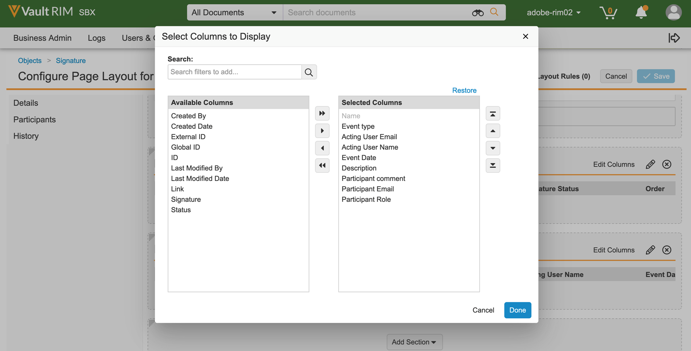
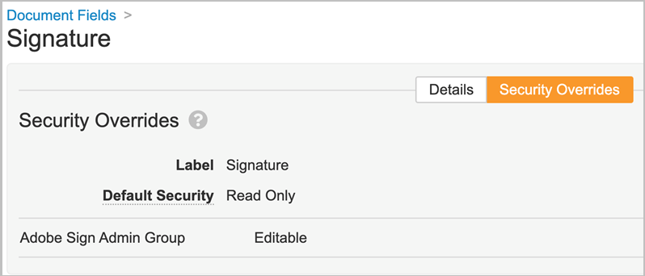
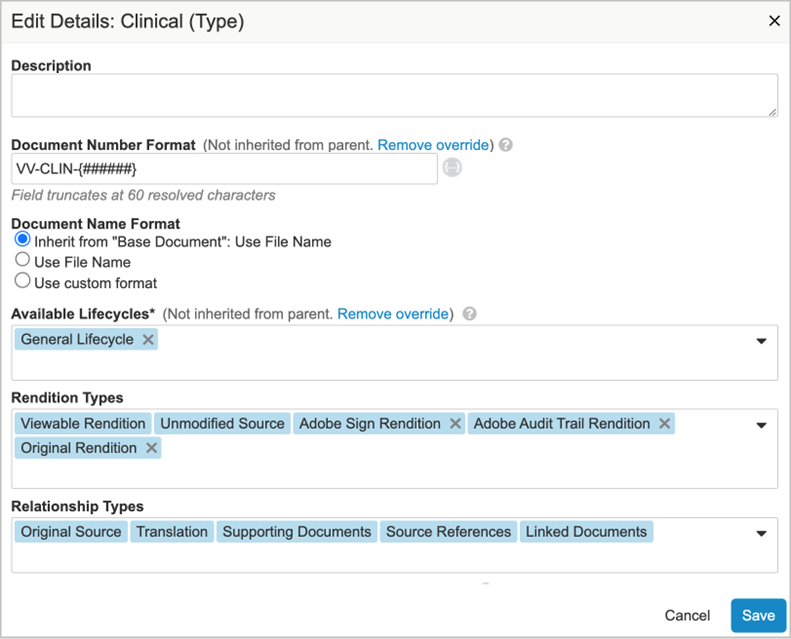
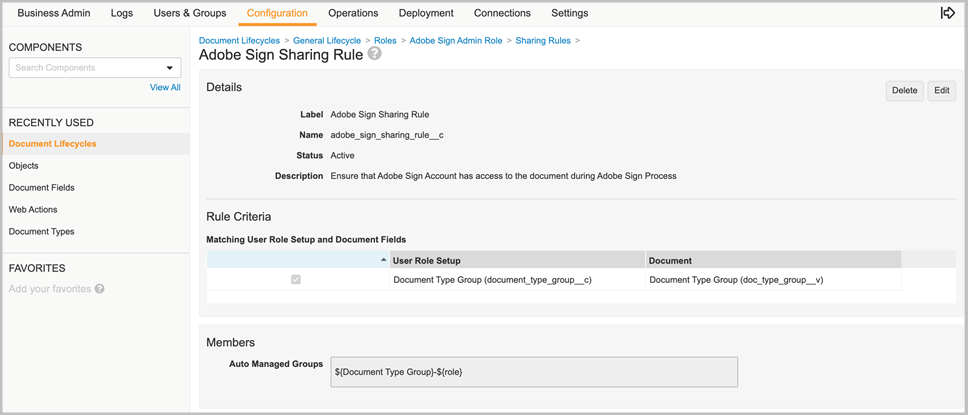
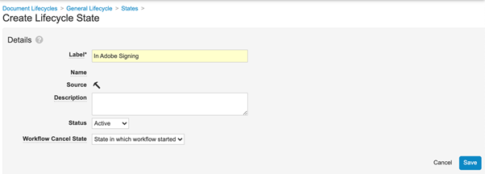
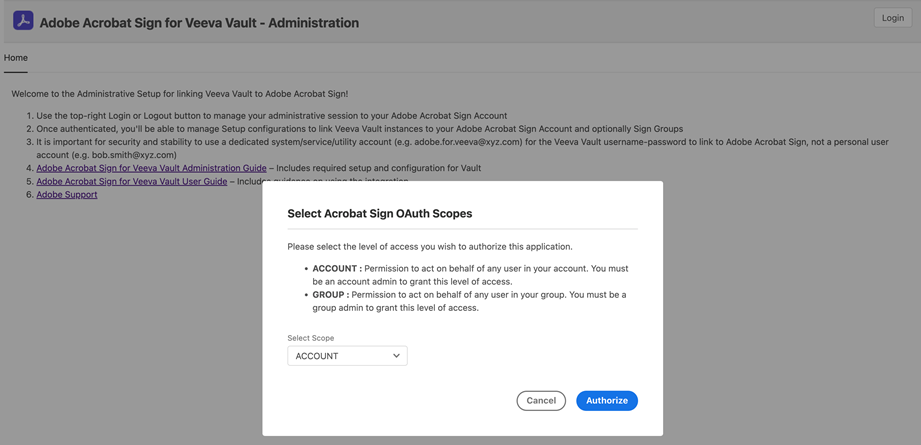

# [!DNL Veeva Vault] Installationshandbok{#veeva-installation-guide}

[**Kontakta Adobe Acrobat Sign Support**](https://adobe.com/go/adobesign-support-center_se)

## Översikt {#overview}

I det här dokumentet beskrivs hur du skapar en integrering av Adobe Acrobat Sign med [!DNL Veeva Vault] plattform. [!DNL Veeva Vault] är en ECM-plattform (Enterprise Content Management) byggd för biovetenskap. Ett &quot;Vault&quot; är ett innehålls- och datalager med typisk användning för registreringsunderlag, forskningsrapporter, anslagsansökningar, allmänna kontrakt med mera. Ett företag kan ha flera &quot;valv&quot; som måste underhållas separat.

De viktigaste stegen för att slutföra integreringen är:

* Aktivera ditt administratörskonto i Adobe Acrobat Sign (endast nya kunder).
* Skapa objekt för att spåra historiken för en avtalslivscykel i Vault.
* Skapa en ny säkerhetsprofil.
* Konfigurera en grupp i Adobe Acrobat Sign för att hålla [!DNL Veeva Vault] integrationsanvändare.
* Skapa dokumentfält och återgivningar.
* Konfigurera webbåtgärder och uppdatera dokumentets livscykel.
* Skapa dokumenttypskonfiguration för användare och användarroll.
* Anslut Veva Vault till Adobe Acrobat Sign med mellanvara.

>[!NOTE]
>
>Adobe Sign-administratören måste utföra installationsstegen för Adobe Acrobat Sign i Adobe Acrobat Sign.

## Konfigurera [!DNL Veeva Vault] {#configure-veeva}

Konfigurera [!DNL Veeva Vault] För integrering med Adobe Acrobat Sign måste du implementera stegen nedan.

### Steg 1. Skapa grupp {#create-group}

Så här konfigurerar du Adobe Acrobat Sign för [!DNL Vault], en ny grupp med namnet *Adobe Sign-administratörsgrupp* har skapats. Den här gruppen används för att ställa in dokumentfältnivåsäkerhet för Adobe Acrobat Sign-relaterade fält och ska inkludera *Integreringsprofil för Adobe Sign* som standard.

### Steg 2. Distribuera paketet {#deploy-package}

[Distribuera paketet](https://helpx.adobe.com/content/dam/help/en/sign-integrations-new/veeva-vault/PKG-AdobeSign-Integration-Veeva.zip) och följ stegen. När paketet har distribuerats skapas:

* Anpassade objekt: Signaturobjekt, Signaturobjekt, Signaturhändelseobjekt, Process Locker-objekt
* Sidlayout för signaturobjekt
* Layout för signaturhändelseobjekt
* Layout för signeringsobjektssida
* Layout för processvalvsobjektssida
* Layout för loggobjekt för Adobe Sign Integration
* Adobe Sign-återgivningstyp
* Ursprunglig återgivningstyp
* Delad fältsignatur__c
* Adobe Sign Web Action
* Avbryt Adobe Sign-webbåtgärd
* Behörighetsuppsättning för Adobe Sign-administratörsåtgärder
* Säkerhetsprofil för Adobe Sign-integrationsprofil
* Programroll Adobe Sign-administratörsroll
* Dokumenttypgruppen &quot;Adobe Sign-dokument&quot;
* Loggobjekt för Adobe Sign Integration

#### Signaturobjekt {#signature-object}

Signaturobjekt skapas för att lagra avtalsrelaterad information. Ett signaturobjekt är en databas som innehåller information under följande specifika fält:

**Fält för signaturobjekt**

| Fält | Etikett | Typ | Beskrivning |
|:---|:---|:---|:------- | 
| external_id__c | Avtals-ID | Sträng (100) | Innehåller Adobe Acrobat Sign unika avtals-ID |
| file_hash__c | Filhash | Sträng (50) | Innehåller md5-kontrollsumman för filen som har skickats till Adobe Acrobat Sign |
| name__v | Namn | Sträng (128) | Innehåller avtalsnamnet |
| sender__c | Avsändare | Objekt (användare) | Innehåller referensen till den Vault-användare som har skapat avtalet |
| signature_status__c | Signaturstatus | Sträng (75) | Innehåller avtalets status i Adobe Acrobat Sign |
| signature_type__c | Signaturtyp | Sträng (20) | Innehåller avtalets signaturtyp i Adobe Acrobat Sign (SKRIFTLIG eller ESIGN) |
| start_date__c | Startdatum | DatumTid | Datum när avtalet har skickats för signering |
| cancellation_date__c | Uppsägningsdatum | DatumTid | Innehåller datumet då avtalet har annullerats. |
| complete_date__c | Slutdatum | DatumTid | Innehåller datumet då avtalet har slutförts. |
| viewable_rendition_used__c | Visningsbar återgivning används | Boolesk | Flagga som anger om visningsbar återgivning har skickats för signering. (som standard är det sant) |
| plugin_version__c | Version av plugin-program | Text (10) | Den används för att möjliggöra lämplig bearbetning av alla avtal som skapats innan en ny version 4.0 driftsätts. Obs! Efter att anpassad webbprogramversion 4.0 har distribuerats ställs detta fält in på 4.0 varje gång en signaturpost skapas. |
| external_environment__c | Extern miljö | Text (20) | Innehåller Adobe Sign-miljönamnet som avtalet har skapats i. |

#### Signatory-objekt {#signatory-object}

Signeringsobjekt skapas för att lagra information relaterad till deltagarna i ett avtal. Den innehåller information under följande specifika fält:

**Fält för signeringsobjekt**

| Fält | Etikett | Typ | Beskrivning |
|:---|:---|:---|:------- | 
| email__c | E-post | Sträng (120) | Innehåller Adobe Acrobat Sign unika avtals-ID |
| external_id__c | Deltagar-ID | Sträng (80) | Innehåller Adobe Acrobat Sign unika deltagares identifierare |
| name__v | Namn | Sträng (128) | Innehåller Adobe Acrobat Sign-deltagarens namn |
| order__c | Ordning | Nummer | Innehåller Adobe Acrobat Sign-avtalsdeltagarens ordernummer |
| role__c | Roll | Sträng (30) | Innehåller Adobe Acrobat Sign-avtalsdeltagarens roll |
| signature__c | Signatur | Objekt (signatur) | Innehåller referensen till den överordnade signaturposten |
| signature_status__c | Signaturstatus | Sträng (100) | Innehåller status för Adobe Acrobat Sign-avtalsdeltagare |
| user__c | Användare | Objekt (användare) | Innehåller referensen till undertecknarens användarpost om deltagaren är en vaultanvändare |

#### Signature Event-objekt {#signature-event}

Signaturhändelseobjektet skapas för att lagra ett avtals händelserelaterad information. Den innehåller information under följande specifika fält:

Fält för signaturhändelseobjekt

| Fält | Etikett | Typ | Beskrivning |
|:---|:---|:---|:-------- | 
| acting_user_email__c | E-post för agerande användare | Sträng | Innehåller e-postadressen till den Adobe Acrobat Sign-användare som utförde åtgärden som orsakade händelsen |
| acting_user_name__c | Tillförordnat användarnamn | Sträng | Innehåller namnet på den Adobe Acrobat Sign-användare som utförde åtgärden som orsakade att händelsen skapades |
| description__c | Beskrivning | Sträng | Innehåller beskrivningen av Adobe Acrobat Sign-händelsen |
| event_date__c | Händelsedatum | DatumTid | Innehåller datum och klockslag för Adobe Acrobat Sign-händelsen |
| event_type__c | Händelsetyp | Sträng | Innehåller Adobe Acrobat Sign-händelsens typ |
| name__v | Namn | Sträng | Namn på automatiskt genererad händelse |
| participant_comment__c | Deltagarkommentar | Sträng | Innehåller eventuella kommentarer från Adobe Acrobat Sign-deltagaren |
| participant_email__c | E-post till deltagare | Sträng | Innehåller Adobe Acrobat Sign-deltagarens e-postadress |
| participant_role__c | Deltagarroll | Sträng | Innehar Adobe Acrobat Sign-deltagarens roll |
| signature__c | Signatur | Objekt (signatur) | Innehåller referensen till den överordnade signaturposten |
| external_id__c | Externt ID | Text (200) | Innehåller avtalshändelse-ID som genererats av Adobe Sign. |

#### Process Locker-objekt {#process-locker}

Ett Process Locker-objekt skapas för att låsa Adobe Acrobat Sign-integreringsprocessen. Inga anpassade fält krävs.

#### Loggobjekt för Adobe Sign-integrering {#task-log}

Skapa Adobe Sign Integration Task Log (as_int_task_log__c). Det är ett objekt med hög volym som används för att spåra körningen av AgreementsEventsSynchronizerJob och AgreementsEventsProcessingJob.
AgreementsEventsSynchronizerJob: Den här aktiviteten ser till att alla avtalshändelser som saknas från Adobe Sign skapas som aktiva signaturhändelser i Vault för alla signaturer som har skapats i Vault under de senaste N-dagarna.
AgreementsEventsProcessingJob: Den här uppgiften ser till att alla dokument med aktiva signaturhändelseposter bearbetas beroende på händelsetyp.

Objektfält för Adobe Sign-integreringsuppgiftslogg

| Fält | Etikett | Typ | Beskrivning |
|:--|:--|:--|:---------| 
| start_date__c | Startdatum | DatumTid | Aktivitetens startdatum |
| end_date__c | Slutdatum | DatumTid | Aktivitetens slutdatum |
| task_status__c | Uppgiftsstatus | Plocklista | Innehåller aktivitetsstatus:   Slutförd (task_completed__c) Slutförd med fel (task_completed_with_errors__c) Misslyckades (task_failed__c) |
| task_type__c | Aktivitetstyp | Plocklista | Innehåller uppgiftstyp:    Synkronisering av avtalshändelser (agreements_events_sync__c) Bearbetning av avtalshändelser (agreements_events_processing__c) |
| meddelanden__c | Meddelande | Lång (32000) | Innehåller aktivitetsmeddelande |

Egenskapen Granska dataändringar för det här objektet är aktiverad som standard för signatur-, signatur-, signaturhändelse-, Process Locker- och aktivitetsloggsobjekten som ingår i distributionspaketet.

**Obs!** Du kan ändra data i vault-hämtningsobjektposter i granskningsloggar genom att aktivera inställningen för Granska dataändringar . Den här inställningen är inaktiverad som standard. När du har aktiverat den här inställningen och skapat poster kan du inte längre inaktivera den. Om den här inställningen är av och det finns poster, kan bara en vaultägare uppdatera inställningen.

#### **Visa deltagare och historik för signaturobjektet** {#display-participants-history}

Signaturobjektet som ingår i distributionspaketet levereras med [Sidlayout för signaturinformation](https://vvtechpartner-adobe-rim.veevavault.com/ui/#admin/content_setup/object_schema/pagelayout?t=signature__c&amp;d=signature_detail_page_layout__c). Sidlayouten innehåller avsnitt för Deltagare och Historik.

* Den *Deltagare* i avsnittet Relaterade objekt som är konfigurerat enligt bilden nedan.

   

* Du kan redigera de kolumner som ska visas för deltagarna, enligt nedan.

   

* Den *Historik* i avsnittet Relaterade objekt som är konfigurerat enligt bilden nedan.

   

* Du kan redigera de kolumner som ska visas för historiken enligt nedan.

   

#### **Visa deltagare och granskningshistorik för Adobe Acrobat Sign-dokumentet** {#view-participants-audit-history}

* Om du vill visa deltagare och granskningshistorik för Adobe Acrobat Sign-dokumentet markerar du länken i dokumentets Adobe-signatur.

   

* På sidan som öppnas visas Deltagare och historik för Adobe Acrobat Sign-dokumentet enligt nedan.

   

* Visa granskningsspåret för signaturen enligt nedan.

   

### Steg 3. Konfigurera säkerhetsprofiler {#security-profiles}

En lyckad paketdistribution i steg 2 skapar en Adobe Sign-integrationsprofil. Adobe Sign-integreringsprofilen tilldelas systemkontot och används av integreringen när Vault-API:er anropas. Den här profilen tillåter behörigheter för:

* Vault API:er
* Läsa, skapa, redigera och ta bort: Signatur-, signatur-, signaturhändelse- och Process Locker-objekt

Du måste uppdatera Adobe Sign administratörsgrupp (som skapades i steg 1) genom att ställa in den inkluderade säkerhetsprofilen på Adobe Sign-integreringsprofil, som visas på bilden nedan.

### Steg 4. Skapa användare {#create-user}

Vaults systemkontoanvändare av Adobe Acrobat Sign-integreringen måste:

* Ha en Adobe Sign-integrationsprofil
* Ha en säkerhetsprofil
* Har en specifik säkerhetsprincip som inaktiverar utgångsdatum för lösenord
* Bli medlem i Adobe Sign administratörsgrupp.

Om du vill göra det följer du stegen nedan:

1. Skapa Vault-systemkonto för användare av Adobe Acrobat Sign-integrering.

   

2. Lägg till användaren i Adobe Sign administratörsgrupp.

   

### Steg 5. Konfigurera dokumenttypsgrupp {#create-document-type-group}

När du distribuerar Adobe Acrobat Sign-paketet skapas en dokumenttypsgrupppost med namnet Adobe Sign-dokument.

Du måste lägga till den här dokumenttypgruppen för alla dokumentklassificeringar som är berättigade till Adobe Acrobat Sign-processer. Eftersom dokumenttypens gruppegenskap inte ärvs från typ till undertyp eller från undertyp till klassificeringsnivå, måste den anges för varje dokuments klassificering som är berättigad till Adobe Acrobat Sign.

**Obs!** Om inställningsobjektet för användarroll inte innehåller det fält som refererar till objektet Dokumenttypgrupp, måste du lägga till fältet. Gå till **[!UICONTROL Objekt]** > **[!UICONTROL Inställning av användarroll]** > **[!UICONTROL Fält]** och utför de steg som krävs enligt bilden nedan.

### Steg 6. Skapa användarrollskonfiguration {#create-user-role-setup}

När livscyklerna har konfigurerats korrekt bör systemet se till att Adobe Sign-administratörsanvändare läggs till av DAC för alla dokument som är berättigade till Adobe Acrobat Sign-processer. Detta görs genom att skapa rätt inställningspost för användarrollen med följande specifikationer:

* Dokumenttypsgrupp som Adobe Sign-dokument
* Programroll som Adobe Sign-administratörsroll
* Integreringsanvändare

### Steg 7. Ställ in dokumentfält {#create-fields}

Paketdistributionen skapar följande nya delade dokumentfält som krävs för att upprätta integreringen:

* Underskrift (underskrift__c)

Så här ställer du in dokumentfält:

1. Gå till fliken Konfiguration och välj **[!UICONTROL Dokumentfält]** > **[!UICONTROL Delade fält]**.
1. I fältet Visa avsnitt väljer du **[!UICONTROL Skapa visningsavsnitt]** och tilldela **[!UICONTROL Adobe-signatur]** som avsnittsetiketten.

   

1. För de delade dokumentfälten (signature__c) uppdaterar du gränssnittsavsnittet med **[!UICONTROL Adobe-signatur]** som avsnittsetiketten.
1. Lägg till de två delade fälten i alla dokumenttyper som är berättigade till Adobe Acrobat-signatur. För att göra det väljer du på sidan Basdokument **[!UICONTROL Lägg till]** > **[!UICONTROL Befintligt delat fält]** från det övre högra hörnet.

   

   

   

1. Båda fälten måste ha ett specifikt säkerhetsvärde som tillåter att endast medlemmar i Adobe Sign administratörsgrupp uppdaterar sina värden.

   

Inaktivera vaultövertäckningar (disable_vault_overlays__v) är ett befintligt delat fält. Alternativt kan fältet ha en specifik säkerhetsuppdatering som endast tillåter medlemmar i Adobe Sign administratörsgrupp att uppdatera dess värde.

### Steg 8. Deklarera dokumentåtergivningar {#declare-renditions}

Den nya återgivningstypen anropas *Adobe Sign-återgivning (adobe_sign_rendition__c)* används av Vault-integrering för att överföra signerade PDF-dokument till Adobe Acrobat Sign. Du måste deklarera Adobe Sign-återgivningen för varje dokumenttyp som är berättigad till Adobe Acrobat-signatur.

Den nya återgivningstypen anropas *Ursprunglig återgivning* (original_rendition__c) används av vaultintegreringen som namnet på den återgivning som ska användas för att lagra den ursprungliga visningsbara återgivningen om det signerade dokumentet importeras som en visningsbar återgivning.

Du måste deklarera den ursprungliga återgivningen för varje dokumenttyp som är berättigad till Adobe Acrobat-signatur.

Valvet kan även ha en ny återgivningstyp, Adobe Audit Trail Rendition (adobe_audit_trail_rendition__c), som används för vaultintegrering för att lagra Adobe-granskningsspårsrapporten.

Följ stegen nedan för att konfigurera återgivning av Adobe granskningsspår:

1. Gå till **Återgivningstyp** > **Skapa ny återgivningstyp**.
Skapa den nya återgivningstypen som Återgivning av granskningsspår (adobe_audit_trail_rendition__c).

   

1. Deklarera om du vill visa och hämta Adobe-återgivningen av granskningsspår för dokument *Återgivning av Adobe granskningsspår* för varje dokumenttyp som är berättigad till Adobe Acrobat-signatur.

   

**Anteckning**: Du kan välja att bifoga granskningsrapporten till den signerade återgivningen genom att aktivera **[!UICONTROL Bifoga revideringsrapport till signerad återgivning]** och visa återgivningen genom att aktivera ****[!UICONTROL Visa Acrobat Sign-återgivning]**** alternativ i inställningarna för administratörsgränssnittet.

När en användare väljer ett avtal för elektronisk underskrift med ovanstående inställningar visas ett meddelande (som visas nedan) som anger att Adobe Acrobat Sign använder PDF Portfolio för att kombinera digitalt signerade PDF- och granskningsversionsrapporter.

Om du vill visa dokumentinnehållet tillsammans med den digitala signaturen och granskningsspåret ska du inte markera Bifoga granskningsrapport till signerad återgivning med Visa Acrobat Sign-återgivning i administratörsgränssnittet för digital signatur.

Du kan hämta eller visa Adobe granskningsspår som en separat återgivning från den signerade återgivningen med hjälp av funktionen Återgivning av Adobe granskningsspår.

### Steg 9. Uppdatera webbåtgärder {#web-actions}

För integrering med Adobe Acrobat Sign och Vault måste du skapa och konfigurera följande två webbåtgärder:

* **Skapa Adobe Sign**: Adobe Acrobat Sign-avtal skapas eller visas.

   Typ: Dokumentmål: Visa med vaultreferenser: Aktivera autentiseringsuppgifter efter sessionen via URL efter meddelande: <https://api.na1.adobesign.com/api/gateway/veevavaultintsvc/partner/agreement?docId=${Document.id}&majVer=${Document.major_version_number__v}&minVer=${Document.minor_version_number__v}&vaultid=${Vault.id}&useWaitPage=true>

   

* **Avbryt Adobe Sign**: Det avbryter ett befintligt avtal i Adobe Acrobat Sign och återställer ett dokuments status till det ursprungliga.

   Typ: Dokumentmål: Visa med vaultreferenser: Aktivera autentiseringsuppgifter efter sessionen via URL efter meddelande: : <https://api.na1.adobesign.com/api/gateway/veevavaultintsvc/partner/agreement/cancel?docId=${Document.id}&majVer=${Document.major_version_number__v}&minVer=${Document.minor_version_number__v}&vaultid=${Vault.id}&useWaitPage=true>

   

### Steg 10. Uppdatera dokumentets livscykel {#document-lifecycle}

För varje dokumenttyp som är berättigad till Adobe-signatur måste du uppdatera motsvarande dokumentlivscykel genom att lägga till en ny livscykelroll och nya tillstånd.

Livscykeln för Adobe Acrobat Sign-avtal har följande tillstånd:

* UTKAST
* AUTHORING eller DOCUMENTS_NOT_YET_PROCESSED
* OUT_FOR_SIGNATURE eller OUT_FOR_APPROVAL
* SIGNERAT eller GODKÄNT
* AVBRUTEN
* FÖRFALLEN

Följ stegen nedan för att uppdatera dokumentets livscykel:

1. Lägg till livscykelroll. Adobe Sign administratörsprogramroll måste läggas till i alla livscykler som används av dokument som är berättigade till Adobe Acrobat-signatur, enligt nedan.

   

   Administratörsrollen ska skapas med följande alternativ:

   * Aktiverad dynamisk åtkomstkontroll.
   * Regler för dokumentdelning som endast omfattar dokumenttypsgrupp, som bilden nedan visar.

   

2. Skapa livscykeltillstånd. Gå till **[!UICONTROL Inställningar]** > **[!UICONTROL Konfiguration]** > **[!UICONTROL Dokumentlivscykler]** > **[!UICONTROL Allmänna livscykler]** > **[!UICONTROL Stater]** > **[!UICONTROL Skapa]**. Skapa sedan följande lägen:

   * I Adobe Sign Draft

   

   * Redigera i Adobe Sign

   

   * Signering i Adobe

   

3. Lägg till användaråtgärder i nedanstående lista.

   När ett Vault-dokument skickas till Adobe Acrobat Sign ska dess tillstånd motsvara läget i vilket avtalet finns. Gör det genom att lägga till följande lägen i varje livscykel som används av dokument som är berättigade till Adobe-signatur:

   * **Före Adobe-underskrift** (Granskad): Det här är ett platshållarnamn för läget som dokumentet kan skickas från till Adobe Acrobat Sign. Beroende på dokumenttyp kan det vara Utkast eller Granskat. Etiketten för dokumentstatus kan anpassas enligt kundens krav. Före Adobe måste signaturtillståndet definiera följande två användaråtgärder:

      * Åtgärd som ändrar dokumentstatus till *I Adobe Sign Draft* tillstånd. Namnet på den här användaråtgärden måste vara detsamma för alla dokumenttyper i alla livscykler.
      * En åtgärd som kallar webbåtgärden &quot;Adobe Sign&quot;. Tillståndet måste ha en säkerhet som tillåter Adobe Sign administratörsroll att: visa dokument, visa innehåll, redigera fält, redigera relationer, hämta källa, hantera visningsbar återgivning och ändra tillstånd.

      

      * Ändra *Granskad* State Atomic Security genom inställning *I Adobe Sign Draft* som standard till Dold och endast Kör för *Adobe Sign-administratörsroll*.
      **Obs!** Om *Adobe Sign-administratörsroll* rollen ingår inte i *atomisk säkerhet:användaråtgärd*, Lägg till **[!UICONTROL Adobe Sign-administratörsroll]** genom att välja **[!UICONTROL Redigera]**> **[!UICONTROL Åsidosättning av roll]**. Nästa, lägg till **Adobe Sign-administratörsroll** för *Granskad* stat.

      
      
      

   * **I Adobe Sign Draft**: Det här är ett platshållarnamn för läget som anger att dokumentet redan har överförts till Adobe Acrobat Sign och att dess avtal är i läget UTKAST. Det är ett nödvändigt tillstånd. Detta tillstånd måste definiera följande fem användaråtgärder:

      * Åtgärd som ändrar dokumentstatus till *Redigera i Adobe Sign* tillstånd. Namnet på den här användaråtgärden måste vara detsamma för alla dokumenttyper i alla livscykler.
      * Åtgärd som ändrar dokumentstatus till *I signeringsläget Adobe*. Namnet på den här användaråtgärden måste vara detsamma för alla dokumenttyper i alla livscykler.
      * Åtgärd som ändrar dokumentstatus till *Adobe Sign har avbrutits* tillstånd. Namnet på den här användaråtgärden måste vara detsamma för alla dokumenttyper i alla livscykler.
      * Åtgärd som anropar webbåtgärden *Adobe Sign*.
      * Åtgärd som anropar webbåtgärden *Avbryt Adobe Sign*. Tillståndet måste ha en säkerhet som tillåter Adobe Sign administratörsroll att: visa dokument, visa innehåll, redigera fält, redigera relationer, hämta källa, hantera visningsbar återgivning och ändra tillstånd.

      

      * Ändra *I Adobe Sign Draft* kärnsäkerhet: funktionsmakron *Adobe Sign har avbrutits*, *Redigera i Adobe Sign*, *Signering i Adobe* måste vara dolt för alla utom Adobe Sign administratörsroll
      **Obs!** Om *Adobe Sign-administratörsroll* ingår inte i *Atomsäkerhet: Användaråtgärder*, lägg till **[!UICONTROL Adobe Sign-administratörsroll]** genom att välja **[!UICONTROL Redigera]** > **[!UICONTROL Åsidosättning av roll]**. Nästa, lägg till **[!UICONTROL Adobe Sign-administratörsroll]** roll för *I Adobe Sign Draft* stat.

      

   * **Redigera i Adobe Sign**: Det här är ett platshållarnamn för läge som anger att dokumentet redan har överförts till Adobe Acrobat Sign och att dess avtal är i läget AUTHORING eller DOCUMENTS_NOT_YET_PROCESSED. Det är ett nödvändigt tillstånd. Detta tillstånd måste ha följande fyra användaråtgärder definierade:

      * Åtgärd som ändrar dokumentets status till Adobe Sign avbrutet. Namnet på den här användaråtgärden måste vara detsamma för alla dokumenttyper oavsett livscykel.
      * Åtgärd som ändrar dokumentets status till Signeringsläge i Adobe. Namnet på den här användaråtgärden måste vara detsamma för alla dokumenttyper oavsett livscykel.
      * Åtgärd som kallar webbåtgärden &quot;Adobe Sign&quot;
      * En åtgärd som kallar webbåtgärden för Avbryt Adobe Sign. Tillståndet måste ha en säkerhet som gör att Adobe Sign-administratörsrollen kan: visa dokument, visa innehåll, redigera fält, redigera relationer, hämta källa, hantera visningsbar återgivning och ändra tillstånd.

      

      * Ändra *Redigera i Adobe Sign* kärnsäkerhet: funktionsmakron *Adobe Sign har avbrutits* och *Signering i Adobe* måste vara dolt för alla utom Adobe Sign administratörsroll
      **Obs!** Om *Adobe Sign-administratörsroll* ingår inte i *Atomsäkerhet: Användaråtgärder*, lägg till **[!UICONTROL Adobe Sign-administratörsroll]** genom att välja **[!UICONTROL Redigera]** > **[!UICONTROL Åsidosättning av roll]**. Nästa, lägg till **[!UICONTROL Adobe Sign-administratörsroll]** roll för *Redigera i Adobe Sign* stat.

      

   * **Signering i Adobe**: Det här är ett platshållarnamn för läget som anger att dokumentet har överförts till Adobe Acrobat Sign och att dess avtal redan har skickats till deltagare (tillståndet OUT_FOR_SIGNATURE eller OUT_FOR_APPROVAL). Det är ett nödvändigt tillstånd. Detta tillstånd måste ha följande fem användaråtgärder definierade:

      * Åtgärd som ändrar dokumentets status till Adobe Sign avbrutet. Måltillståndet för den här åtgärden kan vara vilket kundbehov som än finns och det kan vara olika för olika typer. Namnet på den här användaråtgärden måste vara detsamma för alla dokumenttyper oavsett livscykel.
      * Åtgärd som ändrar dokumentstatus till Adobe Sign avvisat läge. Måltillståndet för den här åtgärden kan vara vilket kundbehov som än finns och det kan vara olika för olika typer. Namnet på den här användaråtgärden måste vara detsamma för alla dokumenttyper oavsett livscykel.
      * Åtgärd som ändrar dokumentstatus till Adobe-signerat läge. Måltillståndet för den här åtgärden kan vara vilket kundbehov som än finns och det kan vara olika för olika typer. Namnet på den här användaråtgärden måste dock vara detsamma för alla dokumenttyper oavsett livscykel.
      * Åtgärd som anropar webbåtgärden *Adobe Sign*.
      * Åtgärd som anropar Web Action *Avbryt Adobe Sign*. Tillståndet måste ha en säkerhet som gör att Adobe Sign-administratörsrollen kan: visa dokument, visa innehåll, redigera fält, redigera relationer, hämta källa, hantera visningsbar återgivning och ändra tillstånd.

      

      * Ändra *Signering i Adobe* kärnsäkerhet: funktionsmakron *Adobe Sign har avbrutits*, *Adobe Sign avvisades* och *Adobe signerat* måste vara dolt för alla utom Adobe Sign administratörsroll
      **Obs!** Om *Adobe Sign-administratörsroll* ingår inte i *Atomsäkerhet: Användaråtgärder*, lägg till **[!UICONTROL Adobe Sign-administratörsroll]** genom att välja **[!UICONTROL Redigera]** > **[!UICONTROL Åsidosättning av roll]**. Nästa, lägg till **[!UICONTROL Adobe Sign-administratörsroll]** roll för *Signering i Adobe* stat.

      

      * **Adobe undertecknat (godkänt)**: Det här är ett platshållarnamn för läget som anger att dokumentet har överförts till Adobe Acrobat Sign och att dess avtal har slutförts (läget SIGNERAT eller GODKÄNT). Det är ett obligatoriskt steg och det kan vara ett befintligt livscykelsteg, som Godkänt.
Detta tillstånd kräver inte användaråtgärder. Det måste ha en säkerhet som tillåter Adobe Sign administratörsroll att: visa dokument, visa innehåll och redigera fält.

   I följande diagram visas mappningarna mellan Adobe Acrobat Sign-avtal och Vaults dokumenttillstånd, där tillståndet &quot;Före Adobe-signatur&quot; är Utkast.

   

### Steg 11. Lägg till Adobe Sign-scenen i den allmänna livscykeln i livscykelstegsgrupper

### Steg 12. Ange behörigheter för användarrollen i livscykeltillståndet

Du måste ange lämpliga behörigheter för varje användarroll i livscykeltillståndet, som visas i bilden nedan.

### Steg 13. Ställ in kärnsäkerhet baserat på dokumentstatus och användarroll

### Steg 14. Avbryt Skapa dokumentmeddelanden för Adobe Sign

## Anslut [!DNL Veeva Vault] till Adobe Acrobat Sign med mellanvara {#connect-middleware}

När du har slutfört konfigurationen för [!DNL Veeva Vault] och Adobe Acrobat Sign administratörskonto måste administratören skapa en anslutning mellan de två kontona med hjälp av mellanvara. Den [!DNL Veeva Vault] och Adobe Acrobat Sign-kontoanslutningen initieras av Adobe Acrobat Sign Identity och används sedan för att lagra[!DNL Veeva Vault] identitet.
För systemets säkerhet och stabilitet måste administratören använda en särskild [!DNL Veeva Vault] system/tjänst/verktyg, till exempel `adobe.for.veeva@xyz.com`i stället för ett personligt användarkonto, t.ex. `bob.smith@xyz.com`.

En Adobe Acrobat Sign-kontoadministratör måste följa stegen nedan för att ansluta [!DNL Veeva Vault] till Adobe Acrobat Sign med mellanvara:

1. Gå till [Adobe Acrobat Sign för [!DNL Veeva Vault] Startsida](https://static.adobesigncdn.com/veevavaultintsvc/index.html).
1. Välj **[!UICONTROL Logga in]** från det övre högra hörnet.

   

1. Om du vill godkänna åtkomstnivån för programmet väljer du Acrobat Sign OAuth-omfång som **[!UICONTROL KONTO]** eller **[!UICONTROL GRUPP]**. Välj sedan **[!UICONTROL Auktorisera]**.

   

1. På inloggningssidan för Adobe Acrobat Sign som öppnas anger du e-postadress och lösenord för kontoadministratören och väljer sedan **[!UICONTROL Logga in]**.

   

   När du har loggat in visas motsvarande e-post-ID och en inställningsflik på sidan, som visas nedan.

   

1. Välj **[!UICONTROL Inställningar]** -fliken.

   På sidan Inställningar visas tillgängliga anslutningar och *Inga anslutningar tillgängliga* vid första anslutningsinställning, se nedan.

   

1. Välj **[!UICONTROL Lägg till anslutning]** för att lägga till en ny anslutning.

1. I dialogrutan Lägg till anslutning som öppnas anger du den information som krävs, inklusive [!DNL Veeva Vault] autentiseringsuppgifter.

   Adobe Acrobat Sign-inloggningsuppgifterna fylls i automatiskt från den första Adobe Sign-inloggningen.

   

1. Välj **[!UICONTROL Validera]** för att validera kontouppgifterna.

   När valideringen är klar visas ett meddelande om att användaren har validerats, enligt nedan.

   

1. Om du vill begränsa användningen till en viss Adobe Acrobat Sign-grupp expanderar du **[!UICONTROL Grupp]** och väljer en av de tillgängliga grupperna.

   

1. Markera kryssrutan om du vill bifoga granskningsrapporten till den signerade återgivningen **[!UICONTROL Bifoga revideringsrapport till signerad återgivning]**.

   

1. Markera kryssrutan om du vill tillåta automatisk etablering av användare i Adobe Acrobat Sign **[!UICONTROL Etablera Sign-användare automatiskt]**.

   **Obs!** Automatisk etablering av nya Adobe Acrobat Sign-användare fungerar bara om den har aktiverats på Adobe Acrobat Sign-kontonivå i Adobe Acrobat Sign förutom att aktivera **[!UICONTROL Etablera Sign-användare automatiskt]** för[!DNL Veeva Vault] Adobe Acrobat Sign-integreringen visas nedan av Adobe Acrobat Sign-kontoadministratören.

   

1. Markera kryssrutan om du vill att Adobe Sign-återgivningen ska visas i Veva i stället för i den ursprungliga återgivningen **[!UICONTROL Visa Acrobat Sign-återgivning]**.

   

1. Välj **[!UICONTROL Spara]** för att spara din nya anslutning.

   Den nya anslutningen visas under fliken Inställningar och visar att integreringen mellan [!DNL Veeva Vault] och Adobe Acrobat Sign.

   

