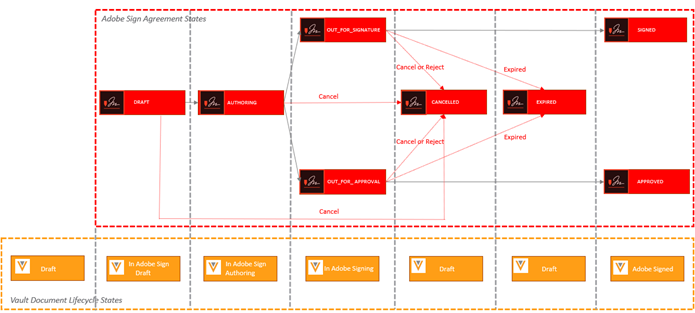
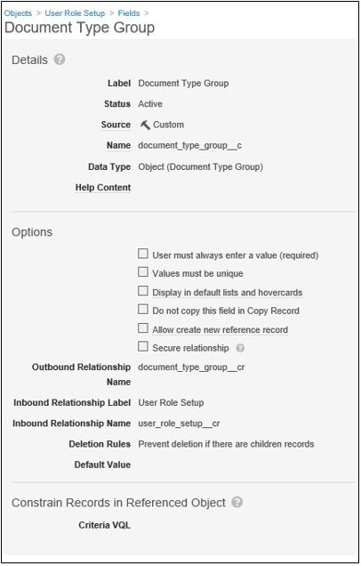

# [!DNL Veeva Vault] Installationshandbok{#veeva-installation-guide}

[**Kontakta supporten för Adobe Sign**](https://adobe.com/go/adobesign-support-center_se)

## Översikt {#overview}

I det här dokumentet beskrivs hur du skapar integrering av Adobe Sign med [!DNL Veeva Vault]-plattformen. [!DNL Veeva Vault] är en ECM-plattform (Enterprise Content Management) som byggts för medicin och bioteknik. Ett&quot;valv&quot; är ett innehålls- och datalager med typisk användning för regelregistrering, forskningsrapporter, bidragsansökningar, allmän upphandling med mera. Ett enskilt företag kan ha flera &quot;valv&quot; som måste underhållas separat.

De steg som krävs för att slutföra integreringen är:

* Aktivera ditt administratörskonto i Adobe Sign (endast nya kunder)
* Skapa objekt för att spåra historiken för en avtals livscykel i Vault.
* Skapa en ny säkerhetsprofil.
* Konfigurera en grupp i Adobe Sign som ska innehålla [!DNL Veeva Vault]-integreringsanvändaren.
* Skapa dokumentfält och återgivningar.
* Konfigurera webbåtgärder och uppdatera dokumentets livscykel.
* Skapa inställningar för användare och användarroller för dokumenttypen.

>[!NOTE]
>
>Adobe Sign-administratören måste utföra Adobe Sign installationssteg inom Adobe Sign.

## Konfigurera [!DNL Veeva Vault]

För att konfigurera [!DNL Veeva Vault] för integrering med Adobe Sign skapar vi vissa objekt som hjälper till att spåra historiken för en avtalscykel i Vault. Administratörer måste skapa följande objekt:

* Signatur
* Undertecknare
* Signaturhändelse
* Processlås

### Skapa signaturobjekt  {#create-signature-object}

Signaturobjekt skapas för att lagra avtalsrelaterad information. Ett Signature-objekt är en databas som innehåller information i följande specifika fält:

**Fält för signaturobjekt**

| Fält  | Etikett | Typ | Beskrivning |
| --- | --- | ---| --- | 
| external_id__c | Avtals-ID | Sträng (100) | Innehåller Adobe Sign unika avtals-ID |
| file_hash__c | Fil-hash | Sträng (50) | Innehåller kontrollsumman för md5 för filen som har skickats till Adobe Sign |
| name__v | Namn | Sträng (128) | Innehåller avtalsnamnet |
| sender__c | Avsändare | Objekt (användare) | Innehåller referensen till valvanvändaren som har skapat avtalet |
| signature_status__c | Signaturstatus | Sträng (75) | Innehåller avtalets status i Adobe Sign |
| signature_type__c | Signaturtyp | Sträng (20) | Innehåller avtalets signaturtyp i Adobe Sign (SKRIFTLIGT eller ESIGN) |
| start_date__c | Startdatum | DatumTid | Datum när avtal har skickats för signatur |
| cancellation_date__c | Annulleringsdatum | DatumTid | Innehåller datumet då avtalet har annullerats. |
| complete_date__c | Slutförandedatum | DatumTid | Innehåller datumet då avtalet har slutförts. |
| viewable_rendition_used__c | Synlig återgivning används | Boolesk | Flagga som anger om en återgivning som kan visas har skickats för signatur. (som standard är det sant) |

### Skapa underskriftsobjekt {#create-signatory-object}

Underskriftsobjekt skapas för att lagra information som är relaterad till deltagarna i ett avtal. Det innehåller information i följande specifika fält:

**Underskriftsobjektsfält**

| Fält  | Etikett | Typ | Beskrivning |
| --- | --- | ---| --- | 
| email__c | E-post | Sträng (120) | Innehåller Adobe Sign unika avtals-ID |
| external_id__c | Deltagar-ID | Sträng (80) | Innehåller Adobe Sign unika deltagares identifierare |
| name__v | Namn | Sträng (128) | Innehåller Adobe Sign-deltagarens namn |
| order__c | Ordning | Nummer | Innehåller Adobe Sign-deltagarens ordernummer |
| role_c | Roll | Sträng (30) | Innehåller deltagarens roll i Adobe Sign-avtalet |
| signature__c | Signatur | Objekt (signatur) | Innehåller referensen till den överordnade signaturposten |
| signature_status__c | Signaturstatus | Sträng (100) | Innehåller deltagarens status för Adobe Sign-avtal |
| user__c | Användare | Objekt (användare) | Innehåller referensen till undertecknarens användarpost om deltagaren är en Vault-användare |

### Skapa objekt för signaturhändelse  {#create-signature-event}

Signaturhändelseobjekt skapas för att lagra ett avtals händelserelaterade information. Det innehåller information i följande specifika fält:

| Fält  | Etikett | Typ | Beskrivning |
| --- | --- | ---| --- | 
| acting_user_email__c | E-post för agerande användare | Sträng | Innehåller e-postadressen till den Adobe Sign-användare som utförde åtgärden som orsakade att händelsen genererades |
| acting_user_name__c | Aktuellt användarnamn | Sträng | Innehåller namnet på den Adobe Sign-användare som utförde åtgärden som orsakade att händelsen genererades |
| description__c | Beskrivning | Sträng | Innehåller beskrivningen av Adobe Sign-händelsen |
| event_date__c | Händelsedatum | DatumTid | Innehåller datum och tid för Adobe Sign-event |
| event_type__c | Händelsetyp | Sträng | Innehåller händelsetypen för Adobe Sign |
| name__v | Namn | Sträng | Automatiskt genererat händelsenamn |
| participating_comment__c | Deltagarkommentar | Sträng | Innehåller Adobe Sign-deltagarens kommentar, om någon |
| participating_email__c | E-post till deltagare | Sträng | Innehåller Adobe Sign-deltagarens e-postadress |
| deltagare_roll__c | Deltagarroll | Sträng | Innehåller Adobe Sign deltagares roll |
| signature__c | Signatur | Objekt (signatur) | Innehåller referensen till den överordnade signaturposten |

### Skapa Process Locker-objekt  {#create-process-locker}

Ett Process Locker-objekt skapas för att låsa integreringsprocessen i Adobe Sign. Det kräver inga anpassade fält.

## Skapa säkerhetsprofiler{#security-profiles}

För att vault ska kunna integreras skapas en ny säkerhetsprofil med namnet *Adobe Sign-integreringsprofil* och dess behörighet anges för *Adobe Sign Admin Actions*. Adobe Sign integreringsprofil tilldelas till systemkontot och används av integreringen när Vault API:er anropas. Den här profilen tillåter behörigheter för:

* Vault API:er
* Läsa, skapa, redigera och ta bort: Signatur-, signatur-, signaturhändelser- och Process Locker-objekt

Säkerhetsprofiler för användare som kräver åtkomst till Adobe Sign historik i Vault måste ha läsbehörighet för signatur-, signatur- och signaturhändelseobjekt.

## Skapa grupp {#create-group}

Om du vill konfigurera Adobe Sign för [!DNL Vault] skapas en ny grupp med namnet *Adobe Sign Admin Group*. Den här gruppen används för att ange dokumentfältnivåsäkerhet för Adobe Sign-relaterade fält och bör som standard inkludera *Adobe Sign-integreringsprofil*.

## Skapa användare {#create-user}

Vaultsystemkontoanvändaren som använder Adobe Sign-integreringen måste:

* Har Adobe Sign integreringsprofil
* Har en säkerhetsprofil
* Har en specifik säkerhetsprincip som inaktiverar förfallodatum för lösenord
* Bli medlem i Adobe Sign Admin Group.

Om du vill vara säker på att systemkontoanvändaren tillhör Adobe Sign Admin Group för dokumentets specifika livscykel måste du skapa poster för användarrollinställningar.

## Skapa programroller {#create-application-roles}

Du måste skapa en programroll med namnet *Adobe Sign Admin Role*. Den här rollen måste definieras i livscykeln för varje dokumenttyp som är berättigad till Adobe-signatur. För vart och ett av Adobe Sign specifika livscykeltillstånd läggs Adobe Sign Admin Role till och konfigureras med lämplig behörighet.

## Skapa dokumentfält {#create-fields}

För att kunna integrera med Adobe Sign måste administratörer skapa följande två nya delade dokumentfält:

* Signatur (signature__c)
* Tillåt Adobe Sign-användaråtgärder (allow_adobe_sign_user_actions__c)

Dessa delade fält måste läggas till i alla dokumenttyper som är berättigade till Adobe-signatur. Båda fälten ska ha en specifik säkerhet som tillåter att endast medlemmar i Adobe Sign Admin Group uppdaterar sina värden.

Administratörer måste lägga till det befintliga delade fältet *Inaktivera vaultövertäckningar (disable_vault_overlays__v)* och ställa in det på Aktiv för alla dokumenttyper som är berättigade till Adobe-signatur. Alternativt kan fältet ha en specifik säkerhet som bara tillåter medlemmar i Adobe Sign Admin Group att uppdatera dess värde.

## Skapa dokumentåtergivningar {#create-renditions}

Administratörer måste skapa en ny renderingstyp med namnet *Adobe Sign Rendition (adobe_sign_rendition__c)*, som används av Vaultintegrering för att överföra signerade PDF-dokument till Adobe Sign. Adobe Sign-återgivningen bör deklareras för varje dokumenttyp som är berättigad till Adobe-signatur.

## Konfigurera webbåtgärder {#web-actions}

Integrering med Adobe Sign och Vault kräver att du skapar och konfigurerar följande två webbåtgärder:

* **Skapa Adobe Sign**: Det skapar eller visar Adobe Sign Agreement.

   Typ: Dokument
Mål: Visa på valv
URL: <https://{integrationDomain}/adobe-sign-int/signature?docId=${Document.id}&majVer=${Document.major_version_number__v}&minVer=${Document.minor_version_number__v}&sessionId=${Session.id}&vaultId=${Vault.Id>}

* **Avbryt Adobe Sign**: Det annullerar ett befintligt avtal i Adobe Sign och återställer ett dokuments status till det ursprungliga.

   Typ: Dokument
Mål: Visa på valv
URL: <https://{integrationDomain}/adobe-sign-int/cancel?docId=${Document.id}&majVer=${Document.major_version_number__v}&minVer=${Document.minor_version_number__v}&sessionId=${Session.id}&vaultId=${Vault.Id>}

## Uppdatera dokumentets livscykel {#document-lifecycle}

För varje dokumenttyp som är berättigad till Adobe-signatur måste motsvarande dokumentlivscykel uppdateras genom att nya livscykelroller och -lägen läggs till.

### Livscykelroll {#lifecycle-role}

Adobe Sign Admin-programrollen måste läggas till i alla livscykler som används av dokument som är berättigade till Adobe Signature. Den här rollen bör skapas med följande alternativ:

* Aktivera dynamisk åtkomstkontroll
* Regler för dokumentdelning som endast omfattar dokumenttypsgrupp

### Livscykeltillstånd {#lifecycle-states}

Adobe Sign avtals livscykel har följande tillstånd:

* UTKAST
* REDIGERA ELLER DOKUMENT_NOT_YET_PROCESSED
* OUT_FOR_SIGNATURE eller OUT_FOR_APPROVAL
* SIGNERAD ELLER GODKÄND
* AVBRUTEN
* FÖRFALLEN

När ett vaultdokument skickas till Adobe Sign ska dess status motsvara det tillstånd som avtalet har. Gör det genom att lägga till följande lägen i varje livscykel som används av dokument som är berättigade till Adobe-signatur:

* **Före Adobe-signatur**  (granskad): Det här är ett platshållarnamn för det tillstånd som dokumentet kan skickas från till Adobe Sign. Beroende på dokumenttypen kan det vara utkastläge eller Granskat. Etiketten för dokumenttillstånd kan anpassas efter kundens behov. Före signaturläget i Adobe måste följande två användaråtgärder definieras:

   * Åtgärd som ändrar dokumentets tillstånd till *I Adobe Sign Draft*. Namnet på den här användaråtgärden måste vara detsamma för alla dokumenttyper för alla livscykler. Om det behövs kan villkoret för den här åtgärden ställas in på&quot;Tillåt Adobe Sign-användaråtgärder är lika med Ja&quot;.
   * Åtgärd som kallar webbåtgärden&quot;Adobe Sign&quot;. Det här tillståndet måste ha en säkerhet som tillåter Adobe Sign Admin Roll att: visa dokument, visa innehåll, redigera fält, redigera relationer, hämta källa, hantera visningsbar återgivning och ändra status.

   

* **I Adobe Sign Draft**: Det här är ett platshållarnamn för det tillstånd som anger att dokumentet redan har överförts till Adobe Sign och att avtalet är i utkastläge. Det är ett obligatoriskt tillstånd. Det här tillståndet måste innehålla följande fem användaråtgärder:

   * Åtgärd som ändrar dokumentets tillstånd till *I Adobe Sign Authoring*-tillstånd. Namnet på den här användaråtgärden måste vara detsamma för alla dokumenttyper för alla livscykler. Om det behövs kan villkoret för den här åtgärden ställas in på&quot;Tillåt Adobe Sign-användaråtgärder är lika med Ja&quot;.
   * Åtgärd som ändrar dokumentets tillstånd till *I signeringsläge för Adobe*. Namnet på den här användaråtgärden måste vara detsamma för alla dokumenttyper för alla livscykler. Om det behövs kan villkoret för den här åtgärden ställas in på&quot;Tillåt Adobe Sign-användaråtgärder är lika med Ja&quot;.
   * Åtgärd som ändrar dokumentets tillstånd till *Adobe Sign Canceled*-tillstånd. Namnet på den här användaråtgärden måste vara detsamma för alla dokumenttyper för alla livscykler. Om det behövs kan villkoret för den här åtgärden ställas in på&quot;Tillåt Adobe Sign-användaråtgärder är lika med Ja&quot;.
   * Åtgärd som kallar webbåtgärden&quot;Adobe Sign&quot;.
   * Åtgärd som anropar webbåtgärden&quot;Cancel Adobe Sign&quot;. Det här tillståndet måste ha en säkerhet som tillåter att Adobe Sign-administratörsrollen kan: visa dokument, visa innehåll, redigera fält, redigera relationer, hämta källa, hantera visningsbar återgivning och ändra status.

   

* **I Adobe Sign Authoring**: Det här är ett platshållarnamn som anger att dokumentet redan har överförts till Adobe Sign och att avtalet är i tillståndet AUTHORING eller DOCUMENTS_NOT_YET_PROCESSED. Det är ett obligatoriskt tillstånd. Det här tillståndet måste ha följande fyra definierade användaråtgärder:

   * Åtgärd som ändrar dokumentets status till läget Adobe Sign Canceled. Namnet på den här användaråtgärden måste vara detsamma för alla dokumenttyper oavsett livscykel. Om det behövs kan villkoret för den här åtgärden ställas in på&quot;Tillåt Adobe Sign-användaråtgärder är lika med Ja&quot;.
   * Åtgärd som ändrar dokumentets status till Underteckningsläge i Adobe. Namnet på den här användaråtgärden måste vara detsamma för alla dokumenttyper oavsett livscykel. Om det behövs kan villkoret för den här åtgärden ställas in på&quot;Tillåt Adobe Sign-användaråtgärder är lika med Ja&quot;.
   * Åtgärd som kallar webbåtgärden&quot;Adobe Sign&quot;
   * Åtgärd som anropar webbåtgärden&quot;Cancel Adobe Sign&quot;. Det här tillståndet måste ha en säkerhet som tillåter att Adobe Sign-administratörsrollen kan: visa dokument, visa innehåll, redigera fält, redigera relationer, hämta källa, hantera visningsbar återgivning och ändra status.

   

* **In Adobe-signering**: Det här är ett platshållarnamn för det tillstånd som anger att dokumentet överförs till Adobe Sign och att dess avtal redan har skickats till deltagare (läget OUT_FOR_SIGNATURE eller OUT_FOR_APPROVAL). Det är ett obligatoriskt tillstånd. Det här läget måste ha följande fem definierade användaråtgärder:

   * Åtgärd som ändrar dokumentets status till läget Adobe Sign Canceled. Måltillståndet för den här åtgärden kan vara vilket kundkrav som helst och det kan vara olika för olika typer. Namnet på den här användaråtgärden måste vara detsamma för alla dokumenttyper oavsett livscykel. Om det behövs kan villkoret för den här åtgärden ställas in på&quot;Tillåt Adobe Sign-användaråtgärder är lika med Ja&quot;.
   * Åtgärd som ändrar dokumentets tillstånd till Adobe Sign Avvisat. Måltillståndet för den här åtgärden kan vara vilket kundkrav som helst och det kan vara olika för olika typer. Namnet på den här användaråtgärden måste vara detsamma för alla dokumenttyper oavsett livscykel. Om det behövs kan villkoret för den här åtgärden ställas in på&quot;Tillåt Adobe Sign-användaråtgärder är lika med Ja&quot;.
   * Åtgärd som ändrar dokumentets tillstånd till signerat Adobe. Måltillståndet för den här åtgärden kan vara vilket kundkrav som helst och det kan vara olika för olika typer. Namnet på den här användaråtgärden måste dock vara detsamma för alla dokumenttyper oavsett livscykel. Om det behövs kan villkoret för den här åtgärden ställas in på&quot;Tillåt Adobe Sign-användaråtgärder är lika med Ja&quot;.
   * Åtgärd som anropar webbåtgärden *Adobe Sign*.
   * Åtgärd som anropar webbåtgärd *Avbryt Adobe Sign*. Det här tillståndet måste ha en säkerhet som tillåter att Adobe Sign-administratörsrollen kan: visa dokument, visa innehåll, redigera fält, redigera relationer, hämta källa, hantera visningsbar återgivning och ändra status.

   

* **Adobe signerad (godkänd)**: Det här är ett platshållarnamn för det tillstånd som anger att dokumentet överförs till Adobe Sign och att dess godkännande har slutförts (signerats eller godkänts). Det är ett obligatoriskt tillstånd och kan vara ett befintligt livscykeltillstånd, som Godkänd.
Det här läget kräver inga användaråtgärder. Det här tillståndet måste ha en säkerhet som tillåter att Adobe Sign Admin-rollen kan: visa dokument, visa innehåll och redigera fält.

I följande diagram visas mappningarna mellan Adobe Sign-avtal och Vaultdokumentstatus, där läget Före Adobe-signatur är Utkast.

## Skapa inställningar för dokumenttypsgrupp och användarroll  {#document-type-group-user-role}

### Skapa dokumenttypgrupp {#create-document-type-group}

Administratörer måste skapa en ny dokumenttypsgrupppost med namnet&quot;Adobe Sign Document&quot;. Den här dokumenttypsgruppen har lagts till för alla dokumentklassificeringar som är kvalificerade för Adobe Sign-processer. Eftersom egenskapen för dokumenttypsgrupp inte ärvs från typ till undertyp eller från undertyp till klassificeringsnivå, måste den anges för varje dokuments klassificering som är berättigad till Adobe Sign.

### Skapa inställningar för användarroll {#create-user-role-setup}

När livscykeln är korrekt konfigurerad bör systemet se till att Adobe Sign Admin-användaren läggs till av DAC för alla dokument som är berättigade till Adobe Sign-processer. Detta görs genom att skapa rätt post för konfiguration av användarroll som anger:

* Dokumenttypsgrupp som &#39;Adobe Sign Document&#39;,
* Programrollen som &#39;Adobe Sign Admin Role&#39; och
* Integreringsanvändare.

>[!NOTE]
>
>Om inställningsobjektet för användarroller inte innehåller fältet som refererar till objektet för dokumenttypsgruppen ska det här fältet läggas till.

## Anslut [!DNL Veeva Vault] till Adobe Sign med mellanvara {#connect-middleware}

En Adobe Sign-kontoadministratör måste följa stegen nedan för att ansluta [!DNL Veeva Vault] till Adobe Sign med hjälp av mellanvara:

1. [Gå till Adobe Sign  [!DNL Veeva Vault] for Home-sidan](https://static.adobesigncdn.com/veevavaultintsvc/index.html).
1. Välj **[!UICONTROL Logga in]** i det övre högra hörnet.

   

1. På inloggningssidan för Adobe Sign som öppnas anger du e-postadress och lösenord för kontoadministratören och väljer sedan **[!UICONTROL Logga in]**.

   

   När du har loggat in visas det tillhörande e-post-ID:t och fliken Inställningar på sidan, enligt nedan.

   

1. Välj fliken **[!UICONTROL Inställningar]**.

   På sidan Inställningar visas de tillgängliga anslutningarna och inga av dem visas vid den första anslutningsinställningen, enligt nedan.

   

1. Välj **[!UICONTROL Lägg till anslutning]** om du vill lägga till en ny anslutning.

1. I dialogrutan Lägg till anslutning som öppnas anger du den information som behövs, inklusive [!DNL Veeva Vault]-inloggningsuppgifterna.

   Adobe Sign-inloggningsuppgifterna fylls i automatiskt från den ursprungliga Adobe Sign-inloggningen.

   

1. Välj **[!UICONTROL Validera]** för att validera kontoinformationen.

   När valideringen är klar visas ett meddelande om att användaren har validerats, enligt nedan.

   

1. Om du vill begränsa användningen till en viss Adobe Sign-grupp expanderar du listrutan **[!UICONTROL Grupp]** och väljer en av de tillgängliga grupperna.

   

1. Välj **[!UICONTROL Spara]** för att spara den nya anslutningen.

   Den nya anslutningen visas på fliken Inställningar och visar en lyckad integrering mellan [!DNL Veeva Vault] och Adobe Sign.

   

## Paketets driftsättningslivscykel {#deployment-lifecycle}

### Allmän driftsättningslivscykel {#general-deployment}

**Steg 1.** Skapa en ny programroll som heter Adobe Sign Admin Role.

**Steg 2.** Skapa en ny dokumenttypgrupp som heter&quot;Adobe Sign Document&quot;.

**Steg 3.** Distribuera paketet.

**Steg 4.** Skapa en ny användarhanterad grupp som heter Adobe Sign Admin Group.

**Steg 5.** Skapa en integreringsanvändarprofil med säkerhetsprofilen Adobe Sign Integration Profile och tilldela den till Adobe Sign Admin Group.

**Steg 6.** Tilldela läsarbehörigheter för alla säkerhetsprofiler till objekten Signature, Signature och Signature Event för användare som behöver åtkomst till Adobe Sign-historik i Vault.

**Steg 7.** Definiera Adobe Sign Admin-rollen i livscykeln för varje dokumenttyp som är berättigad till Adobe-signatur. För varje Adobe Sign-specifikt livscykeltillstånd läggs den här rollen till och konfigureras med rätt behörigheter.

**Steg 8.** Deklarera Adobe Sign-återgivning för varje dokumenttyp som är berättigad till Adobe-signatur.

**Steg 9.** För varje dokumenttyp som är berättigad till Adobe-signatur uppdaterar du motsvarande dokumentlivscykel genom att lägga till en ny livscykelroll och nya livscykeltillstånd.

**Steg 10.** Lägg till dokumenttypsgruppen&quot;Adobe Sign Document&quot; för alla dokumentklassificeringar som är kvalificerade för Adobe Sign-processer.

**Steg 11.** När alla konfigurationer är klara bör systemet se till att Adobe Sign Admin-användaren läggs till av DAC för alla dokument som är kvalificerade för Adobe Sign-processer. Detta görs genom att skapa lämplig post för konfiguration av användarroll som anger att dokumenttypsgruppen ska vara Adobe Sign-dokument, programrollen som Adobe Sign-administratörsroll och en integreringsanvändare.

### Specifik driftsättningslivscykel {#specific-deployment}

**Steg 1.** Skapa en ny programroll med namnet Adobe Sign Admin Role.

**Steg 2.** Skapa en ny dokumenttypsgrupp med namnet&quot;Adobe Sign Document&quot;.

**Steg 3.** Distribuera paketet.

**Steg 4.** Skapa en ny användarhanterad grupp som heter Adobe Sign Admin Group.

**Steg 5.** Skapa en integreringsanvändarprofil med säkerhetsprofilen som heter Adobe Sign Integration Profile och tilldela till Adobe Sign Admin Group.
