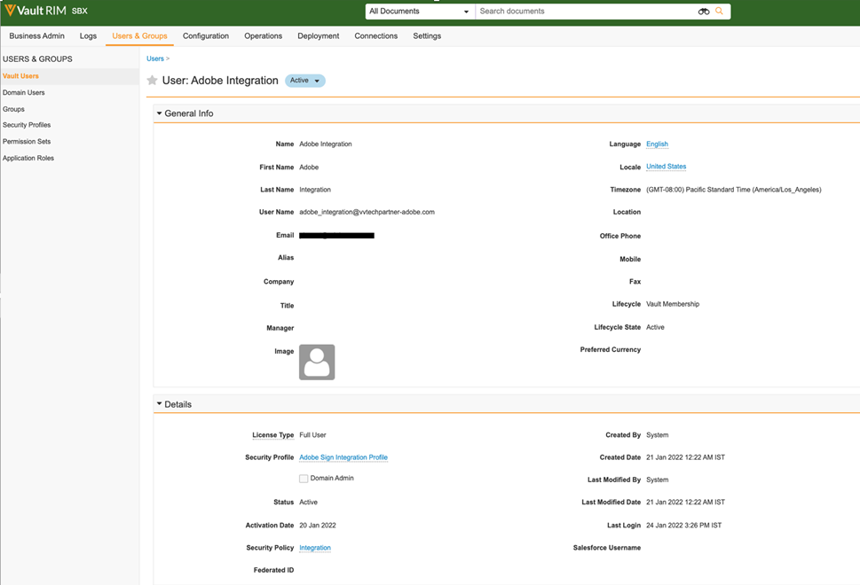
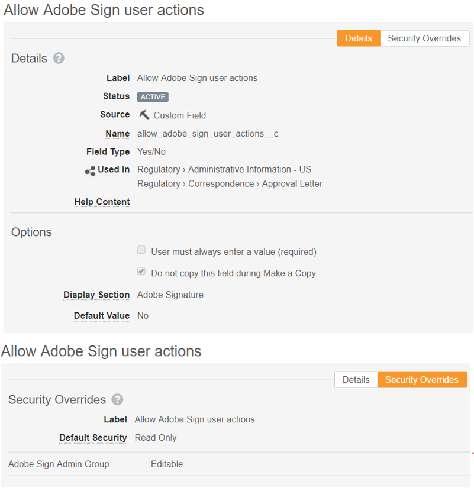
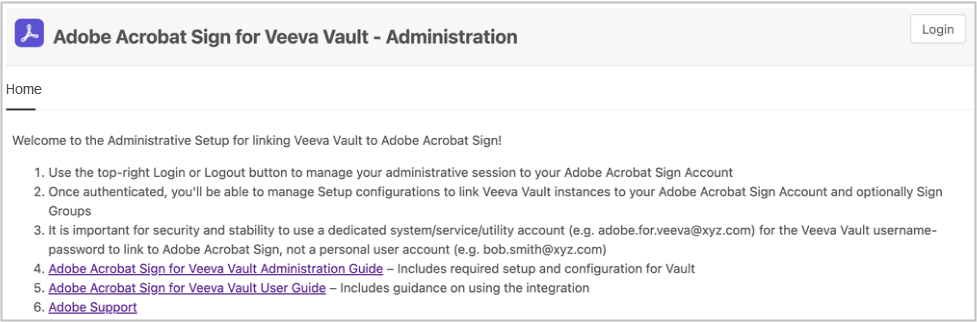

# [!DNL Veeva Vault] Installationshandbok{#veeva-installation-guide}

[**Kontakta supporten för Adobe Sign**](https://adobe.com/go/adobesign-support-center_se)

## Översikt {#overview}

I det här dokumentet beskrivs hur du skapar en integrering av Adobe Sign med [!DNL Veeva Vault] plattform. [!DNL Veeva Vault] är en ECM-plattform (Enterprise Content Management) byggd för biovetenskap. Ett &quot;Vault&quot; är ett innehålls- och datalager med typisk användning för registreringsunderlag, forskningsrapporter, anslagsansökningar, allmänna kontrakt med mera. Ett företag kan ha flera &quot;valv&quot; som måste underhållas separat.

De viktigaste stegen för att slutföra integreringen är:

* Aktivera ditt administratörskonto i Adobe Sign (endast nya kunder).
* Skapa objekt för att spåra historiken för en avtalslivscykel i Vault.
* Skapa en ny säkerhetsprofil.
* Konfigurera en grupp i Adobe Sign för att hålla [!DNL Veeva Vault] integrationsanvändare.
* Skapa dokumentfält och återgivningar.
* Konfigurera webbåtgärder och uppdatera dokumentets livscykel.
* Skapa dokumenttypskonfiguration för användare och användarroll.

>[!NOTE]
>
>Adobe Sign-administratören måste utföra installationsstegen för Adobe Sign i Adobe Sign.

## Konfigurera [!DNL Veeva Vault] {#configure-veeva}

Konfigurera [!DNL Veeva Vault] för integrering med Adobe Sign måste du implementera stegen nedan.

### Steg 1. Skapa grupp {#create-group}

Så här konfigurerar du Adobe Sign för [!DNL Vault], en ny grupp med namnet *Adobe Sign-administratörsgrupp* har skapats. Den här gruppen används för att ställa in dokumentfältnivåsäkerhet för Adobe Sign-relaterade fält och ska inkludera *Integreringsprofil för Adobe Sign* som standard.

### Steg 2. Distribuera paketet {#deploy-package}

[Distribuera paketet](https://helpx.adobe.com/content/dam/help/en/PKG-AdobeSign-Integration.zip) och följ stegen. När paketet har distribuerats skapas:

* Anpassade objekt: Signaturobjekt, Signaturobjekt, Signaturhändelseobjekt, Process Locker-objekt
* Sidlayout för signaturobjekt
* Layout för signaturhändelseobjekt
* Layout för signeringsobjektssida
* Layout för processvalvsobjektssida
* Adobe Sign-återgivningstyp
* Delad fältsignatur__c , allow_adobe_sign_user_actions__c
* Adobe Sign Web Action
* Avbryt Adobe Sign-webbåtgärd
* Behörighetsuppsättning för Adobe Sign-administratörsåtgärder
* Säkerhetsprofil för Adobe Sign-integrationsprofil
* Programroll Adobe Sign-administratörsroll
* Dokumenttypgruppen &quot;Adobe Sign-dokument&quot;

#### Signaturobjekt {#signature-object}

Signaturobjekt skapas för att lagra avtalsrelaterad information. Ett signaturobjekt är en databas som innehåller information under följande specifika fält:

**Fält för signaturobjekt**

| Fält | Etikett | Typ | Beskrivning |
| --- | --- | ---| --- | 
| external_id__c | Avtals-ID | Sträng (100) | Innehåller Adobe Sign unika avtals-ID |
| file_hash__c | Filhash | Sträng (50) | Innehåller md5-kontrollsumman för filen som har skickats till Adobe Sign |
| name__v | Namn | Sträng (128) | Innehåller avtalsnamnet |
| sender__c | Avsändare | Objekt (användare) | Innehåller referensen till den Vault-användare som har skapat avtalet |
| signature_status__c | Signaturstatus | Sträng (75) | Innehåller avtalets status i Adobe Sign |
| signature_type__c | Signaturtyp | Sträng (20) | Innehåller avtalets signaturtyp i Adobe Sign (SKRIFTLIG eller ESIGN) |
| start_date__c | Startdatum | DatumTid | Datum när avtalet har skickats för signering |
| cancellation_date__c | Uppsägningsdatum | DatumTid | Innehåller datumet då avtalet har annullerats. |
| complete_date__c | Slutdatum | DatumTid | Innehåller datumet då avtalet har slutförts. |
| viewable_rendition_used__c | Visningsbar återgivning används | Boolesk | Flagga som anger om visningsbar återgivning har skickats för signering. (som standard är det sant) |

#### Signatory-objekt {#signatory-object}

Signeringsobjekt skapas för att lagra information relaterad till deltagarna i ett avtal. Den innehåller information under följande specifika fält:

**Fält för signeringsobjekt**

| Fält | Etikett | Typ | Beskrivning |
| --- | --- | ---| --- | 
| email__c | E-post | Sträng (120) | Innehåller Adobe Sign unika avtals-ID |
| external_id__c | Deltagar-ID | Sträng (80) | Innehåller Adobe Sign unika deltagares identifierare |
| name__v | Namn | Sträng (128) | Innehåller Adobe Sign-deltagarens namn |
| order__c | Ordning | Nummer | Innehåller Adobe Sign-avtalsdeltagarens ordernummer |
| role__c | Roll | Sträng (30) | Innehåller Adobe Sign-avtalsdeltagarens roll |
| signature__c | Signatur | Objekt (signatur) | Innehåller referensen till den överordnade signaturposten |
| signature_status__c | Signaturstatus | Sträng (100) | Innehåller status för Adobe Sign-avtalsdeltagare |
| user__c | Användare | Objekt (användare) | Innehåller referensen till undertecknarens användarpost om deltagaren är en vaultanvändare |

#### Signature Event-objekt {#signature-event}

Signaturhändelseobjektet skapas för att lagra ett avtals händelserelaterad information. Den innehåller information under följande specifika fält:

| Fält | Etikett | Typ | Beskrivning |
| --- | --- | ---| --- | 
| acting_user_email__c | E-post för agerande användare | Sträng | Innehåller e-postadressen till den Adobe Sign-användare som utförde åtgärden som orsakade händelsen |
| acting_user_name__c | Tillförordnat användarnamn | Sträng | Innehåller namnet på den Adobe Sign-användare som utförde åtgärden som orsakade att händelsen skapades |
| description__c | Beskrivning | Sträng | Innehåller beskrivningen av Adobe Sign-händelsen |
| event_date__c | Händelsedatum | DatumTid | Innehåller datum och klockslag för Adobe Sign-händelsen |
| event_type__c | Händelsetyp | Sträng | Innehåller Adobe Sign-händelsens typ |
| name__v | Namn | Sträng | Namn på automatiskt genererad händelse |
| participant_comment__c | Deltagarkommentar | Sträng | Innehåller eventuella kommentarer från Adobe Sign-deltagaren |
| participant_email__c | E-post till deltagare | Sträng | Innehåller Adobe Sign-deltagarens e-postadress |
| participant_role__c | Deltagarroll | Sträng | Innehar Adobe Sign-deltagarens roll |
| signature__c | Signatur | Objekt (signatur) | Innehåller referensen till den överordnade signaturposten |

#### Process Locker-objekt {#process-locker}

Ett Process Locker-objekt skapas för att låsa Adobe Sign-integreringsprocessen. Inga anpassade fält krävs.

#### programroll {#create-application-roles}

Du måste skapa en programroll med namnet *Adobe Sign-administratörsroll*. Den här rollen måste definieras i livscykeln för varje dokumenttyp som är berättigad till Adobe-signatur. För vart och ett av Adobe Sign specifika livscykeltillstånd läggs Adobe Sign administratörsroll till och konfigureras med lämpliga behörigheter.

### Steg 3. Konfigurera säkerhetsprofiler {#security-profiles}

En ny säkerhetsprofil som heter *Integreringsprofil för Adobe Sign* skapas och dess behörighet anges för *Administratörsåtgärder för Adobe Sign*. Adobe Sign-integreringsprofilen tilldelas systemkontot och används av integreringen när Vault-API:er anropas. Den här profilen tillåter behörigheter för:

* Vault API:er
* Läsa, skapa, redigera och ta bort: Signatur-, signatur-, signaturhändelse- och Process Locker-objekt

Säkerhetsprofiler för användare som behöver åtkomst till Adobe Sign-historik i Vault måste ha läsbehörighet för signatur-, signatur- och signaturhändelseobjekt.

### Steg 4. Skapa användare {#create-user}

Vaults systemkontoanvändare av Adobe Sign-integreringen måste:

* Ha en Adobe Sign-integrationsprofil
* Ha en säkerhetsprofil
* Har en specifik säkerhetsprincip som inaktiverar utgångsdatum för lösenord
* Bli medlem i Adobe Sign administratörsgrupp.

Om du vill säkerställa att systemkontoanvändaren tillhör Adobe Sign administratörsgrupp för den specifika dokumentlivscykeln måste du skapa användarrollsinställningsposter. Så här gör du:

1. Skapa Vault-systemkonto för användare av Adobe Sign-integrering.

   

2. Lägg till användaren i Adobe Sign administratörsgrupp.

   

### Steg 5. Konfigurera dokumenttypsgrupp {#create-document-type-group}

När du distribuerar Adobe Sign-paketet skapas en dokumenttypsgrupppost med namnet Adobe Sign-dokument.

Du måste lägga till den här dokumenttypgruppen för alla dokumentklassificeringar som är berättigade till Adobe Sign-processer. Eftersom dokumenttypens gruppegenskap inte ärvs från typ till undertyp eller från undertyp till klassificeringsnivå, måste den anges för varje dokuments klassificering som är berättigad till Adobe Sign.

**Obs!** Om inställningsobjektet för användarroll inte innehåller det fält som refererar till objektet Dokumenttypgrupp, måste du lägga till fältet.

### Steg 6. Skapa användarrollskonfiguration {#create-user-role-setup}

När livscykeln/livscyklerna har konfigurerats korrekt bör systemet säkerställa att Adobe Sign-administratörsanvändare läggs till av DAC för alla dokument som är berättigade till Adobe Sign-processer. Detta görs genom att skapa rätt inställningspost för användarrollen med följande specifikationer:

* Dokumenttypsgrupp som Adobe Sign-dokument
* Programroll som Adobe Sign-administratörsroll
* Integreringsanvändare

**Obs!** Om inställningsobjektet för användarroll inte innehåller det fält som refererar till objektet Dokumenttypgrupp, måste du lägga till fältet. Gå till **[!UICONTROL Objekt]** > **[!UICONTROL Inställning av användarroll]** > **[!UICONTROL Fält]** och utför de steg som krävs enligt bilden nedan.

### Steg 7. Ställ in dokumentfält {#create-fields}

Om du vill integrera med Adobe Sign måste du använda två nya dokumentfält:

* Underskrift (underskrift__c)
* Tillåt användaråtgärder för Adobe Sign (allow_adobe_sign_user_actions__c)

Så här ställer du in dokumentfält:

1. Gå till fliken Konfiguration och välj **[!UICONTROL Dokumentfält]** > **[!UICONTROL Delade fält]**.
1. I fältet Visa avsnitt väljer du **[!UICONTROL Skapa visningsavsnitt]** och tilldela **[!UICONTROL Adobe-signatur]** som avsnittsetiketten.

   

1. För de två delade dokumentfälten (signature__c och allow_adobe_sign_user_actions__c) uppdaterar du gränssnittsavsnittet med **[!UICONTROL Adobe-signatur]** som avsnittsetiketten.
1. Lägg till de tre delade fälten i alla dokumenttyper som är berättigade till Adobe-signatur. För att göra det väljer du på sidan Basdokument **[!UICONTROL Lägg till]** > **[!UICONTROL Befintligt delat fält]** från det övre högra hörnet.

   

   

1. Observera att båda fälten måste ha en specifik säkerhetsuppdatering som endast tillåter medlemmar i Adobe Sign administratörsgrupp att uppdatera sina värden.

   

1. Administratörer måste lägga till det befintliga delade fältet *Inaktivera vaultövertäckningar (disable_vault_overlays__v)* och ställa in den på **[!UICONTROL Aktiv]** för alla dokumenttyper som är berättigade till Adobe-signatur. Alternativt kan fältet ha en specifik säkerhetsuppdatering som endast tillåter medlemmar i Adobe Sign administratörsgrupp att uppdatera dess värde.

   

### Steg 8. Deklarera dokumentåtergivningar {#declare-renditions}

Den nya återgivningstypen anropas *Adobe Sign-återgivning (adobe_sign_rendition__c)* används av Vault-integrering för att överföra signerade PDF-dokument till Adobe Sign. Du måste deklarera Adobe Sign-återgivningen för varje dokumenttyp som är berättigad till Adobe-signatur.

### Steg 9. Uppdatera webbåtgärder {#web-actions}

För integrering med Adobe Sign och Vault måste du skapa och konfigurera följande två webbåtgärder:

* **Skapa Adobe Sign**: Adobe Sign-avtal skapas eller visas.

   Typ: Dokumentmål: Visa i vault-URL: <https://api.na1.adobesign.com/api/gateway/veevavaultintsvc/partner/agreement?docId=${Document.id}&majVer=${Document.major_version_number__v}&minVer=${Document.minor_version_number__v}&vaultid=${Vault.id}&useWaitPage=true>

   

* **Avbryt Adobe Sign**: Det avbryter ett befintligt avtal i Adobe Sign och återställer ett dokuments status till det ursprungliga.

   Typ: Dokumentmål: Visa i vault-URL: : <https://api.na1.adobesign.com/api/gateway/veevavaultintsvc/partner/agreement/cancel?docId=${Document.id}&majVer=${Document.major_version_number__v}&minVer=${Document.minor_version_number__v}&vaultid=${Vault.id}&useWaitPage=true>

   

### Steg 10. Uppdatera dokumentets livscykel {#document-lifecycle}

För varje dokumenttyp som är berättigad till Adobe-signatur måste du uppdatera motsvarande dokumentlivscykel genom att lägga till en ny livscykelroll och nya tillstånd.

Livscykeln för Adobe Sign-avtal har följande tillstånd:

* UTKAST
* AUTHORING eller DOCUMENTS_NOT_YET_PROCESSED
* OUT_FOR_SIGNATURE eller OUT_FOR_APPROVAL
* SIGNERAT eller GODKÄNT
* AVBRUTEN
* FÖRFALLEN

Följ stegen nedan för att uppdatera dokumentets livscykel:

1. Lägg till livscykelroll. Adobe Sign administratörsprogramroll måste läggas till i alla livscykler som används av dokument som är berättigade till Adobe-signatur, enligt nedan.

   

   Administratörsrollen ska skapas med följande alternativ:

   * Aktiverad dynamisk åtkomstkontroll.
   * Regler för dokumentdelning som endast omfattar dokumenttypsgrupp, som bilden nedan visar.

   

2. Skapa livscykeltillstånd. Gå till **[!UICONTROL Inställningar]** > **[!UICONTROL Konfiguration]** > **[!UICONTROL Dokumentlivscykler]** > **[!UICONTROL Allmänna livscykler]** > **[!UICONTROL Stater]** > **[!UICONTROL Skapa]**. Skapa sedan följande lägen:

   * I Adobe Sign Draft

   

   * Redigera i Adobe Sign

   

   * Signering i Adobe

   

3. Lägg till användaråtgärder i nedanstående lista.

   När ett Vault-dokument skickas till Adobe Sign ska dess tillstånd motsvara läget i vilket avtalet finns. Gör det genom att lägga till följande lägen i varje livscykel som används av dokument som är berättigade till Adobe-signatur:

   * **Före Adobe-underskrift** (Granskad): Det här är ett platshållarnamn för läget som dokumentet kan skickas från till Adobe Sign. Beroende på dokumenttyp kan det vara Utkast eller Granskat. Etiketten för dokumentstatus kan anpassas enligt kundens krav. Före Adobe måste signaturtillståndet definiera följande två användaråtgärder:

   * Åtgärd som ändrar dokumentstatus till *I Adobe Sign Draft* tillstånd. Namnet på den här användaråtgärden måste vara detsamma för alla dokumenttyper i alla livscykler. Om det behövs kan villkor för den här åtgärden ställas in på &quot;Tillåt Adobe Sign-användaråtgärder är lika med Ja&quot;.
   * En åtgärd som kallar webbåtgärden &quot;Adobe Sign&quot;. Tillståndet måste ha en säkerhet som tillåter Adobe Sign administratörsroll att: visa dokument, visa innehåll, redigera fält, redigera relationer, hämta källa, hantera visningsbar återgivning och ändra tillstånd.

   

   * **I Adobe Sign Draft**: Det här är ett platshållarnamn för läget som anger att dokumentet redan har överförts till Adobe Sign och att dess avtal är i läget UTKAST. Det är ett nödvändigt tillstånd. Detta tillstånd måste definiera följande fem användaråtgärder:

   * Åtgärd som ändrar dokumentstatus till *Redigera i Adobe Sign* tillstånd. Namnet på den här användaråtgärden måste vara detsamma för alla dokumenttyper i alla livscykler. Om det behövs kan villkor för den här åtgärden ställas in på &quot;Tillåt Adobe Sign-användaråtgärder är lika med Ja&quot;.
   * Åtgärd som ändrar dokumentstatus till *I signeringsläget Adobe*. Namnet på den här användaråtgärden måste vara detsamma för alla dokumenttyper i alla livscykler. Om det behövs kan villkor för den här åtgärden ställas in på &quot;Tillåt Adobe Sign-användaråtgärder är lika med Ja&quot;.
   * Åtgärd som ändrar dokumentstatus till *Adobe Sign har avbrutits* tillstånd. Namnet på den här användaråtgärden måste vara detsamma för alla dokumenttyper i alla livscykler. Om det behövs kan villkor för den här åtgärden ställas in på &quot;Tillåt Adobe Sign-användaråtgärder är lika med Ja&quot;.
   * En åtgärd som kallar webbåtgärden &quot;Adobe Sign&quot;.
   * En åtgärd som kallar webbåtgärden för Avbryt Adobe Sign. Tillståndet måste ha en säkerhet som gör att Adobe Sign-administratörsrollen kan: visa dokument, visa innehåll, redigera fält, redigera relationer, hämta källa, hantera visningsbar återgivning och ändra tillstånd.

   

   * **Redigera i Adobe Sign**: Det här är ett platshållarnamn för läge som anger att dokumentet redan har överförts till Adobe Sign och att dess avtal är i läget AUTHORING eller DOCUMENTS_NOT_YET_PROCESSED. Det är ett nödvändigt tillstånd. Detta tillstånd måste ha följande fyra användaråtgärder definierade:

   * Åtgärd som ändrar dokumentets status till Adobe Sign avbrutet. Namnet på den här användaråtgärden måste vara detsamma för alla dokumenttyper oavsett livscykel. Om det behövs kan villkor för den här åtgärden ställas in på &quot;Tillåt Adobe Sign-användaråtgärder är lika med Ja&quot;.
   * Åtgärd som ändrar dokumentets status till Signeringsläge i Adobe. Namnet på den här användaråtgärden måste vara detsamma för alla dokumenttyper oavsett livscykel. Om det behövs kan villkor för den här åtgärden ställas in på &quot;Tillåt Adobe Sign-användaråtgärder är lika med Ja&quot;.
   * Åtgärd som kallar webbåtgärden &quot;Adobe Sign&quot;
   * En åtgärd som kallar webbåtgärden för Avbryt Adobe Sign. Tillståndet måste ha en säkerhet som gör att Adobe Sign-administratörsrollen kan: visa dokument, visa innehåll, redigera fält, redigera relationer, hämta källa, hantera visningsbar återgivning och ändra tillstånd.

   

   * **Signering i Adobe**: Det här är ett platshållarnamn för läget som anger att dokumentet har överförts till Adobe Sign och att dess avtal redan har skickats till deltagare (tillståndet OUT_FOR_SIGNATURE eller OUT_FOR_APPROVAL). Det är ett nödvändigt tillstånd. Detta tillstånd måste ha följande fem användaråtgärder definierade:

   * Åtgärd som ändrar dokumentets status till Adobe Sign avbrutet. Måltillståndet för den här åtgärden kan vara vilket kundbehov som än finns och det kan vara olika för olika typer. Namnet på den här användaråtgärden måste vara detsamma för alla dokumenttyper oavsett livscykel. Om det behövs kan villkor för den här åtgärden ställas in på &quot;Tillåt Adobe Sign-användaråtgärder är lika med Ja&quot;.
   * Åtgärd som ändrar dokumentstatus till Adobe Sign avvisat läge. Måltillståndet för den här åtgärden kan vara vilket kundbehov som än finns och det kan vara olika för olika typer. Namnet på den här användaråtgärden måste vara detsamma för alla dokumenttyper oavsett livscykel. Om det behövs kan villkor för den här åtgärden ställas in på &quot;Tillåt Adobe Sign-användaråtgärder är lika med Ja&quot;.
   * Åtgärd som ändrar dokumentstatus till Adobe-signerat läge. Måltillståndet för den här åtgärden kan vara vilket kundbehov som än finns och det kan vara olika för olika typer. Namnet på den här användaråtgärden måste dock vara detsamma för alla dokumenttyper oavsett livscykel. Om det behövs kan villkor för den här åtgärden ställas in på &quot;Tillåt Adobe Sign-användaråtgärder är lika med Ja&quot;.
   * Åtgärd som anropar webbåtgärden *Adobe Sign*.
   * Åtgärd som anropar Web Action *Avbryt Adobe Sign*. Tillståndet måste ha en säkerhet som gör att Adobe Sign-administratörsrollen kan: visa dokument, visa innehåll, redigera fält, redigera relationer, hämta källa, hantera visningsbar återgivning och ändra tillstånd.

   

   * **Adobe undertecknat (godkänt)**: Det här är ett platshållarnamn för läget som anger att dokumentet har överförts till Adobe Sign och att dess avtal har slutförts (läget SIGNERAT eller GODKÄNT). Det är ett obligatoriskt steg och det kan vara ett befintligt livscykelsteg, som Godkänt.
Detta tillstånd kräver inte användaråtgärder. Det måste ha en säkerhet som tillåter Adobe Sign administratörsroll att: visa dokument, visa innehåll och redigera fält.

   I följande diagram visas mappningarna mellan Adobe Sign-avtal och Vaults dokumenttillstånd, där tillståndet &quot;Före Adobe-signatur&quot; är Utkast.

   

### Steg 11. Lägg till Adobe Sign-scenen i den allmänna livscykeln i livscykelstegsgrupper

### Steg 12. Ange behörigheter för användarrollen i livscykeltillståndet

Du måste ange lämpliga behörigheter för varje användarroll i livscykeltillståndet, som visas i bilden nedan.

### Steg 13. Ställ in kärnsäkerhet baserat på dokumentstatus och användarroll

### Steg 14. Avbryt Skapa dokumentmeddelanden för Adobe Sign

## Anslut [!DNL Veeva Vault] till Adobe Sign med mellanvara {#connect-middleware}

När du har slutfört konfigurationen för [!DNL Veeva Vault] och Adobe Sign administratörskonto måste administratören skapa en anslutning mellan de två kontona med hjälp av mellanvara. Den [!DNL Veeva Vault] och Adobe Sign-kontoanslutningen initieras av Adobe Sign Identity och används sedan för att lagra[!DNL Veeva Vault]identitet.
För systemets säkerhet och stabilitet måste administratören använda en särskild [!DNL Veeva Vault] system/tjänst/verktyg, till exempel `adobe.for.veeva@xyz.com`i stället för ett personligt användarkonto, t.ex. `bob.smith@xyz.com`.

En Adobe Sign-kontoadministratör måste följa stegen nedan för att ansluta [!DNL Veeva Vault] till Adobe Sign med mellanvara:

1. Gå till [Adobe Sign för [!DNL Veeva Vault] Startsida](https://static.adobesigncdn.com/veevavaultintsvc/index.html).
1. Välj **[!UICONTROL Logga in]** från det övre högra hörnet.

   

1. På inloggningssidan för Adobe Sign som öppnas anger du e-postadress och lösenord för kontoadministratören och väljer sedan **[!UICONTROL Logga in]**.

   

   När du har loggat in visas motsvarande e-post-ID och en inställningsflik på sidan, som visas nedan.

   

1. Välj **[!UICONTROL Inställningar]** -fliken.

   På sidan Inställningar visas tillgängliga anslutningar och inga vid den första anslutningsinställningen, se nedan.

   

1. Välj **[!UICONTROL Lägg till anslutning]** för att lägga till en ny anslutning.

1. I dialogrutan Lägg till anslutning som öppnas anger du den information som krävs, inklusive [!DNL Veeva Vault] autentiseringsuppgifter.

   Adobe Sign-inloggningsuppgifterna fylls i automatiskt från den första Adobe Sign-inloggningen.

   

1. Välj **[!UICONTROL Validera]** för att validera kontouppgifterna.

   När valideringen är klar visas ett meddelande om att användaren har validerats, enligt nedan.

   

1. Om du vill begränsa användningen till en viss Adobe Sign-grupp expanderar du **[!UICONTROL Grupp]** och väljer en av de tillgängliga grupperna.

   

1. Markera kryssrutan om du vill bifoga granskningsrapporten till den signerade återgivningen **[!UICONTROL Bifoga revideringsrapport till signerad återgivning]**.

   

1. Markera kryssrutan om du vill tillåta automatisk etablering av användare i Adobe Sign **[!UICONTROL Etablera Sign-användare automatiskt]**.

   **Obs!** Automatisk etablering av nya Adobe Sign-användare fungerar bara om den har aktiverats på Adobe Sign-kontonivå i Adobe Sign förutom att aktivera **[!UICONTROL Etablera Sign-användare automatiskt]** för[!DNL Veeva Vault]Adobe Sign-integreringen visas nedan av Adobe Sign-kontoadministratören.

   

1. Välj **[!UICONTROL Spara]** för att spara din nya anslutning.

   Den nya anslutningen visas under fliken Inställningar och visar att integreringen mellan [!DNL Veeva Vault] och Adobe Sign.

   

