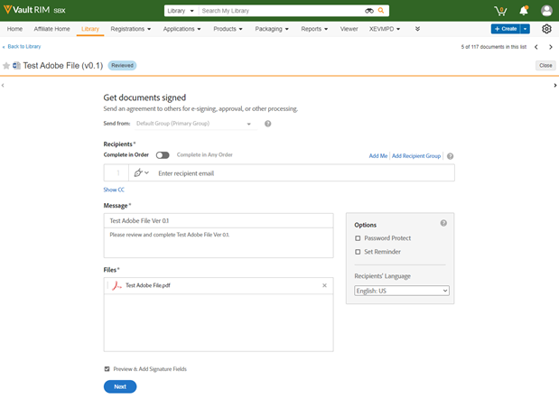

# Adobe Acrobat Sign för [!DNL Veeva Vault]: Användarhandbok {#veeva-vault-user-guide}

[**Kontakta Adobe Acrobat Sign Support**](https://adobe.com/go/adobesign-support-center_se)

Det här dokumentet är utformat för att hjälpa dig [!DNL Veeva Vault] kan du lära dig använda Adobe Acrobat Sign för [!DNL Veeva Vault] integration för att skicka ett avtal.

## Översikt {#overview}

Adobe Acrobat Sign-integrering med [!DNL Veeva Vault] underlättar processen för att erhålla en signatur eller ett godkännande för all dokumentation som kräver juridiska signaturer eller granskningsbar dokumentbearbetning.

Den övergripande processen att skicka dokument för signering påminner om att skicka ett e-postmeddelande, så det är enkelt att använda för de flesta användare.

Adobe Acrobat Sign-integrering med [!DNL Veeva Vault] effektiviserar och snabbar upp arbetsflödena för dokument och signaturer. Genom att använda arbetsflödet för integrering kan du

* Spara tid och resurser på snigelmejl, övernattning och fax.
* Skicka kontrakt för e-signering eller godkännande från [!DNL Veeva Vault], få åtkomst till kontraktshistorik i realtid och visa sparade kontrakt.
* Spåra erbjudandena i realtid i hela organisationen och få uppdateringar när avtal visas, signeras, avbryts eller avvisas.
* eSign på över 20 språk och stöd för faxtjänster på 50+ platser runt hela jorden.
* Skapa återanvändbara avtalsmallar för sändningsalternativ.

## Skicka ett avtal med Adobe Acrobat Sign för [!DNL Veeva Vault] {#send-sign-vault-agreement}

Så här skickar du ett avtal med Adobe Acrobat Sign för Veva:

1. Gå till [[!DNL Veeva Vault] inloggningssida](https://login.veevavault.com/) och ange ditt användarnamn och lösenord. Den öppnar startsidan för ditt valv, som visas nedan.

   

1. Välj **[!UICONTROL Bibliotek]** och sedan välja **[!UICONTROL Skapa]** från det övre högra hörnet.

   

1. Välj **[!UICONTROL Överför och fortsätt]**.

1. Ladda upp alla dokument från den lokala enheten.

1. I dialogrutan som visas väljer du **[!UICONTROL Text]** som *[!UICONTROL Kliniska]* och välj sedan en **[!UICONTROL Undertyp]** och **[!UICONTROL Klassificering]**, om så krävs.

   

1. Stäng dialogrutan genom att välja **[!UICONTROL OK]**.

1. Välj **[!UICONTROL Nästa]**.

1. I fönstret som visas fyller du i alla obligatoriska fält i metadataavsnittet och väljer **[!UICONTROL Spara]**.

   

1. Ett testdokument skapas i **[!UICONTROL Utkast]** status, se nedan.

   

1. I det övre högra hörnet väljer du  och väljer **[!UICONTROL Starta granskning]**.

   

1. Välj **[!UICONTROL Granskare]** och **[!UICONTROL Granska förfallodatum]**.

1. Välj **[!UICONTROL Start]**. Dokumentstatus ändras till [!UICONTROL GRANSKAS].

   

1. Slutför den tilldelade uppgiften för granskarnas räkning. När du är klar ändras dokumentstatusen till [!UICONTROL GRANSKAD].

   

1. Välj  och väljer **[!UICONTROL Adobe Sign]**.

   

1. Om UMG-funktionen (Användare i flera grupper) är aktiverad på Adobe Acrobat Sign-kontot och avsändaren tillhör flera grupper visas en dialogruta så som visas nedan. Markera gruppen i dialogrutan och välj sedan **[!UICONTROL Nästa]**.

   

1. I iFrame-fönstret som öppnas i Vault anger du mottagarens e-postadress och väljer **[!UICONTROL Nästa]**.

   

   **Obs!** Om det inte finns något Adobe Acrobat Sign-användarkonto för avsändarens e-post visas ett meddelande i iFrame-fönstret, enligt nedan. Användaren får också ett e-postmeddelande med instruktioner om hur kontot aktiveras.

   

   

   Om *Etablera Sign-användare automatiskt* är inaktiverad, Adobe Acrobat Sign-användargenerering misslyckas och i iFrame-fönstret visas ett meddelande där användaren uppmanas att kontakta sin Adobe Acrobat Sign-kontoadministratör. Kontoadministratören för Adobe Acrobat Sign kan vidta en av följande åtgärder:

   * Aktivera *Etablera Sign-användare automatiskt* för kontot.
   * Skapa användaren i Adobe Acrobat Sign innan du använder VEVA Vault Adobe Acrobat Sign Integration.

   

1. När dokumentet har bearbetats drar och släpper du signaturfälten från den högra panelen och väljer **[!UICONTROL Skicka]**.

   

1. Dokumentet skickas till mottagarna för signering. När mottagaren tar emot dokumentets e-postadress ändras dokumentstatusen från [!UICONTROL Granskad] till [!UICONTROL Signering i Adobe].

   

1. När alla signaturer har samlats in och slutförts i Adobe Acrobat Sign ändras dokumentstatusen i Vault till [!UICONTROL Approved].

1. Välj **[!UICONTROL Dokumentfiler]** och expandera **[!UICONTROL Återgivningar]** i Vault. En återgivning med namnet Adobe Sign-återgivning skapas automatiskt när dokumentet har statusen Godkänd.

   

1. Hämta Adobe Sign-återgivningen för att validera mottagarens signatur.

   

## Avbryta ett avtal med Adobe Acrobat Sign för [!DNL Veeva Vault] {#cancel-sign-vault-agreement}

1. Gå till [[!DNL Veeva Vault] inloggningssida](https://login.veevavault.com/) och ange ditt användarnamn och lösenord. Den öppnar startsidan för ditt valv, som visas nedan.

   

1. Välj **[!UICONTROL Bibliotek]** och sedan markera dokumentet. Dokumentstatus kan vara: [!UICONTROL I Adobe Sign Draft], [!UICONTROL Redigera i Adobe Sign]eller [!UICONTROL Signering i Adobe].

   

1. Välj **[!UICONTROL Avbryt Adobe Sign]**.

   

1. Det utlöser webbåtgärden och läser in iFrame-fönstret i [!UICONTROL valv].

   

1. Dokumentstatusen ändras automatiskt till [!UICONTROL Granska].

   

När dokumentstatusen har ändrats till Granska kan du skicka ut det för signering igen.
