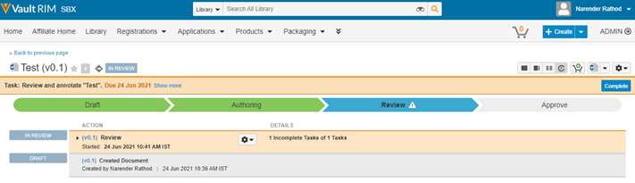
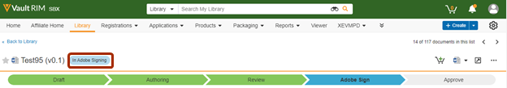

# Adobe Sign för [!DNL Veeva Vault]: Användarhandbok {#veeva-vault-user-guide}

[**Kontakta supporten för Adobe Sign**](https://adobe.com/go/adobesign-support-center_se)

Det här dokumentet är utformat för att hjälpa [!DNL Veeva Vault]-kunder att lära sig hur man använder Adobe Sign för [!DNL Veeva Vault]-integrering för att skicka ett avtal.

## Översikt {#overview}

Adobe Sign integrering med [!DNL Veeva Vault] underlättar processen att erhålla en signatur eller godkännande av dokumentation som kräver giltiga signaturer eller granskningsbar dokumentbearbetning.

Den övergripande processen att skicka dokument för signering liknar att skicka ett e-postmeddelande, så det är enkelt att anta för de flesta användare.

Adobe Sign integrering med [!DNL Veeva Vault] effektiviserar och snabbar upp arbetsflödena för dokument och signaturer. Genom att använda arbetsflödet för integrering kan du:

* Spara tid och resurser på snigelpost, kurirtjänster och fax.
* Skicka kontrakt för e-signatur eller godkännande från [!DNL Veeva Vault], få åtkomst till kontraktshistorik i realtid och visa sparade kontrakt.
* Spåra avtalen i realtid i hela organisationen och få uppdateringar när avtal visas, signeras, avbryts eller avvisas.
* eSign på över 20 språk och stöd för faxtjänster på 50+ platser runt hela jorden.
* Skapa återanvändbara avtalsmallar för sändningsalternativ.

## Skicka ett avtal med Adobe Sign för [!DNL Veeva Vault] {#send-sign-vault-agreement}

Så här skickar du ett avtal med Adobe Sign for Veeva:

1. Gå till [[!DNL Veeva Vault] inloggningssidan](https://login.veevavault.com/) och ange ditt användarnamn och lösenord. Den öppnar Vaults hemsida, som visas nedan.

   

1. Välj fliken **[!UICONTROL Bibliotek]** och välj sedan **[!UICONTROL Skapa]** i det övre högra hörnet.

   

1. Välj **[!UICONTROL Överför och Fortsätt]**.

1. Överför alla dokument från den lokala enheten.

1. I dialogrutan som visas väljer du **[!UICONTROL Skriv]** som *[!UICONTROL Klinisk]* och sedan en **[!UICONTROL undertyp]** och **[!UICONTROL Klassificering]**, om det behövs.

   

1. Stäng dialogrutan genom att välja **[!UICONTROL OK]**.

1. Välj **[!UICONTROL Nästa]**.

1. I fönstret som visas fyller du i alla obligatoriska fält i metadataavsnittet och väljer **[!UICONTROL Spara]**.

   

1. Det skapar ett testdokument med statusen **[!UICONTROL Utkast]**, enligt nedan.

   

1. I det övre högra hörnet väljer du  och väljer **[!UICONTROL Starta granskning]**.

   

1. Välj **[!UICONTROL Granskare]** och **[!UICONTROL Granskningsförfallodatum]**.

1. Välj **[!UICONTROL Start]**. Dokumentstatusen ändras till [!UICONTROL IN REVIEW].

   

1. Slutför den tilldelade uppgiften å granskarnas vägnar. När du är klar ändras dokumentstatusen till [!UICONTROL GRANSKAD].

   

1. Välj  och välj **[!UICONTROL Adobe Sign]**.

   

1. I fönstret iFrame som öppnas i Vault anger du mottagarens e-postadress och väljer **[!UICONTROL Nästa]**.

   

1. När dokumentet har bearbetats drar och släpper du signaturfälten på den högra panelen och väljer **[!UICONTROL Skicka]**.

   

1. Det skickar dokumentet till mottagaren för signering. När mottagaren tar emot e-postmeddelandet ändras dokumentets status från [!UICONTROL Granskad] till [!UICONTROL Underteckna i Adobe].

   

1. När alla signaturer har hämtats och slutförts i Adobe Sign ändras dokumentstatusen i Valv till [!UICONTROL Godkänd].

1. Välj **[!UICONTROL Dokumentfiler]** och utöka avsnittet **[!UICONTROL Återgivningar]** i Vabell. En ny återgivning med namnet&quot;Adobe Sign-återgivning&quot; skapas automatiskt när dokumentet har statusen Godkänd.

   

1. Hämta Adobe Sign Rendition för att validera mottagarens signatur.

   

## Avbryta ett avtal med Adobe Sign för [!DNL Veeva Vault] {#cancel-sign-vault-agreement}

1. Gå till [[!DNL Veeva Vault] inloggningssidan](https://login.veevavault.com/) och ange ditt användarnamn och lösenord. Den öppnar Vaults hemsida, som visas nedan.

   

1. Välj fliken **[!UICONTROL Bibliotek]** och markera sedan dokumentet. Dokumentstatus kan vara: [!UICONTROL I Adobe Sign Draft], [!UICONTROL I Adobe Sign Authoring] eller [!UICONTROL In Adobe Signing].

   

1. Välj **[!UICONTROL Avbryt Adobe Sign]**.

   

1. Den utlöser webbåtgärden och läser in iFrame-fönstret i [!UICONTROL Vault].

   

1. Dokumentets status ändras automatiskt till [!UICONTROL Review].

   

När dokumentstatusen har ändrats till Granska kan du skicka det igen för signatur.
