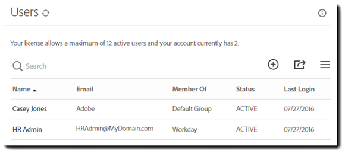

# [!DNL Workday] Installationshandbok{#workday-installation-guide}

[**Kontakta Adobe Sign Support**](https://adobe.com/go/adobesign-support-center)

## Översikt {#overview}

I det här dokumentet beskrivs hur du integrerar Adobe Sign i [!DNL Workday] klientorganisation. Så här använder du Adobe Sign i [!DNL Workday]behöver du veta hur du skapar och ändrar [!DNL Workday] föremål som

* Ramverk för affärsprocesser
* Klientinställning och konfiguration
* Rapportering och [!DNL Workday] studiointegration

De viktigaste stegen för att slutföra integreringen är:

* Aktivera ditt administratörskonto i Adobe Sign (endast nya kunder)
* Konfigurera en grupp i Adobe Sign för att hålla [!DNL Workday] integrationsanvändare
* Upprätta OAuth-relationen mellan [!DNL Workday] och Adobe Sign

## Aktivera ditt Adobe Sign-konto {#activating-your-adobe-sign-account}

Befintliga kunder med etablerade konton kan hoppa till [Konfigurera Adobe Sign för [!DNL Workday]](#config) ämne.

Om du inte har använt Adobe Sign tidigare och inte redan har loggat in tillhandahåller en Adobe-specialist ditt konto (i Adobe Sign) för [!DNL Workday]. När det är klart får du ett bekräftelsemeddelande enligt beskrivningen nedan.

Du måste följa anvisningarna i e-postmeddelandet för att initiera ditt konto och få åtkomst till ditt Adobe Sign [!UICONTROL Startsida] sidan.

## Konfigurera Adobe Sign för [!DNL Workday] {#config}

Så här konfigurerar du Adobe Sign för [!DNL Workday]måste du generera följande två dedikerade objekt i Adobe Sign-systemet:

* **A [!DNL Workday] grupp**: [!DNL Workday] kräver en dedikerad &quot;grupp&quot; i Adobe Sign-kontot för att aktivera integreringsfunktioner. Adobe Sign-gruppen används bara för att styra [!DNL Workday] användning av Adobe Sign. Annan potentiell användning, som Salesforce.com eller Arriba, påverkas inte. E-postmeddelanden döljs i [!DNL Workday] grupp så att [!DNL Workday] användare endast får meddelanden inom [!DNL Workday] inkorgen.

* **En verifierande användare med integreringsnyckeln**: A [!DNL Workday] gruppen får bara ha en administratör på gruppnivå, som är den auktoritativa innehavaren av integreringsnyckeln. Vi rekommenderar att administratören använder en fungerande e-postadress som `HR@MyDomain.com` i stället för ett personligt e-postmeddelande för att minska risken för att användaren inaktiveras i framtiden och därmed inaktivera integreringen.

### Skapa en användare och en grupp i Adobe Sign {#create-a-user-and-group-in-adobe-sign}

Så här skapar du en användare i Adobe Sign:

1. Logga in på Adobe Sign som kontoadministratör.
1. Gå till **[!UICONTROL Konto]** > **[!UICONTROL Användare]**.
1. Klicka på  för att skapa en ny användare.

   

1. Ange information om den nya användaren i dialogrutan som öppnas:

   * Ange en fungerande e-postadress som du kan komma åt.
   * Ange ett lämpligt värde för för- och efternamn.
   * Välj **[!UICONTROL Skapa en ny grupp för den här användaren]** från användargruppen.
   * Ge **[!UICONTROL Nytt gruppnamn]** med ett intuitivt namn som *[!DNL Workday]*.

   

1. Klicka **[!UICONTROL Spara]**.

   Det för dig tillbaka till [!UICONTROL Användare] sida som visar den nya användaren med en **[!UICONTROL SKAPAD]** status.

   

Så här verifierar du e-postadressen för användaren med statusen &quot;Skapad&quot;:

1. Logga in på den nya användarens e-postadress.
2. Hitta e-postmeddelandet &quot;Välkommen till Adobe Sign&quot;.
3. Klicka där det står **[!UICONTROL Klicka här för att ange ditt lösenord]**.
4. Ange lösenordet.

När du har verifierat e-postadressen ändras statusen för användaren från [!UICONTROL SKAPAD] till [!UICONTROL AKTIV].

### Definiera den verifierande användaren {#define-the-authenticating-user}

Så här befordrar du den nya användaren i [!DNL Workday] grupp:

1. Gå till [!UICONTROL Användare] sidan (om den inte redan finns).
2. Dubbelklicka på användaren i [!DNL Workday] grupp.

   Detta öppnar en [!UICONTROL Redigera] för användarbehörigheterna.

3. Kontrollera **[!UICONTROL Gruppadministratör]**.
4. Klicka **[!UICONTROL Spara]**.

## Konfigurera [!DNL Workday] klientorganisation {#configure-workday}

Så här slutför du anslutningen mellan [!DNL Workday] klientorganisation och Adobe Sign måste vi etablera en betrodd relation mellan tjänsterna. När du är klar kan vi lägga till steget Granska dokument som aktiverar signeringsprocessen via Adobe Sign.

>[!NOTE]
>
>Adobe Sign varumärkesmarkeras som Adobe Document Cloud i hela [!DNL Workday] miljön.

Så här upprättar du den betrodda relationen:

1. Logga in på [!DNL Workday] som kontoadministratör.
1. Öppna **[!UICONTROL Redigera klientinställning - Affärsprocesser]** sidan.
1. Leta reda på [!UICONTROL Konfiguration av e-signatur] avsnitt:

   

1. Klicka **[!UICONTROL Autentisera med Adobe]**.

   Detta startar autentiseringssekvensen OAuth2.0.

1. När du tillfrågas anger du autentiseringsuppgifterna för Adobe Sign-gruppadministratören som du skapade tidigare.
1. Godkänn åtkomsten till Adobe Sign.

>[!NOTE]
>
>Se till att du loggar ut helt från alla andra Adobe Sign-instanser innan du fortsätter.

När anslutningen är klar är kryssrutan Adobe-konfiguration aktiverad markerad och du kan börja använda Adobe Sign med [!DNL Workday].

### Konfigurera steget Granska dokument {#configure-review}

Dokumentet för steget Granska dokument kan vara något av följande:

* Ett statiskt dokument
* Ett dokument som genereras av steget Generera dokument i samma affärsprocess
* En formaterad rapport som skapats med [!DNL Workday] Rapportdesigner

Du kan lägga till dessa dokument med [Adobe-texttaggar](https://adobe.com/go/adobesign_text_tag_guide) för att styra utseendet och placeringen av Adobe Signing-specifika komponenter. Dokumentkällan måste anges i affärsprocessdefinitionen. Det går inte att överföra ett ad hoc-dokument medan affärsprocessen körs.

Det enda sättet att använda Adobe Sign med steget Granska dokument är möjligheten att ha serialiserade signerargrupper. Detta gör att du kan ange rollbaserade grupper som loggar in efter varandra. Adobe Sign stöder inte parallella signeringsgrupper.

Om du behöver hjälp med att konfigurera steget Granska dokument ska du gå till [Snabbstartsguide](https://adobe.com//go/adobesign_workday_quick_start){target="_blank"}.

## Support {#support}

### [!DNL Workday] bära {#workday-support}

[!DNL Workday] är integreringsägaren och bör vara din första kontaktpunkt för frågor om omfattningen av integreringen, funktionsförfrågningar eller problem med den dagliga funktionen i integreringen.

Du kan läsa följande [!DNL Workday] användarforum om hur man felsöker integreringen och genererar dokument:

* [Felsöka e-signaturintegreringar](https://doc.workday.com/#/reader/3DMnG~27o049IYFWETFtTQ/zhA~hYllD3Hv1wu0CvHH_g)
* [Steg för granskning av dokument](https://doc.workday.com/#/reader/3DMnG~27o049IYFWETFtTQ/TboWWKQemecNipWgxLAjqg)
* [Dynamisk dokumentgenerering](https://community.workday.com/saml/login?destination=/articles/176443)
* [Tips för dokumentgenerering](https://community.workday.com/node/183242)

### Stöd för Adobe Sign {#adobe-sign-support}

Adobe Sign är integrationspartnern och bör kontaktas om integreringen inte kan hämta signaturer eller om meddelanden om väntande signaturer misslyckas.

Adobe Sign-kunder bör kontakta sin Customer Success Manager (CSM) för support. Du kan även nå Adobe tekniska support via telefon: 1-866-318-4100, vänta på produktlistan och ange sedan: 4 och sedan 2 (enligt anvisning).

* [Lägga till Adobe-texttaggar i dokument](https://adobe.com/go/adobesign_text_tag_guide)
* [Granska dokumentkonfiguration och exempel](https://www.adobe.com//go/adobesign_workday_quick_start)

## Vanliga frågor {#faq}

### Varför uppdateras inte statusen inom [!DNL Workday] även när dokumentet är helt signerat? {#why-is-the-status-not-being-updated-within-workday-even-the-document-is-fully-signed}

Dokumentstatus i [!DNL Workday] återspegla om kandidaten inte klickar på[!UICONTROL Skicka]&#39; efter inloggning i Adobe Sign.

Enligt [!DNL Workday] kontrollera signeringsstatus för e-signatur: Användaren kan skicka den associerade inkorgen för att starta processen.

Enligt [!DNL Workday] Utveckling: Den ursprungliga signeringen slutför bara processen om användaren skickar inkorgen efter att dokumentet har signerats. Efter signeringen stängs iframe-instansen och användaren omdirigeras till samma uppgift där hen kan klicka på [!UICONTROL Skicka] -knappen för att slutföra processen.
