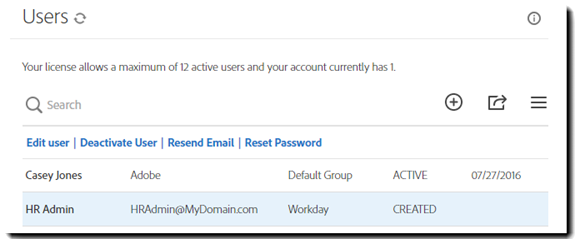

# [!DNL Workday] Installationshandbok{#workday-installation-guide}

[**Kontakta supporten för Adobe Sign**](https://adobe.com/go/adobesign-support-center_se)

## Översikt {#overview}

I det här dokumentet beskrivs hur du integrerar Adobe Sign i din [!DNL Workday]-klient. Om du vill använda Adobe Sign i [!DNL Workday] måste du känna till hur du skapar och ändrar [!DNL Workday]-objekt som:

* Affärsprocessram
* Installation och konfiguration av klientorganisation
* Rapportering och [!DNL Workday]-studiointegration

De steg som krävs för att slutföra integreringen är:

* Aktivera ditt administratörskonto i Adobe Sign (endast nya kunder)
* Konfigurera en grupp i Adobe Sign som ska innehålla [!DNL Workday]-integreringsanvändaren
* Upprätta OAuth-relationen mellan [!DNL Workday] och Adobe Sign

## Aktivera ditt Adobe Sign-konto {#activating-your-adobe-sign-account}

Befintliga kunder med etablerade konton kan hoppa till avsnittet [Konfigurera Adobe Sign för [!DNL Workday]](#config).

För kunder som inte har Adobe Sign och inte redan har inloggning tillhandahåller en Adobe-specialist ditt konto (i Adobe Sign) för [!DNL Workday]. När du är klar får du ett bekräftelsemeddelande via e-post enligt nedan.

Du måste följa instruktionerna i e-postmeddelandet för att initiera ditt konto och komma åt din Adobe Sign [!UICONTROL hemsida].

## Konfigurera Adobe Sign för [!DNL Workday] {#config}

Om du vill konfigurera Adobe Sign för [!DNL Workday] måste du generera följande två dedikerade objekt i Adobe Sign-systemet:

* **En  [!DNL Workday] grupp**:  [!DNL Workday] kräver en dedikerad&quot;grupp&quot; inom Adobe Sign-kontot för att integreringsfunktionerna ska aktiveras. Adobe Sign-gruppen används endast för att styra [!DNL Workday]-användningen av Adobe Sign. Annan användning, t.ex. Salesforce.com eller Arriba, påverkas inte. E-postmeddelandena visas inte i gruppen [!DNL Workday] så att [!DNL Workday]-användarna endast får meddelanden i sin [!DNL Workday]-inkorg.

* **En autentiserad användare som har integreringsnyckeln**: En  [!DNL Workday] grupp får bara ha en gruppnivåadministratör, som är den auktoritativa innehavaren av integrationsnyckeln. Vi rekommenderar att administratören använder en funktionell e-postadress som `HR@MyDomain.com` i stället för en personlig e-postadress för att minska risken för att användaren inaktiveras i framtiden och därmed inaktivera integreringen.

### Skapa en användare och grupp i Adobe Sign {#create-a-user-and-group-in-adobe-sign}

Så här skapar du en användare i Adobe Sign:

1. Logga in på Adobe Sign som kontoadministratör.
1. Navigera till **[!UICONTROL Konto]** > **[!UICONTROL Användare]**.
1. Klicka på  för att skapa en ny användare.

   

1. Ange den nya användarinformationen i dialogrutan som öppnas:

   * Ange en funktionell e-postadress som du kan komma åt.
   * Ange ett för- och efternamn.
   * Välj **[!UICONTROL Skapa en ny grupp för den här användaren]** från användargruppen.
   * Ange **[!UICONTROL Nytt gruppnamn]** med ett intuitivt namn som *[!DNL Workday]*.

   

1. Klicka på **[!UICONTROL Spara]**.

   Du kommer tillbaka till sidan [!UICONTROL Användare] som visar den nya användaren med statusen **[!UICONTROL CREATED]**.

   

Så här verifierar du e-postadressen för användaren med statusen&quot;Skapad&quot;:

1. Logga in på den nya användarens e-postadress.
2. Hitta e-postmeddelandet&quot;Välkommen till Adobe Sign&quot;.
3. Klicka där det står **[!UICONTROL Klicka här för att ange ditt lösenord]**.
4. Ange lösenordet.

När du har verifierat e-postadressen ändras användarens status från [!UICONTROL CREATED] till [!UICONTROL ACTIVE].

### Definiera den autentiserade användaren {#define-the-authenticating-user}

Så här befordrar du den nya användaren i gruppen [!DNL Workday]:

1. Navigera till sidan [!UICONTROL Användare] (om du inte redan är där).
2. Dubbelklicka på användaren i [!DNL Workday]-gruppen.

   Då öppnas en [!UICONTROL Redigera]-sida för användarbehörigheter.

3. Kontrollera **[!UICONTROL gruppadministratören]**.
4. Klicka på **[!UICONTROL Spara]**.

## Konfigurera klientorganisationen [!DNL Workday] {#configure-workday}

För att slutföra anslutningen mellan [!DNL Workday]-klientorganisationen och Adobe Sign måste vi etablera en betrodd relation mellan tjänsterna. När det är klart kan vi lägga till ett steg för Granska dokument som aktiverar signeringsprocessen via Adobe Sign.

>[!NOTE]
>
>Adobe Sign märks som Adobe Document Cloud i hela [!DNL Workday]-miljön.

Så här skapar du den betrodda relationen:

1. Logga in på [!DNL Workday] som kontoadministratör.
1. Öppna sidan **[!UICONTROL Redigera klientinställning - Affärsprocesser]**.
1. Gå till sektionen [!UICONTROL Konfiguration av e-signatur]:

   

1. Klicka på **[!UICONTROL Autentisera med Adobe]**.

   Detta startar autentiseringssekvensen OAuth2.0.

1. När du tillfrågas anger du inloggningsuppgifterna för den Adobe Sign-gruppadministratör som du skapade tidigare.
1. Godkänn åtkomsten till Adobe Sign.

>[!NOTE]
>
>Se till att du loggar ut från alla andra Adobe Sign-instanser innan du fortsätter.

När anslutningen är klar är kryssrutan Adobe-konfiguration aktiverad markerad och du kan börja använda Adobe Sign med [!DNL Workday].

### Konfigurera steget Granska dokument {#configure-review}

Dokumentet för steget Granska dokument kan vara något av följande:

* Ett statiskt dokument
* Ett dokument som genereras av ett genererat dokumentsteg i samma affärsprocess
* En formaterad rapport som skapats med [!DNL Workday] Report Designer

Du kan lägga till något av dessa dokument med [Adobe-texttaggar](https://adobe.com/go/adobesign_text_tag_guide_se) för att styra utseendet och placeringen av komponenterna som är specifika för Adobe Signing. Dokumentkällan måste anges i definitionen för affärsprocessen. Det går inte att överföra ett adhoc-dokument medan affärsprocessen utförs.

Unikt för att använda Adobe Sign med ett steg för att granska dokument är möjligheten att ha serialiserade signerargrupper. Detta gör att du kan använda rollbaserade grupper som signerar efter varandra. Adobe Sign stöder inte parallella signeringsgrupper.

Om du behöver hjälp med att konfigurera steget Granska dokument läser du i [Snabbstart](https://adobe.com//go/adobesign_workday_quick_start){target=&quot;_blank&quot;}.

## Support {#support}

### [!DNL Workday] support {#workday-support}

[!DNL Workday] är integreringsägaren och bör vara den första kontaktpunkten för eventuella frågor om omfattningen av integreringen, funktioner eller problem med det dagliga integreringsarbetet.

Du kan läsa följande [!DNL Workday] community-artiklar om hur du felsöker integreringen och skapar dokument:

* [Felsöka integreringar med e-signaturer](https://doc.workday.com/#/reader/3DMnG~27o049IYFWETFtTQ/zhA~hYllD3Hv1wu0CvHH_g)
* [Steget Granska dokument](https://doc.workday.com/#/reader/3DMnG~27o049IYFWETFtTQ/TboWWKQemecNipWgxLAjqg)
* [Dynamisk dokumentgenerering](https://community.workday.com/saml/login?destination=/articles/176443)
* [Generera tips för dokument](https://community.workday.com/node/183242)

### Adobe Sign support {#adobe-sign-support}

Adobe Sign är integreringspartnern och ska kontaktas om integreringen inte kan hämta signaturer eller om meddelanden med väntande signeringar misslyckas.

Adobe Sign-kunder bör kontakta sin Customer Success Manager (CSM) för att be om hjälp. Det går även att ringa till Adobes tekniska support på 1-866-318-4100, vänta på produktlistan och sedan ange 4 sedan ange 2 (enligt anvisningarna).

* [Lägga till texttaggar i Adobe i dokument](https://adobe.com/go/adobesign_text_tag_guide)
* [Granska dokumentkonfigurationen och exempel](https://experienceleague.adobe.com/docs/dc-sign-integrations/using/workday/quick-start.html?lang=en){target=&quot;_blank&quot;}

## Vanliga frågor {#faq}

### Varför uppdateras inte statusen inom [!DNL Workday] även när dokumentet är fullständigt signerat? {#why-is-the-status-not-being-updated-within-workday-even-the-document-is-fully-signed}

Dokumentstatusen i [!DNL Workday] kanske inte återspeglar om kandidaten inte klickar på knappen [!UICONTROL Skicka] efter att ha signerat i Adobe Sign.

Enligt [!DNL Workday]-aktiviteten Kontrollera signaturstatus: Användaren kan starta processen genom att skicka den associerade inkorgen.

Enligt [!DNL Workday]-utveckling: Den ursprungliga signeringen slutför bara processen om användaren skickar inkorgen efter att ha signerat dokumentet. Efter signering stängs iframe-instansen och användaren omdirigeras till samma uppgift där han/hon kan klicka på knappen [!UICONTROL Skicka] för att slutföra processen.
