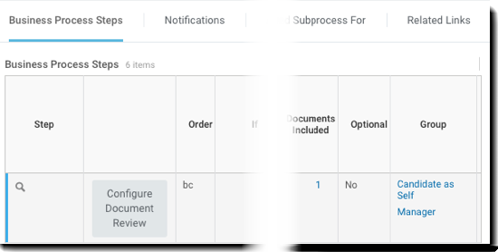
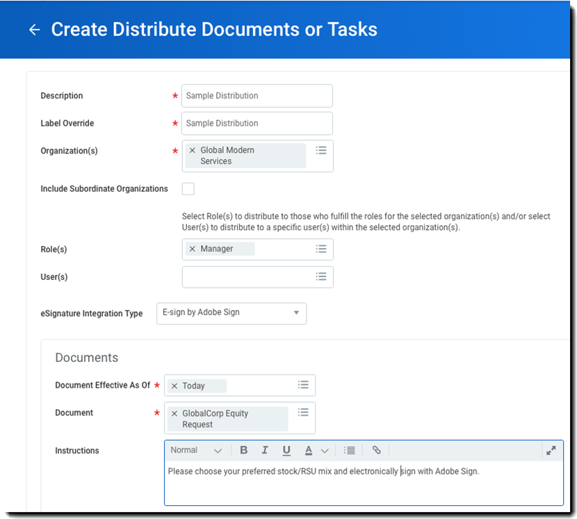

# [!DNL Workday] Snabbstartsguide{#workday-quick-start-guide}

[**Kontakta Adobe Sign Support**](https://www.adobe.com/go/adobesign-support-center)

## Översikt {#overview}

Det här dokumentet är utformat för att hjälpa dig [!DNL Workday] administratörer kan anpassa [!DNL Workday] Affärsprocesser som innefattar Adobe Sign för att erhålla e-signaturer. Så här använder du Adobe Sign i [!DNL Workday], du måste veta hur man skapar och ändrar [!DNL Workday] föremål som

* [!UICONTROL Business Process Framework]
* Klientinställning och konfiguration
* Rapportering och [!DNL Workday] Studio-integrering

## Åtkomst till Adobe Sign i [!DNL Workday] {#access-adobe-sign}

[!UICONTROL Funktioner för elektroniska signaturer i Adobe Sign] visas som [!UICONTROL Steg för granskning av dokument] åtgärder inom [!UICONTROL BPF (Business Process Framework)] och som en uppgift att distribuera dokument.

## [!UICONTROL Steg för granskning av dokument] {#review-document-step}

Adobe Sign för [!DNL Workday] exponeras via [!UICONTROL Steg för granskning av dokument] som du kan lägga till i någon av över 400 affärsprocesser inom [!DNL Workday], inbegripet [!UICONTROL Erbjudande], [!UICONTROL Distribuera dokument och uppgifter], [!UICONTROL Föreslå kompensation]och mycket mer.

Du kan läsa [[!DNL Workday] gemenskapsartiklar om [!UICONTROL Steg för granskning av dokument]](https://doc.workday.com/#/reader/3DMnG~27o049IYFWETFtTQ/TboWWKQemecNipWgxLAjqg).

Det finns en 1:1-relation mellan [!UICONTROL [!UICONTROL Steg för granskning av dokument]s] och fakturerbara transaktioner med Adobe Sign. Du kan kombinera flera dokument i ett och samma dokument [!UICONTROL Steg för granskning av dokument] och de presenteras som ett enda paket för signering.

**Anteckning**: Bara en enda *Dynamisk* kan refereras inom ett visst [!UICONTROL Steg för granskning av dokument].

Så här definierar du en funktion [!UICONTROL Steg för granskning av dokument]:

1. Infoga en [!UICONTROL Steg för granskning av dokument].
1. Ange de grupper (roller) som kan agera på [!UICONTROL Steg för granskning av dokument].

Så här konfigurerar du [!UICONTROL Steg för granskning av dokument]:

1. Ange *[!UICONTROL Typ av e-signaturintegrering]* som *[!UICONTROL eSign by Adobe]*.

1. Lägg till rader i signaturrutnätet.

   * Signaturrutnätet anger i vilken ordningsföljd dokumentet dirigeras för signering. Varje rad kan innehålla en eller flera roller och varje rad representerar ett steg i signeringsprocessen.
   * Varje medlem i rollen i ett visst steg meddelas om att en signeringshändelse väntar.
   * När en person i rollen signerar slutförs radsteget och dokumentet flyttas till nästa radsteg.
   * När alla rader har signerats [!UICONTROL Steg för granskning av dokument] är fullständigt.

1. Ange dokumentet som ska signeras. Om dokumentet är ett [!UICONTROL Erbjudande], du kan använda den från ett steg i Generera dokument. I annat fall väljer du ett befintligt dokument eller en befintlig rapport.

1. Upprepa steg 3 för alla dokument du behöver.

   

1. Du kan även lägga till en omdirigeringsanvändare för att registrera åtgärder som avvisar signering. När användare avböjer [!DNL Workday] dirigerar om dokumenten till en konfigurerad säkerhetsgrupp för granskning.

Från menyn för relaterade åtgärder i en [!UICONTROL Steg för granskning av dokument]väljer du **[!UICONTROL Affärsprocess]** > **[!UICONTROL Underhåll omdirigering]**. Välj sedan något av följande:

* **[!UICONTROL Skicka tillbaka]**: För att göra det möjligt för säkerhetsgruppmedlemmar att skicka tillbaka ett steg till ett tidigare steg i affärsprocessen. Affärsprocessen startar om från det steget.
* **[!UICONTROL Flytta till nästa steg]**: För att göra det möjligt för säkerhetsgruppmedlemmar att vidarebefordra ett steg till nästa steg i affärsprocessen.
* **[!UICONTROL Säkerhetsgrupper]**: Om du vill omdirigera steg i affärsprocessflödet. Säkerhetsgrupper som visas vid denna uppmaning markeras i säkerhetspolicyn för affärsprocessen i omdirigeringsavsnittet.

## Steganteckningar för affärsprocess {#business-process-step-notes}

Den [!UICONTROL Business Process Framework] är kraftfull; Du måste dock se till att

* Varje affärsprocess måste ha ett slutförandesteg, vilket helst är i slutet av affärsprocessen.

* Ett slutförandesteg ställs in på menyn relaterade åtgärder på sökikonen. Detta är endast möjligt när du &quot;visar&quot; affärsprocessen och inte när du &quot;redigerar&quot; den.

* Varje steg i affärsprocessen utförs sekventiellt.

   Du kan ändra ordningen på ett steg genom att ändra ordningsvärdet. Om du till exempel vill infoga ett steg mellan posterna &quot;c&quot; och &quot;d&quot; anger du ett nytt objekt som &quot;ca&quot;.

### Exempel: erbjudande {#example-offer}

Erbjudandet BP är en underprocess till [!UICONTROL Dynamisk affärsprocess för jobbprogram] som måste konfigureras för att utföra erbjudandebasprocessen. Den utlöses när jobbprogramtillståndet flyttas till[!UICONTROL Erbjudande]&quot; eller &quot;[!UICONTROL Erbjud]&quot;.

I exemplet nedan visas en [!UICONTROL Steg för granskning av dokument] använder ett dynamiskt dokumentsteg för både Nordamerika och Japan.

![Exempel på en [!DNL Workday] Affärsprocess](images/bp-for-offersmaller-575.png)

Den här affärsprocessen gör följande:

* Europaparlamentet uppmanar initiativtagaren till BP att föreslå kompensation för kandidaten (steg b).
* Använder ett stegvillkor för att testa om det aktuella landet inte är Japan.

   Om värdet är true utförs steg &quot;ba&quot;, som använder ett dokument på engelska.

   Om värdet är false körs steg &quot;bb&quot;, som använder ett japanskt dokument.

* Definierar signeringsprocessen i [!UICONTROL Steg för granskning av dokument] bc.
* Definierar beslutspunkten för att lämna ett erbjudande i det obligatoriska slutförandesteget &quot;d&quot;.

Det dynamiska dokumentet som genereras i steg &quot;ba&quot; anropas [!UICONTROL Erbjudandebrev] och innehåller ett enda textblock med namnet [!UICONTROL Snabberbjudande]. Du kan lägga till flera textblock, till exempel rubrik, hälsningsfras, kompensation, stock, stängning, villkor med mera efter behov.

![[!DNL Workday] visa dokumentsida](images/offer-letter-575.png)

Det dynamiska erbjudandebrevet nedan skapas i [!DNL Workday] RTF-redigerare. De objekt som markeras i *grå* är [!DNL Workday] tillhandahöll objekt som refererar till sammanhangsberoende data.

Objekt i {{brackets}} är [Adobe Text-taggar](https://adobe.com/go/adobesign_text_tag_guide).

Inom [!UICONTROL Steg för granskning av dokument], refereras det dynamiska dokumentet från föregående steg och definierar den sekventiella signeringsprocessen via två signeringsgrupper.

Det beteende som visas nedan dirigerar det dynamiskt genererade dokumentet först till Anställningshanteraren och sedan till kandidaten.

![[!DNL Workday] signeringsgrupper som definieras](images/configure-rd-stepsmaller-575.png)

### Exempel: Distribuera dokument {#example-distribute-documents}

Introducerades i [!DNL Workday] 30, kan uppgiften Massdistribuera dokument eller Uppgifter användas för att skicka ett dokument till en stor grupp (&lt;20 kB) enskilda signerare. Det är begränsat till en signatur per dokument. En distribution skapas genom att man går till[!UICONTROL Skapa och distribuera dokument eller uppgifter]’ från sökfältet.

Exempel: Skicka ett formulär för personalens eget kapital till alla chefer med [!UICONTROL Global Modern Services]. Du kan filtrera den ytterligare till enskilda hanterare om du vill.

Du kan även gå till **Visa distribuera dokument eller uppgifter** rapport för att följa hur distributionen fortskrider.

### Exempel: Rapportering {#example-reporting}

[!DNL Workday] har en omfattande rapporteringsinfrastruktur. Om du vill titta närmare på Adobe Sign-processen kan du inspektera elementen i *Händelsen Granska dokument*.

Nedan visas en enkel anpassad rapport som kan köras i alla affärsprocesser som letar efter Adobe Sign-transaktioner och deras status.

![Exempel på en [!DNL Workday] Anpassad rapport](images/review-document-eventsmaller-575.png)

Följande rapport genererades genom att titta på affärsprocesserna Erbjudande, Introduktion och Föreslå kompensation inom en implementeringsklient.

Du kan se:

* Dokument som skickats för signering
* Det associerade BP-steget
* Nästa person som väntar på signatur

![Exempel på en [!DNL Workday] Rapportera med tre objekt](images/workday-reportsmaller-575.png)

## Signerade dokument {#signed-documents}

Den [!DNL Workday] signaturcykeln inaktiverar alla e-postmeddelanden från Adobe Sign. Användare informeras om pågående åtgärder inom sina [!DNL Workday] inkorgen.

När ett dokument har signerats av alla signaturgrupper skickas en kopia av det signerade dokumentet till alla medlemmar i signaturgruppen via e-post.

Om du vill inaktivera det här beteendet kan du kontakta [!UICONTROL Adobe Sign Success Manager] eller [Adobe Sign supportteam](https://adobe.com/go/adobesign-support-center).

Inom [!DNL Workday], du kan komma åt de signerade dokumenten i den fullständiga processposten. Du kan hitta:

* Arbetardokument i arbetsprofilen och
* Kandidatdokument (erbjudandebrev) på kandidatprofilen.

Bilden nedan visar ett signerat erbjudandebrev för kandidaten Chris Foxx.

![Exempel [!DNL Workday] erbjudandebrev](images/offer.png)

## Support {#support}

### [!DNL Workday] bära {#workday-support}

[!DNL Workday] är integreringsägaren och bör vara din första kontaktpunkt för frågor om omfattningen av integreringen, funktionsförfrågningar eller problem med den dagliga funktionen i integreringen.

Den [!DNL Workday] användarforumet har flera bra artiklar om hur man felsöker integreringen och genererar dokument:

* [Felsöka e-signaturintegreringar](https://doc.workday.com/#/reader/3DMnG~27o049IYFWETFtTQ/zhA~hYllD3Hv1wu0CvHH_g)
* [Steg för granskning av dokument](https://doc.workday.com/#/reader/3DMnG~27o049IYFWETFtTQ/TboWWKQemecNipWgxLAjqg)
* [Skapa dynamiska dokument](https://community.workday.com/node/176443)
* [Tips angående konfiguration för att skapa dokument](https://community.workday.com/node/183242)

### Stöd för Adobe Sign {#adobe-sign-support}

Adobe Sign är integrationspartnern och bör kontaktas om integreringen inte kan hämta signaturer eller om meddelanden om väntande signaturer misslyckas.

Adobe Sign-kunder bör kontakta sina [!UICONTROL Customer Success Manager] för support. Alternativt [!UICONTROL Adobe teknisk support] kan nås via telefon: 1-866-318-4100, vänta på produktlistan och ange sedan: 4 och sedan 2 (enligt anvisning).

* [Lägga till Adobe-texttaggar i dokument](https://www.adobe.com/go/adobesign_text_tag_guide)

<!--
[Download PDF](images/adobe-sign-for-workday-quick-start-guide-2016.pdf)
-->
