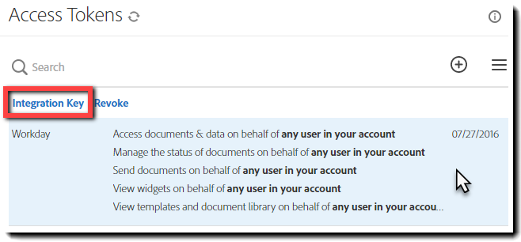
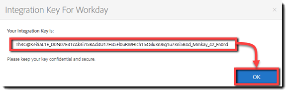
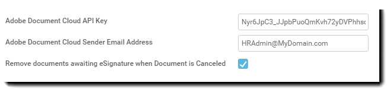

# [!DNL Workday] Testinstallation{#workday-trial-installation}

## Översikt {#overview}

Det här dokumentet är utformat för att hjälpa dig [!DNL Workday] kan du aktivera ett testkonto hos Adobe Sign och sedan integrera det i [!DNL Workday] klientorganisation. Så här använder du Adobe Sign i [!DNL Workday], du måste veta hur man skapar och ändrar [!DNL Workday] föremål som

* Ramverk för affärsprocesser
* Klientinställning och konfiguration
* Rapportering och [!DNL Workday] Studio-integrering

**Anteckning**: Om du har ett Adobe Sign-konto behöver du inte starta en testversion. Du kan kontakta din Client Success Manager för att begära [!DNL Workday] integration.

De åtgärder du måste utföra för att slutföra integreringen är:

* Aktivera ditt testkonto med Adobe Sign
* Skapa en integreringsnyckel i Adobe Sign
* Installera integreringsnyckeln i [!DNL Workday] Klient

## Aktivera ditt testkonto för Adobe Sign {#activate-sign-trial-account}

Om du vill ha en 30-dagars testversion av Adobe Sign måste du fylla i det här [registreringsformulär](https://land.echosign.com/esign-trial-workday-registration.html).

**Anteckning**: Vi rekommenderar starkt att du använder en giltig funktionell e-postadress för att skapa testversionen och inte ett tillfälligt e-postmeddelande. Du måste öppna det här e-postmeddelandet för att verifiera kontot, så adressen måste vara giltig.

Inom en arbetsdag tillhandahåller en Adobe Sign-specialist ditt konto (i Adobe Sign) för [!DNL Workday]. När det är klart får du ett bekräftelsemeddelande enligt beskrivningen nedan.

Så här initierar du ditt konto och får åtkomst till ditt Adobe Sign [!UICONTROL Startsida] följer du instruktionerna i e-postmeddelandet .

## Generera en integreringsnyckel {#generate-an-integration-key}

För nya installationer måste du generera en integreringsnyckel i Adobe Sign och sedan ange den i [!DNL Workday]. Denna nyckel autentiserar Adobe Sign och [!DNL Workday] miljöer där man kan lita på varandra och dela innehåll.

Så här skapar du en integreringsnyckel i Adobe Sign:

1. Logga in som administratör i Adobe Sign.
1. Gå till **[!UICONTROL **Konto]** > **[!UICONTROL Personliga inställningar]** > **[!UICONTROL Åtkomsttoken**]**.
1. Klicka på **plusikonen** till höger i fönstret.

   Det öppnar [!UICONTROL Skapa integreringsnyckel] gränssnitt.

   

1. Ge nyckeln ett intuitivt namn, till exempel [!DNL Workday].

   Integreringsnyckeln måste ha följande element aktiverade:

   * agreement_read
   * agreement_write
   * agreement_send
   * widget_read
   * library_read

   

1. Klicka på **[!UICONTROL Spara]**.

   På sidan [!UICONTROL Åtkomsttoken] visas de nycklar som är avsedda för ditt konto.

1. Klicka på nyckeldefinitionen som skapades för [!DNL Workday].

   Länken [!UICONTROL Integreringsnyckel] visas ovanför definitionen.

1. Klicka på länken **[!UICONTROL Integreringsnyckel.]**

   Integreringsnyckeln visas.

   

1. Kopiera nyckeln och spara den på ett säkert ställe för nästa steg.
1. Klicka på **[!UICONTROL OK]**.

   

## Konfigurera [!DNL Workday] klientorganisation {#configuring-the-workday-tenant}

### Installera integreringsnyckeln {#install-the-integration-key}

Installera integreringsnyckeln i [!DNL Workday] klientorganisationen upprättar den betrodda relationen med Adobe Sign. När relationen är etablerad kan alla affärsprocesser ha en [!UICONTROL Steg för granskning av dokument] som aktiverar signeringsprocessen.

**Anteckning**: Adobe Sign varumärkesmarkeras som &quot;Adobe Document Cloud&quot; i hela [!DNL Workday] miljön.

Så här installerar du integreringsnyckeln:

1. Logga in på [!DNL Workday] som kontoadministratör.
1. Sök efter och öppna **[!UICONTROL Redigera klientinställning - Affärsprocesser]** sidan.

1. Ange information för följande fyra fält:

   * **[!UICONTROL Adobe Document Cloud-bekräftelse]**: En fast textbekräftelse av integreringen.

   * **[!UICONTROL API-nyckel för Adobe Document Cloud]**: Där integreringsnyckeln är installerad

   * **[!UICONTROL E-postadress för Adobe Document Cloud-avsändare]**: E-postadressen till gruppnivåadministratören i Adobe Sign

   * **[!UICONTROL Ta bort dokument som väntar på e-signatur när dokumentet avbryts]**: En valfri konfiguration som tar bort dokument från signaturcykeln om ett dokument avbryts i [!DNL Workday].

   

1. Slutför sedan installationen:

   1. Klistra in integreringsnyckelen i fältet [!UICONTROL API-integreringsnyckel för Adobe Sign.]
   1. Skriv e-postadressen för Adobe Sign-administratören i fältet [!UICONTROL Avsändares e-postadress för Adobe Document Cloud.]
   1. Klicka på **[!UICONTROL OK]**.

   

Adobe Sign-funktioner kan nu läggas till i alla affärsprocesser genom att lägga till en [!UICONTROL Steg för granskning av dokument] och konfigurera den för användning **[!UICONTROL eSign by Adobe]** som e-signaturtypen.

### Konfigurera steget Granska dokument {#configure-the-review-document-step}

Dokumentet för steget Granska dokument kan vara ett statiskt dokument; ett dokument som genereras av steget Generera dokument inom samma affärsprocess, eller en formaterad rapport som skapats med [!DNL Workday] Rapportdesignern. Alla dessa kan kompletteras med [Adobe-texttaggar](https://adobe.com/go/adobesign_text_tag_guide_se) för att kontrollera utseendet och placeringen av specifika komponenter för Adobe Sign. Dokumentkällan måste anges i definitionen för affärsprocessen. Det går inte att överföra ett ad hoc-dokument medan affärsprocessen körs.

Det enda sättet att använda Adobe Sign med steget Granska dokument är möjligheten att ha serialiserade signerargrupper. Med signerargrupper kan du ange rollbaserade grupper som loggar in efter varandra. Adobe Sign stöder inte parallella signeringsgrupper.

Om du behöver hjälp med att konfigurera steget Granska dokument läser du i [Snabbstartsguide](https://adobe.com//go/adobesign_workday_quick_start){target=&quot;_blank&quot;}.

## Support {#support}

### [!DNL Workday] bära {#workday-support}

[!DNL Workday] är integreringsägaren och bör vara den första kontaktpunkten för eventuella frågor om omfattningen av integreringen, funktioner eller problem med det dagliga integreringsarbetet.

Den [!DNL Workday] användarforumet har flera bra artiklar om hur man felsöker integreringen och genererar dokument:

* [Felsöka e-signeringsintegreringar](https://doc.workday.com/#/reader/3DMnG~27o049IYFWETFtTQ/zhA~hYllD3Hv1wu0CvHH_g)
* [Steg för granskning av dokument](https://doc.workday.com/#/reader/3DMnG~27o049IYFWETFtTQ/TboWWKQemecNipWgxLAjqg)
* [Skapa dynamiska dokument](https://community.workday.com/node/176443)

* [Tips angående konfiguration för att skapa dokument](https://community.workday.com/node/183242)

### Stöd för Adobe Sign {#adobe-sign-support}

Adobe Sign är integreringspartnern och ska kontaktas om integreringen inte kan hämta signaturer eller om meddelanden med väntande signeringar misslyckas.

Adobe Sign-kunder bör kontakta sin Customer Success Manager (CSM) för att be om hjälp. Du kan även nå Adobe tekniska support via telefon: 1-866-318-4100; Vänta på produktlistan och ange sedan: 4 och sedan 2 (enligt anvisning).

* [Lägg till Adobe-texttaggar i dokument](https://adobe.com/go/adobesign_text_tag_guide)

* [Granska dokumentkonfiguration och exempel](https://www.adobe.com//go/adobesign_workday_quick_start){target=&quot;_blank&quot;}

[**Kontakta supporten för Adobe Sign**](https://www.adobe.com/go/adobesign-support-center)
